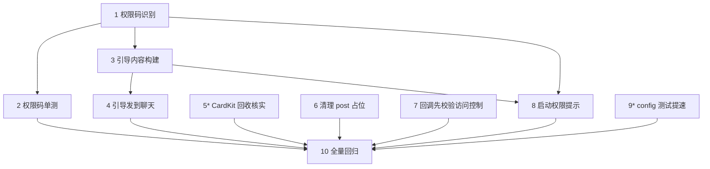

# Implementation Plan

## Overview

针对 `multi-platform-feishu` 审查发现的遗留问题做收口修复，聚焦飞书权限处理、CardKit 生命周期、富文本解析噪声及工程打磨。不改平台抽象与微信行为、不加新功能。每个任务以 `go build/vet/test ./...`（含 `-race`）全绿为门槛。权威参考 `/Volumes/Data/code/tmp/open-im/src/feishu/permission.ts`（终端访问）。带 `*` 为可选/调查类。

> 执行前先把 `multi-platform-feishu` 当前未提交的工作树改动（feishu/incoming.go、feishu/incoming_test.go、messaging/handler.go、messaging/handler_test.go）commit 或确认保留，避免与本批修复混在一起。

## Tasks

- [x] 1. 修正并补全飞书权限错误码识别（P1-2）
  - 在 `feishu/permission.go` 把 `permissionErrorCodes` 扩展为 `{99991400, 99991401, 99991663, 99991672, 99991670, 99991668}`
  - 新增统一入口 `IsPermissionError(err error) bool`：先尝试 `feishuErrorCode(err)` 提取 code 判定；取不到 code 时按错误文本兜底匹配 `permission|权限|scope|forbidden|not authorized|no access`（大小写不敏感）
  - 让发送（`sdkMessageSender.apiError`）、CardKit、凭证校验等处的权限判断统一走该入口
  - _Requirements: 1.1, 1.2, 1.3_

- [x] 2. 扩充权限码单测（P1-2）
  - 在 `feishu/permission_test.go` 覆盖：6 个权限码全部命中；普通参数/系统错误码不误判；无 code 时按文本兜底命中与不命中
  - _Requirements: 1.4_

- [x] 3. 抽出权限开通引导内容构建（P2-4）
  - 在 `feishu/permission.go` 增加引导文案构建函数：包含权限设置页链接 `https://open.feishu.cn/app/{appID}/permission` 与所需 scope 列表（`im:message`、`im:message:send_as_bot`、`im:resource`、`im:chat`，可选 `cardkit:card`）
  - 提供卡片版（lark_md/markdown 元素）与纯文本版两种渲染
  - 不在任何输出中包含 `app_secret`
  - _Requirements: 2.3, 2.5_

- [x] 4. 权限不足时尽力把引导发到聊天（P2-4）
  - 让消息发送器在检测到权限错误时，除日志外按降级链发送引导到当前会话：先卡片、失败退纯文本、再失败仅记日志不二次抛错
  - 复用现有 `permissionGuideLimiter` 60s 冷却；发送引导需要会话标识（openID/chatID），按需把会话上下文传入发送器或在 `Replier` 层处理
  - _Requirements: 2.1, 2.2, 2.4_

- [x] 5.* 核实并落实 CardKit 卡片回收（P2-3）
  - 用终端查阅 `larksuite/oapi-sdk-go/v3` cardkit v1 是否有删除/失效接口（`go doc` 或源码）
  - 有则在 `sdkCardKitClient.DestroyCard` 调真实接口；无则改注释为"依赖飞书侧卡片 TTL 自动回收"，去除"保留钩子供后续替换"措辞
  - 确认不破坏 `feishu/stream_test.go`
  - _Requirements: 3.1, 3.2, 3.3, 3.4_

- [x] 6. 清理 post 富文本解析的无效占位（新发现-1）
  - 在 `feishu/incoming.go` 的 post 解析中，去除注入 agent 文本的 Markdown 图片占位与 `<file key="..."/>` 占位；图片/文件仍下载为 `Attachments`
  - 如需在文本中提示附件，使用与普通图片/文件入站一致的表述（不要用裸 image_key）
  - 更新 `feishu/incoming_test.go` 断言
  - _Requirements: 4.1, 4.2, 4.3_

- [x] 7. 卡片回调先校验访问控制再回 toast（新发现-2）
  - 在 `feishu/adapter.go` 的 `handleCardActionEvent`：在返回成功 toast 前完成访问控制校验；未授权时返回中性/拒绝 toast 且不分发到 agent/审批
  - 复用 `platform` 层访问控制，不在 feishu 包重复实现；如当前访问控制只在 `guardedDispatch` 内，需把"是否允许"的判定暴露给回调路径（例如 dispatch 前置校验或注入判定函数）
  - 增加单测：未授权操作者点击不触发分发、返回非成功 toast
  - _Requirements: 5.1, 5.2, 5.3_

- [x] 8. 启动时输出飞书权限要求提示（P2-4 关联）
  - 在 `feishu/adapter.go` 凭证校验通过后调用一次权限引导日志（scope 清单 + 设置页链接），参考 open-im `logPermissionGuide`
  - _Requirements: 6.1, 6.2_

- [x] 9.* 排查并缓解 config 包测试缓慢（新发现-3）
  - 定位 `config` 包测试约 40s 的根因（agent 二进制探测 / 文件遍历 / sleep）
  - 在不削弱有效性的前提下降耗：注入可替换探测函数、缩短/移除 sleep、限制扫描范围
  - 验证 `config` 包测试通过且耗时明显下降
  - _Requirements: 7.1, 7.2, 7.3_

- [x] 10. 全量回归与质量门槛
  - `go build ./...`、`go vet ./...`、`go test ./...`、`go test -race ./feishu/... ./messaging/... ./platform/... ./wechat/...` 全绿
  - 确认微信行为零回归、平台抽象未被破坏（`messaging` 仍不依赖 `feishu`/`lark*`）
  - _Requirements: 1.4, 2.2, 3.4, 4.1, 5.2, 6.1, 7.3_

## Task Dependency Graph



```json
{
  "waves": [
    { "wave": 1, "tasks": ["1", "5", "6", "7", "9"] },
    { "wave": 2, "tasks": ["2", "3"] },
    { "wave": 3, "tasks": ["4", "8"] },
    { "wave": 4, "tasks": ["10"] }
  ]
}
```

**关键路径**：权限相关任务 1→3→4/8 是主链；任务 5/6/7/9 相互独立可并行；任务 10 收尾依赖全部完成。

## Notes

- **不改平台抽象与微信**：本批修复只动 `feishu/*` 与少量 `messaging`/`config`，禁止改变 `platform` 接口语义与微信 Replier 行为。
- **安全优先**：任务 7（回调访问控制）与"引导不泄露 secret"是安全项，不可省略。
- **权威码以参考实现为准**：权限错误码集合直接对齐 open-im `permission.ts`，不要自行臆测；如发现飞书官方文档有更新，以官方为准并在注释注明来源。
- **任务 5/9 带调查性质**：先用终端核实再动手；若结论是"无需改动代码"（如 SDK 确无删除接口），也要落实注释/文档说明，使状态明确。
- **回归基线**：修复前后对照 `go test ./...` 结果，确保无新增失败；`-race` 必须干净。

## Review Notes

- 2026-06-29：任务 6 已完成。`feishu/incoming.go` 对 post 富文本增加兜底解析，文本中不再注入 Markdown 图片占位或 `<file key="..."/>`，资源仍通过 `Attachments` 下载传递；`messaging/handler.go` 支持文字+图片一起发送时把本地图片路径传给 Agent。验证：`go test ./feishu -run 'TestToIncomingFromMessageParsesPost|TestToIncomingFromMessageParsesPostWithImage|TestToIncomingFromMessageParsesPostContentObjectFallback' -count=1 -timeout 60s`、`go test ./messaging -run 'TestHandlePlatformMessagePassesTextAndImageToAgent|TestResolveProgressConfig' -count=1 -timeout 60s`。
- 2026-06-29：任务 1/2 已完成。`feishu/permission.go` 对齐参考实现的 6 个权限错误码，新增 `IsPermissionError(err)`，支持 code 提取与错误文本兜底；`ValidateCredentials` 改为返回统一 `feishuAPIError`，便于统一权限判定。验证：`go test ./feishu -run 'TestIsPermissionError|TestPermissionGuideLimiter|TestFormatFeishuAPIError|TestValidateCredentials' -count=1 -timeout 60s`。
- 2026-06-29：任务 5 已完成。核实 `larksuite/oapi-sdk-go/v3@v3.9.7/service/cardkit/v1/resource.go`：`card` 资源仅有 `BatchUpdate`、`Create`、`IdConvert`、`Settings`、`Update`，删除接口只存在于 `cardElement.Delete`，没有整卡删除接口；`feishu/cardkit.go` 注释已改为依赖飞书侧 TTL 自动回收。验证：`go test ./feishu -run 'Stream|Card|Choice|Permission|ValidateCredentials' -count=1 -timeout 60s`。
- 2026-06-29：任务 3 已完成。`feishu/permission.go` 新增权限 URL、scope 清单、纯文本引导和 CardKit 2.0 卡片引导构建函数，输出不包含 `app_secret`。验证：`go test ./feishu -run 'TestIsPermissionError|TestPermissionGuide|TestBuildPermissionGuide|TestFormatFeishuAPIError|TestValidateCredentials' -count=1 -timeout 60s`。
- 2026-06-29：任务 8 已完成。`feishu/adapter.go` 在凭证校验通过后调用 `logPermissionGuide`，启动日志输出权限设置页、必需 scope 与可选 `cardkit:card`。验证：`go test ./feishu -run 'TestAdapterRun|TestPermissionGuide|TestBuildPermissionGuide|TestIsPermissionError|TestValidateCredentials' -count=1 -timeout 60s`。
- 2026-06-29：任务 4 已完成。`feishu/replier.go` 在原始消息发送遇到权限错误时复用 `permissionGuideLimiter`，先向当前 `openID` 发送权限引导卡片，失败后降级发送纯文本，引导发送失败仅记录日志，最终仍返回原始权限错误；引导发送使用无递归路径，避免二次触发权限引导。验证：`go test ./feishu -run 'PermissionGuide|SDKMessageSender|Replier|ValidateCredentials' -count=1 -timeout 60s`。
- 2026-06-29：任务 7 已完成。`platform.Registry` 将同一份 `AccessControl` 注入实现 `AccessControlledPlatform` 的平台实例，热更新白名单时同步复用该对象；`feishu.Adapter` 在卡片回调入口先校验操作者，未授权时返回非成功 toast 且不分发到业务层。验证：`go test ./platform ./feishu -run 'AccessControl|HandleCardActionEvent' -count=1 -timeout 60s`。
- 2026-06-29：任务 9 已完成。`config/detect.go` 为 `DetectAndConfigure` 增加包内可替换的 binary lookup 与 command probe 注入点，生产默认仍使用真实 `lookPath`/`commandProbe`；`config/detect_test.go` 将两个慢的 DetectAndConfigure 用例改为 fake 探测，避免真实执行本机 agent 探测；`config/openclaw_gateway.go` 拆出 openclaw gateway 解析，控制 `detect.go` 职责和文件大小。验证：`go test ./config -count=1 -timeout 60s -v`，耗时从约 39.7s 降至 3.4s。
- 2026-06-29：任务 10 已完成。全量质量门槛通过：`go test ./... -count=1 -timeout 60s`、`go vet ./...`、`git diff --check`、`go build ./...`、`go test -race ./feishu ./messaging ./platform ./wechat -count=1 -timeout 60s`。
