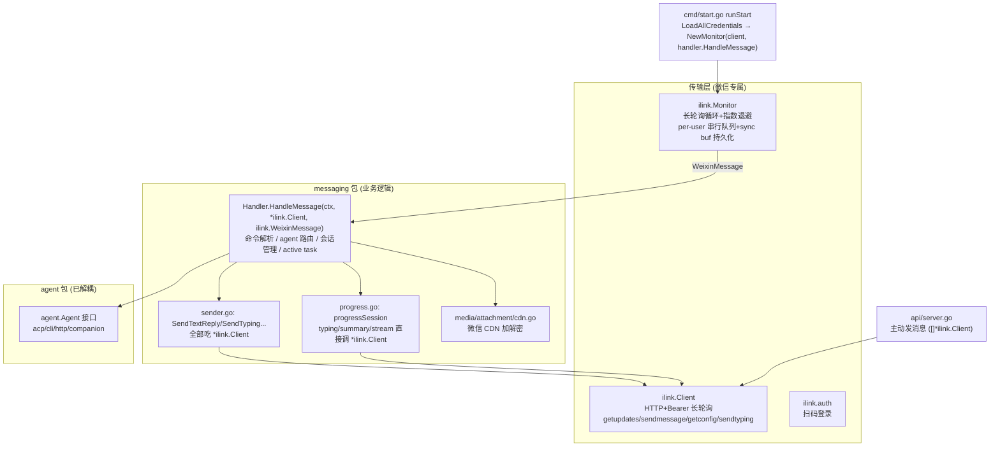
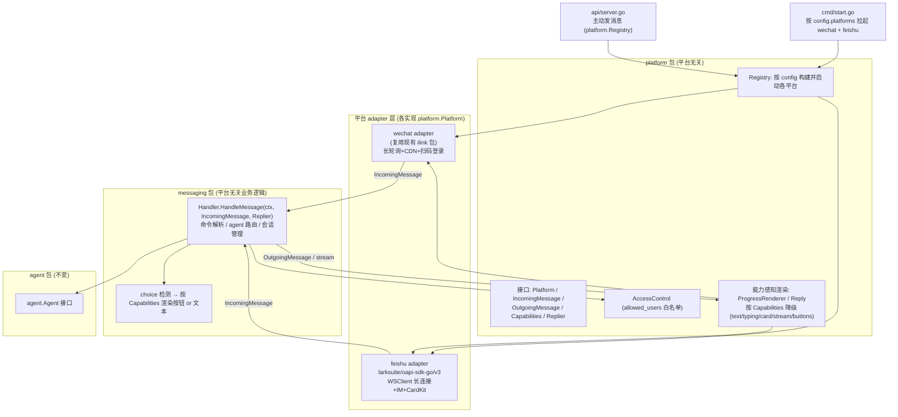
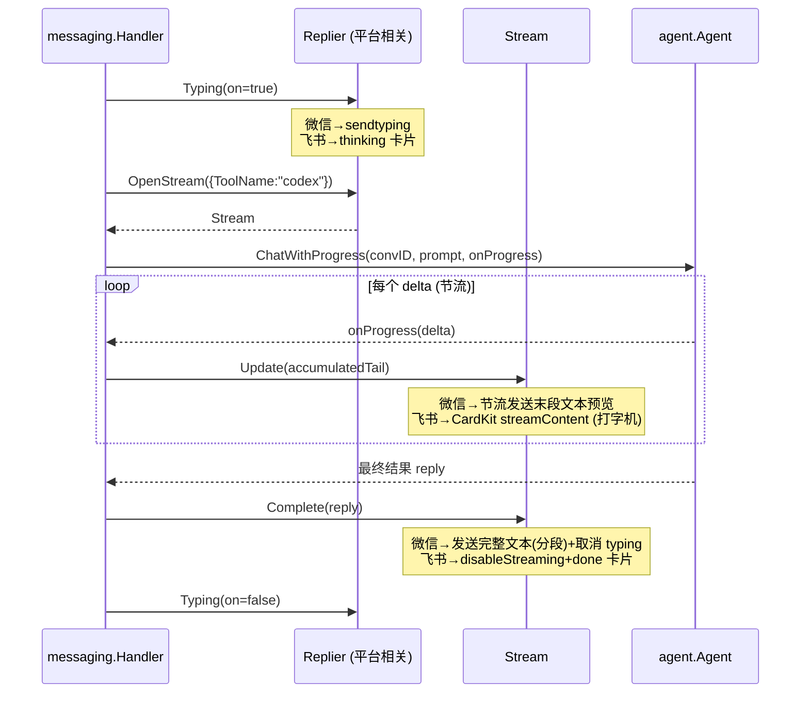
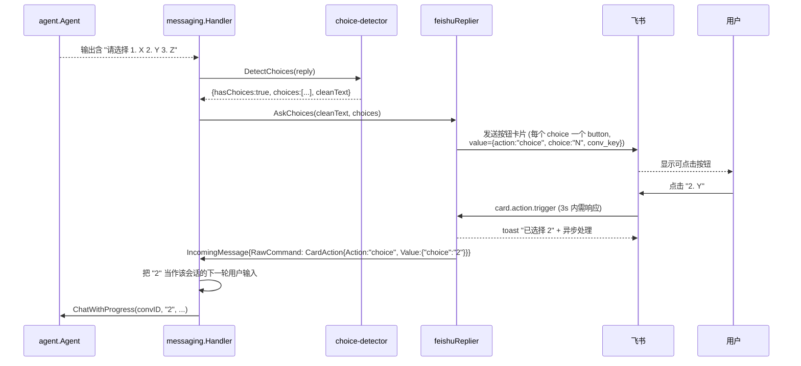
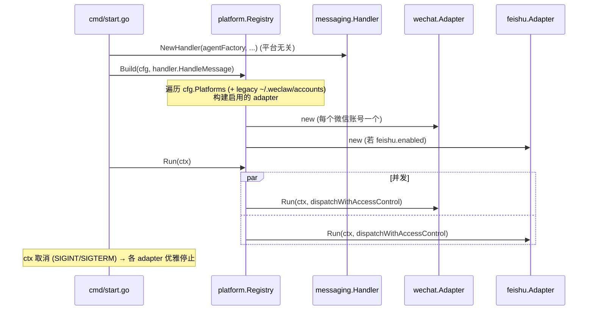

# Design Document: Multi-Platform Bridge with Feishu (Lark) Support

## Overview

weclaw 目前是一个把**微信**桥接到 AI 编程 agent（Codex / Claude / Gemini 等）的 Go 服务。它的传输层（`ilink` 包，基于微信 iLink 的 HTTP 长轮询）与核心业务逻辑（`messaging` 包）深度耦合：`messaging.Handler.HandleMessage` 直接消费 `*ilink.Client` 与 `ilink.WeixinMessage`，`messaging/sender.go` 与 `messaging/progress.go` 也全部直接调用 `*ilink.Client`。这种耦合使得新增任何非微信平台都需要侵入式改造核心逻辑。

本设计引入**平台抽象层**（`platform` 包），把"传输层（如何收发字节、维持连接）"与"messaging 业务逻辑（命令解析、agent 路由、会话管理、进度反馈）"解耦。`ilink` 被重构为该抽象的一个 adapter（微信平台），随后新增 `feishu` adapter，一步到位支持飞书的**卡片（card）/ 流式（streaming）/ 交互按钮（buttons）**富交互能力。同时借鉴参考项目 open-im（TypeScript 多平台 IM 桥接）中微信实现（ClawBot）的工程经验，对 weclaw 微信接入做针对性增强（连接看门狗、回显过滤、消息聚合、访问控制等）。

本设计同时给出**高层设计（HLD：架构图、平台抽象接口、组件与数据模型、能力协商）**与**低层设计（LLD：关键 Go 接口签名、飞书 SDK 调用伪代码、CardKit 流式与按钮回调端到端伪代码）**，目标是让实现者（Codex）能据此直接拆解任务并落地，且**阶段 1（抽象重构）保证微信行为零回归**——现有测试必须全部通过。

> 说明：本文档为**纯规划文档**，不修改任何现有代码。所有代码块均为目标设计的示意（signatures + pseudocode），用于驱动后续 requirements 与 tasks 生成。

---

## 现状架构（As-Is）



**关键痛点**
- `messaging` 对 `ilink` 是**编译期硬依赖**：`HandleMessage`、`sender.go`、`progress.go` 的签名里到处是 `*ilink.Client` / `ilink.WeixinMessage`。
- 没有"平台"维度的概念：配置（`config.Config`）、启动（`cmd/start.go`）、主动发消息 API（`api/server.go`）都假设只有微信。
- 没有任何**访问控制**：任何能给 bot 发消息的人都能驱动拥有 shell 权限的 AI agent（重大安全缺口）。
- 进度/渲染逻辑（`progress.go`）写死了微信能力模型（只有 typing + 文本气泡 + 分段），无法表达飞书的卡片/流式/按钮。

---

## Architecture

> 目标架构 To-Be



**核心思想**
- `messaging.Handler` 不再认识 `ilink`，改为依赖 `platform` 包定义的抽象接口（`IncomingMessage` + `Replier`/`Capabilities`）。
- `ilink` 退化为 `wechat` adapter 的内部实现；新增 `feishu` adapter。两者都实现统一的 `platform.Platform` 接口。
- 进度/渲染逻辑改为**能力感知（capability-aware）**：相同的 progress 模式（off/typing/summary/stream）在不同平台映射到各自能力，飞书可用卡片流式，微信退化为 typing + 文本气泡。
- 访问控制、请求队列、配置热重载等横切能力提到平台无关共享层（借鉴 open-im 的 `create-event-context` / `handle-text-flow`）。

---

## Components and Interfaces

> 平台抽象层设计 HLD + LLD

新增 `platform` 包，定义平台无关的核心抽象。设计原则：**接口在 `platform` 包，adapter 在各自包（`wechat`/`feishu`），`messaging` 只依赖 `platform`**，从而打破 `messaging → ilink` 的硬依赖（避免循环依赖：`platform` 不 import `messaging`，`messaging` import `platform`）。

### 组件职责

| 组件 | 包 | 职责 |
|------|-----|------|
| `Platform` | `platform` | 一个平台实例的生命周期：启动监听、停止、上报能力、构造 Replier |
| `IncomingMessage` | `platform` | 平台无关的入站消息（取代 `ilink.WeixinMessage`） |
| `OutgoingReply` | `platform` | 平台无关的出站回复内容（文本/图片/选择项） |
| `Replier` | `platform` | 针对单条入站消息的回复句柄（取代散落的 `*ilink.Client` 调用） |
| `Capabilities` | `platform` | 平台能力声明（text/typing/image/card/streaming/buttons） |
| `Registry` | `platform` | 按配置构建/启动/停止全部启用平台 |
| `AccessControl` | `platform` | allowed_users 白名单校验 |
| `wechat.Adapter` | `wechat`（原 `ilink`） | 实现 `Platform`，内部复用现有长轮询/CDN/扫码 |
| `feishu.Adapter` | `feishu` | 实现 `Platform`，基于 lark SDK 长连接 + IM + CardKit |

### 核心接口（LLD：关键签名）

```go
// platform/platform.go
package platform

import "context"

// PlatformName 标识一个平台类型。
type PlatformName string

const (
    PlatformWeChat PlatformName = "wechat"
    PlatformFeishu PlatformName = "feishu"
)

// Platform 是一个平台 adapter 的抽象。每个启用的平台账号对应一个实例。
type Platform interface {
    // Name 返回平台类型，用于日志、路由 key 命名空间、按平台取配置。
    Name() PlatformName

    // AccountID 返回该平台账号的稳定标识 (微信=ilink_bot_id, 飞书=app_id)。
    AccountID() string

    // Capabilities 声明该平台支持的富交互能力，供 messaging 做能力降级。
    Capabilities() Capabilities

    // Run 启动入站消息监听循环，阻塞直到 ctx 取消或致命错误。
    // adapter 内部负责重连/退避/看门狗；每条入站消息通过 dispatch 回调上报。
    Run(ctx context.Context, dispatch DispatchFunc) error
}

// DispatchFunc 由 messaging 提供：每条入站消息 + 对应 Replier 回调进来。
type DispatchFunc func(ctx context.Context, msg IncomingMessage, reply Replier)

// Capabilities 描述平台能力。messaging 据此把统一的进度/渲染意图降级到具体能力。
type Capabilities struct {
    Text        bool // 文本气泡
    Typing      bool // typing 指示 (微信 sendtyping / 飞书 typing)
    Image       bool // 发送图片
    File        bool // 发送文件
    Card        bool // 富文本卡片
    Streaming   bool // 卡片内容增量更新 (飞书 CardKit)
    Buttons     bool // 交互按钮 (飞书 card.action / Telegram inline keyboard)
    LongText    bool // 是否需要分段 (微信需要, 飞书卡片不需要)
}
```

```go
// platform/message.go
package platform

// IncomingMessage 是平台无关的入站消息。取代 ilink.WeixinMessage。
type IncomingMessage struct {
    Platform     PlatformName  // 来源平台
    AccountID    string        // 接收此消息的 bot 账号 (微信 bot_id / 飞书 app_id)
    UserID       string        // 平台内用户标识 (微信 from_user_id / 飞书 open_id)
    ChatID       string        // 会话标识 (微信=UserID; 飞书=chat_id, 支持群聊)
    MessageID    string        // 平台消息 ID, 用于去重 (统一为 string)
    Text         string        // 已抽取/清洗后的文本 (含语音转写/富文本展开)
    Attachments  []Attachment  // 图片/文件/语音等附件 (已下载到本地的路径)
    ReplyToID    string        // 被回复的消息 ID (飞书需要; 微信留空)
    ContextToken string        // 平台回包所需的不透明 token (微信 context_token; 飞书可空)
    RawCommand   *CardAction   // 非空表示这是一次卡片按钮回调而非普通消息
    ReceivedAt   time.Time
}

// Attachment 表示一个已落地到本地的入站附件。
type Attachment struct {
    Kind      AttachmentKind // image / file / voice / video
    LocalPath string
    FileName  string
    MIME      string
}

// CardAction 表示一次卡片交互回调 (飞书 card.action.trigger)。
type CardAction struct {
    CardID string            // 触发回调的卡片实例 ID
    Action string            // "choice" / "stop" 等
    Value  map[string]string // 例如 {"choice": "2"}
}

// ConversationKey 返回跨平台唯一的会话路由 key 前缀片段。
// 关键: 加入 Platform 命名空间, 避免不同平台 UserID 冲突。
func (m IncomingMessage) ConversationKey() string {
    return string(m.Platform) + ":" + m.UserID
}
```

```go
// platform/reply.go
package platform

// Replier 是针对"某条入站消息所在会话"的回复句柄。
// 它封装了平台细节 (微信的 client+context_token+client_id; 飞书的 chat_id+card 实例),
// messaging 只面向意图编程, 不再直接持有 *ilink.Client。
type Replier interface {
    // Capabilities 透传所属平台能力 (与 Platform.Capabilities 一致), 便于就地降级。
    Capabilities() Capabilities

    // SendText 发送一条文本回复。adapter 内部负责 markdown→平台格式、必要时分段。
    SendText(ctx context.Context, text string) error

    // SendImage 发送一张本地图片 (能力不支持时返回 ErrUnsupported)。
    SendImage(ctx context.Context, localPath string) error

    // Typing 开启/关闭 typing 指示 (能力不支持时为 no-op)。
    Typing(ctx context.Context, on bool) error

    // OpenStream 开启一个流式渲染句柄 (飞书=CardKit 卡片; 微信=降级为 typing+末段文本)。
    // 返回的 Stream 在 messaging 进度循环中被增量更新, 最终 Close。
    OpenStream(ctx context.Context, opts StreamOptions) (Stream, error)

    // AskChoices 渲染一组可点击选项 (飞书=按钮卡片; 微信=降级为编号文本)。
    // 飞书按钮点击后会以 IncomingMessage{RawCommand:CardAction} 回流。
    AskChoices(ctx context.Context, prompt string, choices []Choice) error
}

// Stream 表示一次进行中的流式输出 (打字机效果)。
type Stream interface {
    // Update 增量更新当前内容 (adapter 内部节流; 飞书 CardKit streamContent)。
    Update(ctx context.Context, content string) error
    // Complete 以最终内容收尾并关闭流 (飞书=disableStreaming+全量更新为 done 卡片)。
    Complete(ctx context.Context, finalContent string) error
    // Fail 以错误状态收尾 (飞书=error 卡片; 微信=文本)。
    Fail(ctx context.Context, errText string) error
}

type StreamOptions struct {
    ToolName string // 用于卡片标题, 如 "codex"/"claude"
    Title    string
}

type Choice struct {
    Number int    // 1..9
    Text   string // 选项文本
}

// ErrUnsupported 表示当前平台不支持该能力, 调用方应降级处理。
var ErrUnsupported = errors.New("platform: capability unsupported")
```

### messaging 的迁移：从 `*ilink.Client` 到抽象接口

当前 `HandleMessage(ctx, *ilink.Client, ilink.WeixinMessage)` 改为：

```go
// messaging/handler.go (目标签名)
func (h *Handler) HandleMessage(ctx context.Context, msg platform.IncomingMessage, reply platform.Replier)
```

迁移要点（**保证微信零回归**）：

1. **去除字段直取**：`msg.FromUserID` → `msg.UserID`；`msg.ContextToken` 由 `Replier` 内部持有，不再在业务层传递。文本抽取（`extractText`/`extractVoiceText`/`extractFile`/`extractImage`）从 `HandleMessage` 上移到 **adapter**，adapter 产出已清洗的 `IncomingMessage.Text` 与 `Attachments`。
2. **sender.go 收敛进 Replier**：`SendTextReply` / `SendTypingState` / `SendTextReplyChunks` 的 markdown→纯文本、微信换行适配（`FormatTextForWeChatDisplay`）、长消息分段（`splitTextReplyChunks`）逻辑下沉到 **wechat adapter 的 Replier 实现**。微信的 1800 runes 分段、`MarkdownToPlainText` 行为完整保留在 wechat 包内，因此现有 `sender` 相关测试迁移到 wechat adapter 后仍应通过。
3. **progress.go 改用 Replier/Stream**：`progressSession` 不再直接调用 `SendTypingState` / `sendProgressMessage`（吃 `*ilink.Client`），改为调用 `reply.Typing(...)` 与 `reply.OpenStream(...)→Stream.Update`。微信能力下 `Stream` 退化为"typing 心跳 + 周期性末段文本预览"，与现有 `progress.go` 行为等价（`progress_test.go` 的语义保持）。
4. **conversationID 加平台维度**：`buildCodexConversationID(userID, agentName, workspaceRoot)` / `buildClaudeConversationID(...)` / `codexBindingKey(userID, agentName)` 的 `userID` 入参统一替换为 `msg.ConversationKey()`（即 `"wechat:"+UserID`）。**迁移兼容**：微信单平台时为避免已持久化会话失效，提供一次性迁移——读取旧 `codex-sessions.json`/`claude-sessions.json` 时把无前缀的 key 视为 `wechat:` 前缀（见"数据模型/会话迁移"）。
5. **api/server.go**：从持有 `[]*ilink.Client` 改为持有 `platform.Registry`，主动发消息按 `(platform, accountID, chatID)` 定位 adapter 并构造 Replier。

### wechat adapter（原 ilink 的重构）

```go
// wechat/adapter.go
package wechat

// Adapter 实现 platform.Platform, 内部复用现有 ilink.Client / Monitor 逻辑。
type Adapter struct {
    client  *ilinkClient   // 原 ilink.Client (可保留在 wechat 包内部或保留 ilink 包被 wechat 引用)
    monitor *monitor       // 原 ilink.Monitor + 新增看门狗
    creds   Credentials
}

func (a *Adapter) Name() platform.PlatformName { return platform.PlatformWeChat }
func (a *Adapter) AccountID() string           { return a.creds.ILinkBotID }

func (a *Adapter) Capabilities() platform.Capabilities {
    return platform.Capabilities{
        Text: true, Typing: true, Image: true, File: true,
        Card: false, Streaming: false, Buttons: false,
        LongText: true, // 需要分段
    }
}

func (a *Adapter) Run(ctx context.Context, dispatch platform.DispatchFunc) error {
    // 复用现有 Monitor 的长轮询循环 + 指数退避 + per-user 串行队列 + sync buf 持久化。
    // 内部把 ilink.WeixinMessage 转换为 platform.IncomingMessage, 并构造 wechatReplier。
    return a.monitor.Run(ctx, func(c context.Context, m ilinkMessage) {
        in := toIncomingMessage(a, m)        // 文本抽取/语音转写/附件下载在此完成
        if in.skip { return }                // 回显过滤等 (见微信优化小节)
        r := newWeChatReplier(a.client, m.FromUserID, m.ContextToken)
        dispatch(c, in, r)
    })
}
```

```go
// wechat/replier.go — 把原 messaging/sender.go 的微信逻辑收进来
type weChatReplier struct {
    client       *ilinkClient
    userID       string
    contextToken string
    clientID     string // 每条回复一个, 用于 typing→finish 关联
}

func (r *weChatReplier) Capabilities() platform.Capabilities { /* 同 Adapter */ }

func (r *weChatReplier) SendText(ctx context.Context, text string) error {
    // 原 SendTextReply 行为: MarkdownToPlainText → FormatTextForWeChatDisplay → 分段 → 逐条发送
    plain := MarkdownToPlainText(text)
    display := formatForWeChatDisplay(plain)
    for _, chunk := range splitChunks(display, defaultChunkRunes) {
        if err := r.sendPlainText(ctx, chunk); err != nil { return err }
    }
    return nil
}

func (r *weChatReplier) Typing(ctx context.Context, on bool) error {
    if on { return sendTypingState(ctx, r.client, r.userID, r.contextToken) }
    return sendTypingCancel(ctx, r.client, r.userID, r.contextToken)
}

func (r *weChatReplier) OpenStream(ctx context.Context, opts platform.StreamOptions) (platform.Stream, error) {
    // 微信无 CardKit: 返回降级 Stream —— Update 只维持 typing 心跳并按节流发送末段文本预览,
    // Complete 发送最终完整文本(分段)。等价于现有 progress stream 模式。
    return newWeChatDegradedStream(r), nil
}

func (r *weChatReplier) AskChoices(ctx context.Context, prompt string, choices []platform.Choice) error {
    // 微信无按钮: 降级为编号文本 "1. ...\n2. ...", 用户回复数字即下一轮输入。
    return r.SendText(ctx, renderChoicesAsText(prompt, choices))
}
```

> 说明：是否保留独立的 `ilink` 包还是整体并入 `wechat` 包，是实现细节。推荐保留 `ilink`（纯传输/CDN/扫码，已有测试），新增 `wechat` 包作为 `ilink → platform.Platform` 的适配壳，微信业务格式化逻辑（原 sender.go）随之并入 `wechat`。这样 `ilink/monitor_test.go` 等底层测试不受影响。

---

## 能力协商与进度/渲染抽象（HLD + LLD）

不同平台能力差异显著：

| 能力 | 微信 (wechat) | 飞书 (feishu) |
|------|--------------|--------------|
| 文本 Text | ✅ | ✅ |
| typing | ✅ (sendtyping) | ✅ (typing 占位卡片/状态) |
| 图片 Image | ✅ (CDN 加密上传) | ✅ (im resource) |
| 卡片 Card | ❌ | ✅ (CardKit 2.0) |
| 流式 Streaming | ❌ (降级 typing+末段文本) | ✅ (CardKit streamContent) |
| 按钮 Buttons | ❌ (降级编号文本) | ✅ (card.action.trigger) |
| 长文分段 LongText | ✅ (1800 runes 分段) | ❌ (卡片无需分段) |

### 统一进度模式 → 平台能力映射

现有进度模式（`progress.go`）：`off / typing / summary / verbose / stream / debug`。在多平台下，这些模式表达的是**意图**，由 Replier/Stream 按 `Capabilities` 落地：



**模式落地规则**

| 模式 | 微信落地 | 飞书落地 |
|------|---------|---------|
| `off` | 不发任何进度，只发最终结果 | 同左（仍用普通文本/单卡片发最终结果） |
| `typing` | typing 心跳，最终发完整文本 | thinking 卡片，最终替换为 done 卡片 |
| `summary` | 周期性阶段提示文本 | 卡片 note 区域周期性更新 |
| `stream` | typing + 节流末段文本预览 | CardKit 打字机增量更新（原生流式） |
| `verbose`/`debug` | 同 summary，更频繁 | 卡片 + 更频繁 note 更新 |

关键不变量：**无论平台能力如何，最终完整结果必须送达**（流式只是过程增强，不能丢失最终态）。这条对应一条核心 Correctness Property（见下）。

### 能力降级的实现位置

降级**只在 adapter 的 Replier/Stream 内部发生**，`messaging` 永远面向全能力意图编程。这样新增平台时 `messaging` 零改动。`messaging` 仅在一处显式查询能力：**choice 渲染**（按钮 vs 文本），因为这关系到后续输入回流路径是否一致（见交互按钮端到端流程）。

```go
// messaging 侧的能力使用 (唯一需要分支的地方)
func (h *Handler) presentChoices(ctx context.Context, reply platform.Replier, prompt string, choices []platform.Choice) error {
    // AskChoices 内部已按能力降级; messaging 不需要 if cap.Buttons。
    // 即便降级为文本, 用户回复数字也会作为普通 IncomingMessage 进入下一轮 —— 路径统一。
    return reply.AskChoices(ctx, prompt, choices)
}
```

---

## 飞书平台实现（HLD + LLD）

### 依赖与鉴权

- Go SDK：`github.com/larksuite/oapi-sdk-go/v3`（需 `go get` 加入 `go.mod`，go 1.25）。
  - `larkcore` / `lark`：核心 client（`app_id` + `app_secret`，SDK 内部维护 tenant_access_token 缓存与刷新）。
  - `larkws`：长连接 `WSClient`（免公网 webhook，开发者后台需开启"使用长连接接收事件"）。
  - `larkim` (`service/im/v1`)：收发消息、下载资源（`messageResource.get`）。
  - `larkcardkit` (`service/cardkit/v1`)：卡片创建/流式更新/设置（CardKit 2.0）。
- 鉴权与微信完全不同：**不是扫码**，而是 `app_id`/`app_secret`。需要独立的配置入口（CLI 命令），不复用微信的 `login` 扫码流程。

### feishu 包结构

```
feishu/
  adapter.go        // Adapter: 实现 platform.Platform; 持有 lark.Client + larkws.Client
  events.go         // 事件分发: im.message.receive_v1 / card.action.trigger → DispatchFunc
  incoming.go       // 飞书事件 → platform.IncomingMessage (文本清洗/post 富文本展开/资源下载)
  replier.go        // feishuReplier: 实现 platform.Replier (文本/图片/typing/OpenStream/AskChoices)
  card.go           // 卡片 JSON 构建 (buildCardV2: processing/thinking/streaming/done/error)
  cardkit.go        // CardKit 会话管理: create/enableStreaming/streamContent/disable/destroy (节流)
  stream.go         // feishuStream: 实现 platform.Stream, 包装 cardkit 会话
  choice.go         // 选项 → 按钮卡片元素; card.action value → CardAction
  permission.go     // 权限错误码识别 + 友好引导 (im:message / send_as_bot / im:resource / im:chat / cardkit:card)
  config.go         // 飞书凭证读写 (~/.weclaw/platforms/feishu.json)
```

### 所需权限（开发者后台开通后发布版本）

| scope | 用途 |
|-------|------|
| `im:message` | 收发单聊/群聊消息 |
| `im:message:send_as_bot` | 以应用身份发消息 |
| `im:resource` | 下载/上传图片文件资源 |
| `im:chat` | 获取群组信息 |
| `cardkit:card`（可选但本特性必需） | CardKit 卡片管理（流式打字机/按钮） |

权限不足时，借鉴 open-im `permission.ts` / `formatFeishuInitError`：识别错误码（`99991400/99991401/99991663/99991672/99991670/99991668` 等），输出指向 `https://open.feishu.cn/app/{appId}/permission` 的引导，并尽力通过卡片→纯文本降级把指引发到聊天。

### 长连接 + 事件分发（LLD 伪代码）

```go
// feishu/adapter.go
func (a *Adapter) Run(ctx context.Context, dispatch platform.DispatchFunc) error {
    // 1. 构建核心 client (token 由 SDK 缓存/刷新)
    a.api = lark.NewClient(a.cfg.AppID, a.cfg.AppSecret)

    // 2. 启动校验凭证 + 输出权限引导
    if err := a.validateCredentials(ctx); err != nil {
        log.Printf(formatFeishuInitError(err)) // 权限不足时给出开通引导
        return err
    }
    logPermissionGuide(a.cfg.AppID)

    // 3. 注册事件分发器
    handler := dispatcher.NewEventDispatcher("", "").
        OnP2MessageReceiveV1(func(c context.Context, e *larkim.P2MessageReceiveV1) error {
            in, ok := a.toIncomingFromMessage(c, e) // 文本清洗/post 展开/资源下载
            if !ok { return nil }                    // 访问控制在 messaging 层统一做
            r := a.newReplier(in.ChatID, in.ReplyToID)
            dispatch(c, in, r)
            return nil
        }).
        OnP2CardActionTrigger(func(c context.Context, e *larkcard.P2CardActionTrigger) (*larkcard.P2CardActionTriggerResponse, error) {
            // 卡片按钮点击: 3 秒内必须返回 (同步只返回 toast, 避免超时 200672)
            in, toast := a.toIncomingFromCardAction(c, e) // RawCommand=CardAction{choice/stop}
            r := a.newReplier(in.ChatID, "")
            go dispatch(c, in, r)                          // 异步处理实际逻辑
            return toastResponse(toast), nil               // 立即回 toast
        })

    // 4. 启动长连接, 阻塞直到 ctx 取消; 内部自动重连
    a.ws = larkws.NewClient(a.cfg.AppID, a.cfg.AppSecret, larkws.WithEventHandler(handler))
    return a.ws.Start(ctx)
}
```

### 收消息（含资源下载，LLD 伪代码）

```go
// feishu/incoming.go
func (a *Adapter) toIncomingFromMessage(ctx context.Context, e *larkim.P2MessageReceiveV1) (platform.IncomingMessage, bool) {
    msg := e.Event.Message
    senderOpenID := e.Event.Sender.SenderId.OpenId
    if senderOpenID == "" { return platform.IncomingMessage{}, false }

    in := platform.IncomingMessage{
        Platform:  platform.PlatformFeishu,
        AccountID: a.cfg.AppID,
        UserID:    *senderOpenID,
        ChatID:    *msg.ChatId,
        MessageID: *msg.MessageId,
        ReplyToID: *msg.MessageId,
        ReceivedAt: time.Now(),
    }

    switch *msg.MessageType {
    case "text":
        // content 形如 {"text":"..."}; 可能含 <p>/<br>/&nbsp;, 做轻量清洗 (保留中间空格)
        in.Text = cleanFeishuText(parseTextContent(*msg.Content))
    case "post":
        in.Text = extractPostPlainText(*msg.Content) // 富文本二维数组 → 纯文本
    case "image":
        path := a.downloadResource(ctx, *msg.MessageId, imageKey(*msg.Content), "image")
        in.Attachments = append(in.Attachments, platform.Attachment{Kind: KindImage, LocalPath: path})
    case "file", "audio", "media":
        path := a.downloadResource(ctx, *msg.MessageId, fileKey(*msg.Content), "file")
        in.Attachments = append(in.Attachments, platform.Attachment{Kind: KindFile, LocalPath: path})
    }
    return in, true
}

func (a *Adapter) downloadResource(ctx context.Context, messageID, fileKey, typ string) string {
    // larkim.NewGetMessageResourceReqBuilder().MessageId(messageID).FileKey(fileKey).Type(typ)
    resp, _ := a.api.Im.MessageResource.Get(ctx, req)
    target := mediaTargetPath(typ, fileKey)
    resp.WriteFile(target) // SDK 提供 WriteFile
    return target
}
```

### 发消息 / typing（LLD 伪代码）

```go
// feishu/replier.go
func (r *feishuReplier) SendText(ctx context.Context, text string) error {
    // 飞书无需像微信那样硬分段; 但单条上限 (~30KB) 仍需保护: 超长时拆为多条。
    for _, chunk := range splitLongContent(text, maxFeishuMessageLen) {
        body := larkim.NewCreateMessageReqBodyBuilder().
            ReceiveId(r.chatID).
            MsgType("text").
            Content(`{"text":` + jsonQuote(chunk) + `}`).
            Build()
        req := larkim.NewCreateMessageReqBuilder().
            ReceiveIdType("chat_id").Body(body).Build()
        if _, err := r.api.Im.Message.Create(ctx, req); err != nil {
            return mapPermissionError(err) // 权限不足→引导
        }
    }
    return nil
}

func (r *feishuReplier) Typing(ctx context.Context, on bool) error {
    // 飞书没有微信式持续 typing API。策略: 用 thinking 卡片占位代替 typing,
    // 由 OpenStream 统一管理 (典型流程是 stream 模式直接走 CardKit)。
    // 在 off/typing 模式下可发送/更新一个轻量 "处理中" 卡片; on=false 时无操作。
    return nil
}

func (r *feishuReplier) SendImage(ctx context.Context, localPath string) error {
    // 1. im.image.create 上传得 image_key  2. 发送 msg_type=image
}
```

### CardKit 流式更新（LLD 伪代码，节流）

CardKit 会话状态机：`create → enableStreaming → streamContent*(节流) → (disableStreaming + 全量 done 卡片) → destroy`。节流间隔 `cardkitThrottleMs`（默认 ~500ms，借鉴 open-im `CARDKIT_THROTTLE_MS`），并对常见限流/状态码做静默忽略与重启流式（参考 open-im `cardkit-manager.ts` 的 code 处理：`200810/300317/200400/200937/200740` 忽略，`200850/300309` 重新 enableStreaming）。

```go
// feishu/stream.go
type feishuStream struct {
    api        *lark.Client
    chatID     string
    cardID     string
    seq        int           // 单调递增 sequence
    toolName   string
    lastUpdate time.Time
    throttle   time.Duration
    mu         sync.Mutex
}

func (r *feishuReplier) OpenStream(ctx context.Context, opts platform.StreamOptions) (platform.Stream, error) {
    cardJSON := buildCardV2(cardOptions{Status: "thinking", ToolName: opts.ToolName, Content: "…"})
    cardID, err := cardkitCreate(ctx, r.api, cardJSON) // cardkit.v1.card.create -> card_id
    if err != nil { return nil, err }
    if _, err := sendCardMessage(ctx, r.api, r.chatID, cardID); err != nil { return nil, err }
    cardkitEnableStreaming(ctx, r.api, cardID)         // settings streaming_mode=true
    return &feishuStream{api: r.api, chatID: r.chatID, cardID: cardID, toolName: opts.ToolName, throttle: cardkitThrottle}, nil
}

func (s *feishuStream) Update(ctx context.Context, content string) error {
    s.mu.Lock(); defer s.mu.Unlock()
    if time.Since(s.lastUpdate) < s.throttle { return nil } // 节流
    s.seq++
    err := cardkitStreamContent(ctx, s.api, s.cardID, "main_content", truncateForStreaming(content), s.seq)
    // err 中的 200850/300309 → 重新 enableStreaming 后重试一次; 其余限流码静默忽略
    s.lastUpdate = time.Now()
    return ignoreThrottleCodes(err)
}

func (s *feishuStream) Complete(ctx context.Context, finalContent string) error {
    s.mu.Lock(); defer s.mu.Unlock()
    cardkitDisableStreaming(ctx, s.api, s.cardID)
    s.seq++
    cardJSON := buildCardV2(cardOptions{Status: "done", ToolName: s.toolName, Content: finalContent})
    err := cardkitUpdateFull(ctx, s.api, s.cardID, cardJSON, s.seq) // 全量更新为 done 卡片
    cardkitDestroy(s.cardID)
    return err
}

func (s *feishuStream) Fail(ctx context.Context, errText string) error {
    cardkitDisableStreaming(ctx, s.api, s.cardID)
    s.seq++
    cardJSON := buildCardV2(cardOptions{Status: "error", ToolName: s.toolName, Content: errText})
    err := cardkitUpdateFull(ctx, s.api, s.cardID, cardJSON, s.seq)
    cardkitDestroy(s.cardID)
    return err
}
```

### 交互按钮端到端流程（LLD：检测 → 渲染 → 回调 → 注入下一轮输入）

这是飞书相对微信的关键增益。完整链路：



```go
// feishu/choice.go
func buildChoiceCard(prompt string, choices []platform.Choice, convKey string) string {
    // CardKit/卡片 JSON: 文本元素(prompt) + 每个 choice 一个 button:
    //   value = {"action":"choice","choice":"<N>","conv":"<convKey>"}
    // convKey 用于回调时定位会话 (= IncomingMessage.ConversationKey())
}

// card.action.trigger → CardAction
func parseCardAction(e *larkcard.P2CardActionTrigger) platform.CardAction {
    v := e.Event.Action.Value // map[string]interface{}
    return platform.CardAction{
        CardID: *e.Event.CardId,
        Action: str(v["action"]),
        Value:  map[string]string{"choice": str(v["choice"]), "conv": str(v["conv"])},
    }
}
```

```go
// messaging/handler.go: 在 HandleMessage 入口识别按钮回调
func (h *Handler) HandleMessage(ctx context.Context, msg platform.IncomingMessage, reply platform.Replier) {
    if msg.RawCommand != nil {
        switch msg.RawCommand.Action {
        case "choice":
            // 把选择编号当作普通文本输入, 复用既有 agent 路由
            msg.Text = msg.RawCommand.Value["choice"]
        case "stop":
            h.cancelActiveTask(msg.ConversationKey()) // 复用 active task 取消机制
            return
        }
    }
    // ... 既有命令解析 / agent 路由 ...
}
```

> 关键设计：无论按钮（飞书）还是降级编号文本（微信），**选择结果都以"普通用户输入"形态回到同一条 agent 路由路径**，因此 choice 行为跨平台一致，messaging 无需为按钮单开分支（除了入口处把 CardAction 归一化为文本）。

---

## 配置模型演进（HLD + LLD）

### 现状

- `config.Config{ DefaultAgent, APIAddr, APIToken, SaveDir, Progress, Agents }`，无平台维度。
- 微信凭证存放在 `~/.weclaw/accounts/{botID}.json`（由 `ilink.SaveCredentials` / `LoadAllCredentials` 管理），与 `config.json` 分离。

### 目标：新增 `platforms` 配置维度

```go
// config/config.go (新增字段, 向后兼容)
type Config struct {
    DefaultAgent string                    `json:"default_agent"`
    APIAddr      string                    `json:"api_addr,omitempty"`
    APIToken     string                    `json:"api_token,omitempty"`
    SaveDir      string                    `json:"save_dir,omitempty"`
    Progress     ProgressConfig            `json:"progress,omitempty"`
    Agents       map[string]AgentConfig    `json:"agents"`
    Platforms    map[string]PlatformConfig `json:"platforms,omitempty"` // 新增, key = "wechat"/"feishu"
}

// PlatformConfig 每平台通用配置。
type PlatformConfig struct {
    Enabled      bool            `json:"enabled"`
    AllowedUsers []string        `json:"allowed_users,omitempty"` // 白名单 (空=拒绝所有? 见安全决策)
    DefaultAgent string          `json:"default_agent,omitempty"` // 覆盖全局 default_agent
    Progress     *ProgressConfig `json:"progress,omitempty"`      // 覆盖全局/agent progress
    // 凭证: 微信凭证仍在 ~/.weclaw/accounts/; 飞书凭证见下 (不放明文进 config.json)
}
```

飞书凭证单独存储，避免把 `app_secret` 明文写进可能被分享的 `config.json`：

```go
// feishu/config.go — 存于 ~/.weclaw/platforms/feishu.json (0600)
type FeishuCredentials struct {
    AppID     string `json:"app_id"`
    AppSecret string `json:"app_secret"`
}
// 也支持环境变量覆盖: WECLAW_FEISHU_APP_ID / WECLAW_FEISHU_APP_SECRET
```

### 兼容/迁移策略

1. **零配置兼容**：`platforms` 缺省时，行为等同"仅 wechat 启用"——读取 `~/.weclaw/accounts/` 下所有微信账号，沿用现有 `Progress`/`DefaultAgent`。现有用户升级后无需改任何配置。
2. **凭证位置不变**：微信凭证继续放 `~/.weclaw/accounts/`；飞书凭证放 `~/.weclaw/platforms/feishu.json`。
3. **progress 覆盖优先级**：`platform.progress` > `agent.progress` > 全局 `progress` > 默认。复用现有 `NormalizeProgressConfig` 的合并语义。
4. **会话 key 迁移**：见数据模型小节（旧无前缀 key → `wechat:` 前缀）。

### 飞书配置入口（CLI，区别于扫码 login）

```
weclaw feishu login --app-id <id> --app-secret <secret>   # 写入 ~/.weclaw/platforms/feishu.json, 校验凭证
weclaw feishu status                                       # 显示飞书连接/权限状态
```

`weclaw login`（扫码）保持微信专用，不变。新增 `weclaw feishu` 子命令族（`cmd/feishu.go`）。

---

## 启动流程演进（HLD + LLD）

`cmd/start.go` 的 `runStart` 从"只起微信 Monitor"演进为"按 `platforms` 配置构建 Registry，并发拉起所有启用平台"。



```go
// platform/registry.go (LLD)
type Registry struct {
    platforms []Platform
    access    map[PlatformName]*AccessControl
    dispatch  DispatchFunc // = handler.HandleMessage
}

func BuildRegistry(cfg *config.Config, dispatch DispatchFunc) (*Registry, error) {
    reg := &Registry{dispatch: dispatch, access: map[PlatformName]*AccessControl{}}

    // 微信: legacy accounts + platforms["wechat"]
    if pc, ok := platformEnabled(cfg, "wechat"); ok {
        accounts, _ := ilink.LoadAllCredentials()
        for _, c := range accounts {
            reg.platforms = append(reg.platforms, wechat.New(c))
        }
        reg.access["wechat"] = NewAccessControl(pc.AllowedUsers)
    }
    // 飞书
    if pc, ok := platformEnabled(cfg, "feishu"); ok {
        creds, err := feishu.LoadCredentials()
        if err != nil { return nil, fmt.Errorf("feishu credentials: %w", err) }
        reg.platforms = append(reg.platforms, feishu.New(creds, pc))
        reg.access["feishu"] = NewAccessControl(pc.AllowedUsers)
    }
    return reg, nil
}

func (r *Registry) Run(ctx context.Context) error {
    var wg sync.WaitGroup
    for _, p := range r.platforms {
        wg.Add(1)
        go func(p Platform) {
            defer wg.Done()
            runPlatformWithRestart(ctx, p, r.guardedDispatch(p)) // 复用现有 runMonitorWithRestart 退避策略
        }(p)
    }
    wg.Wait()
    return nil
}

// guardedDispatch 在分发前做访问控制 (所有平台统一)。
func (r *Registry) guardedDispatch(p Platform) DispatchFunc {
    ac := r.access[p.Name()]
    return func(ctx context.Context, msg IncomingMessage, reply Replier) {
        if ac != nil && !ac.Allowed(msg.UserID) {
            log.Printf("[access] denied platform=%s user=%s", msg.Platform, msg.UserID)
            return // 静默丢弃 (或可选回一句"未授权")
        }
        r.dispatch(ctx, msg, reply)
    }
}
```

**优雅关闭**：`ctx` 由 `signal.NotifyContext` 取消后，每个 adapter 的 `Run` 返回，`wg.Wait()` 解除阻塞。飞书 `WSClient` 在 ctx 取消时关闭长连接；微信 Monitor 沿用现有逻辑。daemon/PID 管理（`runDaemon`/`stopAllWeclaw`）不变。

---

## 微信优化：对 9 个借鉴点的逐条设计决策

针对用户提出的 9 个 open-im ClawBot 借鉴点，逐条给出**采纳与否 + 设计**。

### 1. 连接看门狗（Watchdog）— ✅ 采纳

**问题**：Mac 休眠/断网后 `getupdates` 的 HTTP 请求可能挂起而不报错，现有 `ilink.Monitor` 仅靠 `context` 超时（`longPollTimeout+5s`），极端情况下仍可能长时间无响应。
**设计**：在 `wechat` adapter 内新增看门狗 goroutine。Monitor 每次成功响应记录 `lastActivity`（现已有该字段）；看门狗每 `60s` 检查，若 `> 5min` 无成功响应则强制取消当前轮询 ctx 触发重连。借鉴 open-im 的 `WATCHDOG_INTERVAL_MS=60s` / `WATCHDOG_STALE_MS=5min`。
```go
func (a *Adapter) watchdog(ctx context.Context, cancelPoll context.CancelFunc) {
    t := time.NewTicker(60 * time.Second); defer t.Stop()
    for {
        select {
        case <-ctx.Done(): return
        case <-t.C:
            if time.Since(a.monitor.LastActivity()) > 5*time.Minute {
                log.Printf("[wechat] watchdog: stale >5min, forcing reconnect")
                cancelPoll() // 触发 Run 内 GetUpdates 中断 → 上层重连
            }
        }
    }
}
```

### 2. 回显过滤 — ✅ 采纳（安全相关，需验证）

**问题**：iLink 会把 bot 自己发的消息以 USER 类型回显。weclaw 现仅靠 `MessageType==User` 过滤，**不足以排除自身回显**（回显也是 User 类型）。open-im 用 `client_id` 前缀（`open-im:`）+ "机器人通知 emoji 前缀"识别跳过。
**设计**：
- weclaw 发送时已为每条回复生成 `clientID`（`NewClientID()`，当前是裸 UUID）。**改为带前缀** `weclaw:<uuid>`，入站时若 `client_id` 以 `weclaw:` 开头则跳过（在 `toIncomingMessage` 内判定，置 `skip=true`）。
- 辅助：维护最近自身发送文本的短期指纹集合（已有 `seenMsgs`/dedup 机制可借力），对带已知机器人提示 emoji 前缀的回显做二次过滤。
- **验证**：现有 `handler_test.go` 需补充"自身回显不应触发 agent"的用例。

### 3. 连续消息聚合 — ✅ 采纳（适度）

**问题**：微信把"图片+文字"拆成多条消息，逐条处理会割裂语义。open-im 聚合同一用户连续消息（合并文本 + 图片路径）再分发。
**设计**：在 `wechat` adapter 的 per-user 串行队列出口处加一个**短时间窗聚合**（默认 `800ms` 内同一用户的连续消息合并为一条 `IncomingMessage`，文本拼接、附件合并）。聚合在 adapter 内完成，`messaging` 收到的是已合并消息。**风险**：聚合窗口引入轻微延迟；命令类消息（`/status` 等）不应被聚合——以"是否为命令前缀"短路。默认窗口可配置，设为 `0` 时关闭。

### 4. 访问控制（allowedUserIds）— ✅ 强烈采纳【安全要点】

> ⚠️ **重大安全缺口**：weclaw 当前**无任何访问控制**。任何能给 bot 发消息的人都能驱动拥有 **shell 执行权限**的 AI agent（Codex/Claude 可读写文件、执行命令）。这等同于把本机 shell 暴露给任意微信/飞书联系人。

**设计**：
- 每平台 `allowed_users` 白名单（见配置模型），在 `Registry.guardedDispatch` 统一拦截，**所有平台强制生效**。
- **默认策略需明确**（一条 Correctness Property / 安全决策）：建议白名单为空时**拒绝所有**并在启动日志显著告警，引导用户配置；若为兼容老用户选择"空=放行"，必须在启动时打印醒目安全警告。推荐默认**拒绝**（fail-safe）。本决策在 requirements 阶段需与用户确认（见"开放问题"）。
- 拒绝时静默丢弃（避免被探测），仅日志记录。

### 5. 请求队列 + 队列满/排队通知 — ✅ 采纳（复用现有）

**现状**：`messaging.Handler` 已有 `taskLocks` / `activeTasks` 的 per-conversation 串行 + active task 管理。
**设计**：保留现有机制，统一到平台无关层；当同一会话已有 active task 时，给出"排队/正在处理"反馈（现有 `duplicateTaskReply` 类逻辑）。不引入额外全局并发限制器，除非 requirements 明确需要。判定 key 用 `msg.ConversationKey()`。

### 6. 配置按消息热重载 — ⚠️ 部分采纳

**问题**：open-im 每条消息重新读配置（带 mtime 缓存），切换 agent/平台配置无需重启。
**设计**：weclaw 现在启动时一次性加载 `cfg`。**采纳"带 mtime 缓存的按需重载"**用于 `default_agent` / `progress` / `allowed_users` 等**软配置**（每条消息开销近零）。**不热重载**平台凭证与"是否启用某平台"（涉及长连接生命周期，重启更安全）。这是务实折中，避免引入连接重建的复杂度。

### 7. 消息 WAL（预写日志）— ❌ 暂不采纳（记录为未来项）

**理由**：weclaw 已有 `sync buf` 持久化（`getUpdatesBuf`）保证微信侧不漏消息游标；agent 会话有自身的 thread/session 持久化。完整 WAL（处理前持久化每条消息以便崩溃恢复重放）收益相对有限，且会引入重放幂等性复杂度（重复执行 shell 命令风险）。**决策：暂不实现**，在文档中标注为未来增强；当前用 `seenMsgs` 去重 + sync buf 已覆盖主要场景。

### 8. 重连管理器（stepped backoff + fatal 慢探测）— ✅ 采纳（增强现有）

**现状**：`ilink.Monitor` 已有指数退避（`initialBackoff=3s`→`maxBackoff=60s`）和 session 过期（`errcode -14`）的 `sessionExpiredBackoff=5s` 处理。
**设计**：对齐 open-im 的 stepped backoff（`[3s,5s,10s,20s,30s]`）并明确 **fatal 慢探测模式**：当 bot token 本身失效（sync buf 已空仍持续 -14）时，进入更长的慢探测间隔（如 60s）并持续提示 `weclaw login`，而非快速空转。增强而非重写，保留现有测试语义。

### 9. context_token 持久化 — ✅ 采纳

**问题**：微信主动发消息（`api/server.go`）需要 `context_token`。当前 token 仅存在内存（`h.contextTokens sync.Map`），重启后丢失，重启后无法主动发消息直到用户再次发言。
**设计**：把每个 `(platform, user)` 最近的 `context_token` 持久化到 `~/.weclaw/accounts/{botID}.tokens.json`（微信）；启动时加载。飞书无 context_token 概念（用 `chat_id` 即可主动发），对应字段留空。这样重启后主动发消息能力得以保留。

---

## Data Models

> 数据模型

### 统一消息模型

`platform.IncomingMessage` / `platform.OutgoingReply` / `platform.Attachment` / `platform.CardAction`（已在"平台抽象层"给出）。要点：
- 所有 ID 统一为 `string`（微信 `MessageID int64` 在 adapter 内转 string；飞书原生 string）。
- 文本在 adapter 内完成抽取/清洗（语音转写、富文本展开、HTML 清洗），`messaging` 只见纯文本。
- 附件在 adapter 内完成下载落地，`messaging` 只见本地路径。

### 会话/路由 key 跨平台扩展

现有路由 key 构造（`messaging/codex_sessions.go` / `claude_sessions.go`）：

```go
// 现状
codexBindingKey(userID, agentName)                        // userID = 微信 from_user_id
buildCodexConversationID(userID, agentName, workspaceRoot)
buildClaudeConversationID(userID, agentName, workspaceRoot)
```

**目标**：把所有 `userID` 入参替换为 `msg.ConversationKey()`，即 `"<platform>:<userID>"`：

```go
// 目标: userID → platformUserKey = "wechat:U123" / "feishu:ou_abc"
codexBindingKey(platformUserKey, agentName)
buildCodexConversationID(platformUserKey, agentName, workspaceRoot)
```

这样不同平台、相同字面 userID 不会串话，且同一物理人在微信和飞书上是**独立会话**（符合直觉：不同 IM 的上下文应隔离）。

### 会话持久化迁移（零回归关键）

现有 `~/.weclaw/codex-sessions.json` / `claude-sessions.json` 中的 key 不含平台前缀。迁移策略：

```go
// 加载旧会话文件时, 把无 "<platform>:" 前缀的 binding key 视为 wechat:
func migrateLegacyKey(k string) string {
    if !strings.Contains(k, ":") || !knownPlatformPrefix(k) {
        return "wechat:" + k
    }
    return k
}
```

一次性迁移在 store 加载时完成并回写，保证老用户重启后 Codex/Claude 会话不丢失。

---

## Error Handling

> 错误处理

### 飞书权限不足
**条件**：API 返回权限错误码（`99991400` 等）。
**响应**：识别后输出指向权限设置页的引导（控制台 + 尽力发到聊天，卡片→纯文本降级），60s 冷却避免刷屏。
**恢复**：用户开通权限并发布版本后自动恢复（SDK token 缓存会刷新）。

### 飞书长连接断开
**条件**：`WSClient` 网络中断。
**响应**：SDK 内置重连；adapter 层叠加 `runPlatformWithRestart` 兜底。
**恢复**：重连成功后继续接收事件；进行中的 CardKit 会话可能失效（流式状态码 `200850/300309`），通过重新 `enableStreaming` 恢复或降级为全量更新。

### CardKit 限流/状态码
**条件**：`streamContent` 返回 `200400`（限流）/ `200810`/`300317`（卡片已完成/不存在）等。
**响应**：参考 open-im：可重试码静默忽略，`200850/300309` 重新 enableStreaming 后重试一次，超过 `MAX_REENABLE_ATTEMPTS` 放弃流式但**仍保证 Complete 全量更新最终结果**。

### 微信会话过期
**条件**：`getupdates` 返回 `errcode -14`。
**响应**：沿用现有逻辑（重置 sync buf 重连；buf 已空则提示 `weclaw login`），叠加 fatal 慢探测。

### Agent 错误
沿用现有 `friendlyAgentError`（Codex 上游 502 / WS 403 / ACP session not found 的友好提示），平台无关，不变。

### 访问控制拒绝
**条件**：`UserID` 不在白名单。
**响应**：静默丢弃 + 日志，不回复（避免暴露 bot 存在性供探测）。

---

## Testing Strategy

> 测试策略

### 单元测试

- **平台抽象 mock**：提供 `platform.Platform` / `platform.Replier` / `platform.Stream` 的 mock 实现（`platformtest` 包或 `messaging` 内 testfake），驱动 `HandleMessage` 测试命令解析/agent 路由/会话 key——**与具体平台解耦**。现有 `handler_test.go` 的 `fakeAgent` 复用，新增 `fakeReplier` 替代直接构造 `*ilink.Client`。
- **飞书事件解析单测**（`feishu/incoming_test.go`）：
  - `im.message.receive_v1` 的 text/post/image 事件 → `IncomingMessage`（含 HTML 清洗 `<p>`/`<br>`/`&nbsp;`、post 二维数组展开、open_id 抽取）。
  - `card.action.trigger` → `CardAction`（choice/stop value 解析）。
  - 权限错误码 → 引导文案（`permission_test.go`）。
- **CardKit 流式状态机单测**（`feishu/cardkit_test.go`）：节流逻辑、sequence 单调递增、状态码处理分支（用 mock client）。
- **choice 检测单测**：复用/移植 open-im `detectChoices` 的用例（"1. / 2. / 3." + 选择提示词 → hasChoices）。
- **会话 key 迁移单测**：旧无前缀 key → `wechat:` 前缀；不误伤已带前缀 key。

### 微信零回归验证

- 阶段 1 重构后，**现有全部测试必须通过**：`ilink/monitor_test.go`、`messaging/handler_test.go`、`messaging/progress_test.go`、`messaging/media_test.go`、`messaging/attachment_test.go`、`messaging/codex_sessions_test.go`、`api/server_test.go`、`cmd/start_test.go`。
- wechat adapter 的 Replier 实现需复刻 `sender.go` 行为：补充对照测试（相同输入产出相同微信分段/换行/纯文本结果）。
- `go build ./...` + `go vet ./...` + `go test ./...` 全绿作为每阶段验收门槛。

### 集成测试（手动/半自动）

- 飞书：真实 app 凭证下，端到端验证收文本→thinking 卡片→流式打字机→done 卡片；图片收发；按钮点击回流。
- 微信：真实账号下回归命令与 agent 对话、图文聚合、看门狗重连。

### 属性测试（Property-Based，可选）

**库**：`pgregory.net/rapid`（Go 生态常用 PBT 库）。候选属性：
- 文本分段：对任意文本与上限，`splitChunks` 结果拼接（去分隔）等于原文本，且每段 rune 数 ≤ 上限（不切断 UTF-8）。
- 会话 key 迁移：`migrateLegacyKey` 幂等（`migrate(migrate(k)) == migrate(k)`）。
- CardKit sequence：任意更新序列下 sequence 严格单调递增。

---

## Correctness Properties

用于驱动后续 requirements 与 PBT/示例测试。以全称量化方式表述：

### Property 1: 平台解耦不变量
对任意 `messaging` 代码路径，不存在对 `ilink`/`feishu`/`lark*` 的直接 import（`messaging` 仅依赖 `platform`）。
- 验证方式：依赖检查（`go list -deps` / 静态扫描）+ 架构测试。

### Property 2: 最终结果送达
对任意成功完成的 agent 任务，无论平台能力与进度模式如何，最终完整结果 **必定** 通过 `Replier`/`Stream.Complete` 送达用户（流式过程更新不得替代最终态）。

### Property 3: 能力降级安全
对任意 `Replier` 方法调用，若平台不支持该能力，**必定**降级为受支持能力（文本）或安全 no-op（typing），**绝不** panic 或返回未处理错误给业务层。

### Property 4: 访问控制强制
对任意入站消息，若其 `UserID` 不在该平台白名单，则 **绝不** 触达 agent 执行路径（在 `guardedDispatch` 处被拦截）。

### Property 5: 会话隔离
对任意两条平台或 UserID 不同的消息，其 `ConversationKey()` **必定** 不同 ⇒ 路由到不同 agent 会话，不串话。

### Property 6: 选择回流一致性
对任意 choice 交互，无论以按钮（飞书）还是编号文本（微信）呈现，用户的选择 **必定** 以普通文本输入形态进入同一条 agent 路由路径。

### Property 7: 去重幂等
对任意重复投递的同一 `MessageID` 入站消息，agent 任务 **至多** 被触发一次。

### Property 8: 文本分段保真
对任意文本，微信分段后各段按序拼接（剔除人为分隔）**必定**保留原始可见内容，且不切断多字节字符。

### Property 9: 微信零回归
对阶段 1 重构，所有既有测试用例的输入输出行为 **保持不变**。

---

## 安全考量

> 本特性显著扩大了攻击面：AI agent 拥有 **shell 执行 / 文件读写** 能力，任何能驱动 bot 的人即可间接控制本机。安全是本设计的一等公民。

1. **访问控制（最高优先级）**：每平台 `allowed_users` 白名单，`guardedDispatch` 统一强制。建议**默认拒绝**（fail-safe）；空白名单时启动醒目告警。这是当前最大缺口的直接修复。
2. **凭证存储**：飞书 `app_secret` 存 `~/.weclaw/platforms/feishu.json`（`0600`），不写入可能被分享的 `config.json`；支持环境变量注入。日志中绝不打印 secret 明文（仅打印 `app_id`）。微信凭证位置与权限不变（`0600`）。
3. **飞书长连接鉴权**：使用 SDK 长连接（免公网 webhook），无需暴露入站端口，减少被攻击面。凭 `app_id`/`app_secret` 鉴权，token 由 SDK 管理。若未来改用 webhook 模式，必须校验飞书事件签名（`Encrypt Key` / `Verification Token`）——本设计采用长连接，不引入该路径。
4. **卡片回调校验**：`card.action.trigger` 回调中的 `conv`/`choice` value 必须校验来源用户与白名单（回调同样经过访问控制），防止伪造回调注入输入。
5. **AI agent shell 暴露面**：在文档与启动日志中明确告知用户"bot 可执行 shell"，并以白名单为默认防线。`SaveDir`/工作目录边界沿用现有约束。
6. **主动发消息 API**：`api/server.go` 的 `APIToken` 鉴权保持；扩展为多平台后，发送目标需校验平台与 `chat_id` 合法性。

---

## 依赖

- 新增：`github.com/larksuite/oapi-sdk-go/v3`（飞书官方 Go SDK：core / ws / im / cardkit）。
- 可选（测试）：`pgregory.net/rapid`（属性测试）。
- 现有依赖不变：`cobra` / `uuid` / `gorilla-websocket` / `qrterminal` / `golang.org/x/net`。
- Go 1.25，module `github.com/fastclaw-ai/weclaw`。

---

## 分阶段实施建议

每阶段独立可交付、可回滚，且都以 `go build/vet/test ./...` 全绿为门槛。

### 阶段 1：平台抽象重构（零行为变更）
- 新增 `platform` 包（接口 + Registry + AccessControl + 能力感知 Replier/Stream 契约）。
- 把 `messaging.HandleMessage` / `sender.go` / `progress.go` 改为依赖 `platform` 抽象；微信逻辑下沉到新 `wechat` adapter（封装现有 `ilink`）。
- conversationID 加平台维度 + 会话 key 迁移。
- **风险**：触及核心 2618 行 `handler.go`，回归风险高。**回滚点**：保持 `ilink` 包不删除；分支开发，所有现有测试通过前不合并。**缓解**：先补"行为对照"测试再重构。
- **验收**：现有全部测试通过；微信端手动回归对话/命令/图文/进度无差异。

### 阶段 2：飞书文本 + 图片（MVP 接入）
- `feishu` 包：adapter + 长连接 + `im.message.receive_v1` 解析 + 文本/图片收发 + 凭证管理 + `weclaw feishu login/status` CLI + 权限引导。
- `platforms` 配置维度落地；`Registry` 支持同时拉起微信 + 飞书。
- progress 在飞书先用 `typing`/`off` 等价（thinking 文本/单卡片），暂不上流式。
- **风险**：SDK API 形态需对照官方文档核实（伪代码中的 builder 链需以实际 SDK 为准）。**回滚点**：飞书默认 `enabled:false`，关闭即回到纯微信。
- **验收**：飞书可收发文本与图片；访问控制生效；微信不受影响。

### 阶段 3：飞书卡片 / 流式 / 按钮（富交互一步到位）
- CardKit 会话管理（create/enableStreaming/streamContent 节流/disable/destroy）+ `feishuStream`。
- `stream` 进度模式接入 CardKit 打字机；done/error 卡片。
- choice 检测 → 按钮卡片 → `card.action.trigger` 回调 → 注入下一轮输入（端到端）；stop 按钮取消 active task。
- **风险**：CardKit 状态码/限流处理复杂；3 秒回调时限。**回滚点**：可单独关闭流式（退回阶段 2 的文本/单卡片）与按钮（退回编号文本）。
- **验收**：飞书端流式打字机、按钮选择、停止按钮端到端可用。

### 阶段 4：微信优化
- 按"微信优化"小节采纳项实施：访问控制（已在阶段 1/2 落地的统一机制）、看门狗、回显过滤（`weclaw:` clientID 前缀）、消息聚合（默认 800ms，可配置为 0 关闭）、stepped backoff + fatal 慢探测、软配置热重载、context_token 持久化。
- **风险**：回显过滤误判、聚合窗口引入延迟。**回滚点**：每项独立开关，聚合可配置为 0 退回逐条处理。
- **验收**：补充回显过滤/看门狗/聚合的单测；微信稳定性手动验证（休眠唤醒重连、图文聚合）。

---

## 已确认决策

1. **访问控制默认策略**：白名单为空时默认拒绝所有（fail-safe），启动时输出醒目安全告警。
2. **飞书会话范围**：仅支持单聊（P2P），群聊消息不触发 agent。
3. **消息聚合窗口默认值**：默认开启 800ms，可配置为 0 关闭。
4. **`ilink` 包边界**：保留独立 `ilink` 包，由 `wechat` adapter 封装，不重命名 / 合并。
