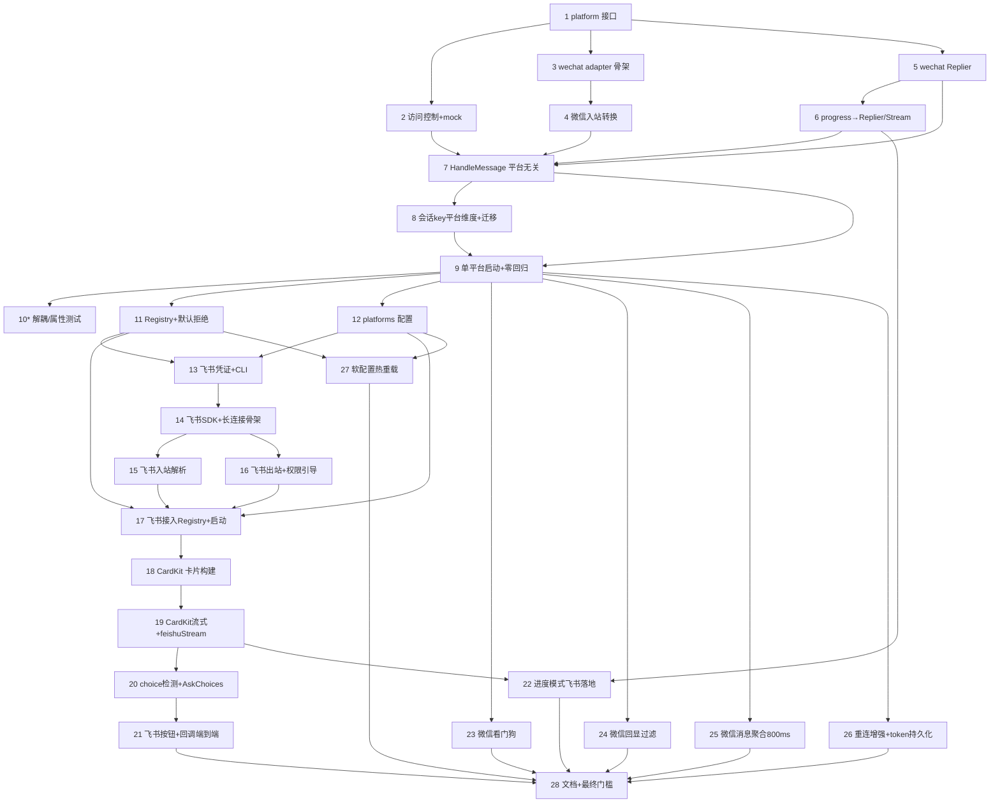

# Implementation Plan

## Overview

本计划按设计文档的 4 个阶段组织：阶段 1 平台抽象重构（零行为变更）、阶段 2 飞书文本/图片 MVP、阶段 3 飞书卡片/流式/按钮、阶段 4 微信优化。每个阶段以 `go build ./...`、`go vet ./...`、`go test ./...` 全绿为验收门槛，且各阶段独立可回滚（飞书默认 `enabled:false`，流式/按钮/聚合各有独立开关）。带 `*` 的任务为可选/加固项。本计划供 Codex 逐项执行；参考项目位于工作区外 `/Volumes/Data/code/tmp/open-im`（TypeScript），执行时需用终端访问。

**执行策略修订**：

- 阶段 1 是独立硬门槛，必须按任务 1→9 串行推进并单独交付；任务 9 未通过全量验证前，不得进入阶段 2。
- 阶段 1 不启用实现型并行。原因：`messaging`、`sender`、`progress`、`cmd/start.go`、`api/server.go` 当前共享 `ilink` 入口和测试夹具，多个子任务同时写入会产生高概率冲突。
- 阶段 2/3 才允许按包边界并行：`config/platform`、`feishu`、`cmd`、`api` 可在接口稳定后拆分；同一文件同一轮只允许一个执行者修改。
- 阶段 4 微信增强不与阶段 2/3 混跑，除非阶段 1 已稳定且当前发布目标明确允许扩大回归面。
- 微信消息聚合默认开启，窗口 800ms；配置为 0 时关闭。该默认值来自已固化需求，不再使用“默认关闭”表述。

## Tasks

### 阶段 1：平台抽象重构（零行为变更）

- [x] 1. 建立 `platform` 包的核心抽象类型与接口
  - 创建 `platform/platform.go`：`PlatformName` 常量（`wechat`/`feishu`）、`Platform` 接口（`Name`/`AccountID`/`Capabilities`/`Run`）、`DispatchFunc`、`Capabilities` 结构体
  - 创建 `platform/message.go`：`IncomingMessage`、`Attachment`、`AttachmentKind`、`CardAction`，以及 `ConversationKey()` 方法
  - 创建 `platform/reply.go`：`Replier` 接口、`Stream` 接口、`StreamOptions`、`Choice`、`ErrUnsupported`
  - 确保 `platform` 包不 import `messaging`/`ilink`/`feishu`/`lark*`
  - _Requirements: 1.1, 1.2, 1.5, 1.6_

- [x] 2. 实现访问控制与 mock 测试桩
  - 创建 `platform/access.go`：`AccessControl`（`NewAccessControl(allowed []string)` + `Allowed(userID) bool`），空名单语义留给 Registry 决定（见任务 11）
  - 创建 `platform/platformtest`（或 `messaging` 内 testfake）：`fakeReplier`、`fakeStream`、`fakePlatform` mock，供 `HandleMessage` 测试解耦使用
  - 编写 `platform/access_test.go`
  - _Requirements: 1.7, 17.1_

- [x] 3. 创建 `wechat` adapter 骨架并封装 `ilink`
  - 创建 `wechat/adapter.go`：`Adapter` 实现 `platform.Platform`，内部持有 `*ilink.Client` 与 monitor；`Capabilities()` 返回 `{Text,Typing,Image,File,LongText: true; Card,Streaming,Buttons: false}`
  - 保留 `ilink` 包不动（传输/CDN/扫码）
  - _Requirements: 2.1, 2.7, 4.8_

- [x] 4. 将微信入站消息转换为 `platform.IncomingMessage`
  - 创建 `wechat/incoming.go`：把 `ilink.WeixinMessage` → `IncomingMessage`，将现有 `extractText`/`extractVoiceText`/`extractFile`/`extractImage` 逻辑从 `messaging` 上移到此处，完成文本抽取/语音转写/附件下载
  - `MessageID int64` 转 string；填充 `Platform`/`AccountID`/`UserID`/`ChatID`/`ContextToken`
  - _Requirements: 2.4_

- [x] 5. 将 `sender.go` 的微信文本处理下沉为 `wechat` Replier
  - 创建 `wechat/replier.go`：`weChatReplier` 实现 `Replier`；`SendText` 复刻 `MarkdownToPlainText`→`FormatTextForWeChatDisplay`→`splitTextReplyChunks`（1800 runes）→逐条发送；`Typing` 复刻 `SendTypingState`/`SendTypingCancel`；`SendImage` 复用现有 CDN 上传
  - 迁移 `messaging/sender_test.go` 相关分段/换行测试到 `wechat` 包，验证相同输入产出相同结果
  - _Requirements: 2.2, 17.5_

- [x] 6. 将 `progress.go` 改为基于 `Replier`/`Stream`
  - 实现 `wechat` 降级 `Stream`（`OpenStream` 返回）：`Update` 维持 typing 心跳 + 节流末段文本预览，`Complete` 发送最终完整文本（分段）+ 取消 typing，`Fail` 发送错误文本
  - 修改 `messaging/progress.go`：`progressSession` 不再直接调用 `*ilink.Client`，改调 `reply.Typing` 与 `reply.OpenStream→Stream.Update/Complete/Fail`
  - 保持 `progress_test.go` 语义（必要时以 `fakeReplier`/`fakeStream` 重写断言）
  - _Requirements: 2.3, 8.1, 8.6_

- [x] 7. 重构 `messaging.HandleMessage` 签名为平台无关
  - 将 `HandleMessage(ctx, *ilink.Client, ilink.WeixinMessage)` 改为 `HandleMessage(ctx, platform.IncomingMessage, platform.Replier)`
  - 全文替换 `msg.FromUserID`→`msg.UserID`；移除业务层对 `ContextToken`/`clientID` 的直接传递（由 Replier 内部持有）
  - 命令解析（`/status`/`/help`/`/new`/`/cwd`/`/cc`/`/cx`/`/guide`/`/run`/`/cancel`）与 agent 路由/广播逻辑改用 `reply.SendText` 等
  - 确保 `messaging` 不再 import `ilink`
  - _Requirements: 1.3, 1.4_

- [x] 8. 会话路由 key 增加平台维度 + 持久化迁移
  - 修改 `codexBindingKey`/`buildCodexConversationID`/`buildClaudeConversationID`：`userID` 入参改用 `msg.ConversationKey()`
  - 在 `codex_sessions.go`/`claude_sessions.go` 的 store 加载处实现 `migrateLegacyKey`（无平台前缀 → `wechat:`，幂等），加载时迁移并回写
  - 编写迁移单测（幂等、不误伤已带前缀 key）
  - _Requirements: 3.1, 3.2, 3.3, 3.4, 3.5, 17.4_

- [x] 9. 接入临时单平台启动路径并通过零回归测试
  - 修改 `cmd/start.go`：用 `wechat.Adapter` 替换直接的 `ilink.NewMonitor(client, handler.HandleMessage)`，先保持"仅微信"行为（Registry 在阶段 2 引入）
  - 更新 `api/server.go` 调用点以适配新 Replier 构造（保持现有发送行为）
  - 运行并修复全部既有测试，确保 `go build/vet/test ./...` 全绿
  - _Requirements: 2.5, 2.6, 9.6_

- [x] 10.* 补充平台解耦架构测试与文本分段属性测试
  - 添加依赖检查测试：`messaging` 的依赖不包含 `ilink`/`feishu`/`lark*`（可用 `go list -deps` 脚本或 `go/packages` 静态扫描）
  - （可选）引入 `pgregory.net/rapid`，为微信分段写属性测试：拼接还原 = 原文且每段 rune ≤ 上限、不切断多字节
  - _Requirements: 1.2, 1.4, 8.* (Property 1, Property 8)_

### 阶段 2：飞书文本 + 图片（MVP 接入）

- [x] 11. 引入 Registry 与统一访问控制（含默认拒绝）
  - 创建 `platform/registry.go`：`BuildRegistry(cfg, dispatch)` + `Run(ctx)` 并发拉起 + `guardedDispatch`（分发前访问控制）+ `runPlatformWithRestart`（复用现有退避语义）
  - 实现"默认拒绝"：白名单为空 → 拒绝所有 + 启动醒目安全告警日志
  - 拒绝时静默丢弃 + 日志，不回复发送者
  - 编写 Registry/访问控制单测
  - _Requirements: 10.1, 10.2, 10.3, 10.4, 11.1, 11.2, 11.3, 11.4, 11.5_

- [x] 12. 配置模型新增 `platforms` 维度并保持兼容
  - 修改 `config/config.go`：新增 `Platforms map[string]PlatformConfig` 与 `PlatformConfig{Enabled, AllowedUsers, DefaultAgent, Progress}`
  - 实现 progress 覆盖优先级 `platform > agent > global > default`（复用 `NormalizeProgressConfig`）
  - `platforms` 缺省时等价"仅 wechat 启用"，旧 `config.json` 可正常解析
  - 编写 config 解析/兼容单测
  - _Requirements: 9.1, 9.2, 9.3, 9.4, 9.5, 9.6_

- [x] 13. 飞书凭证管理与 CLI 命令
  - 创建 `feishu/config.go`：`FeishuCredentials{AppID, AppSecret}`，读写 `~/.weclaw/platforms/feishu.json`（`0600`），支持环境变量 `WECLAW_FEISHU_APP_ID`/`WECLAW_FEISHU_APP_SECRET` 覆盖
  - 创建 `cmd/feishu.go`：`weclaw feishu login --app-id --app-secret`（写入并校验凭证）、`weclaw feishu status`（连接/权限状态）
  - 确保日志不打印 `app_secret`，`config.json` 不含 secret
  - _Requirements: 4.3, 4.4, 4.5, 4.6_

- [x] 14. 引入飞书 SDK 并实现 adapter 长连接骨架
  - `go get github.com/larksuite/oapi-sdk-go/v3`（core/ws/im/cardkit），更新 `go.mod`/`go.sum`
  - 创建 `feishu/adapter.go`：`Adapter` 实现 `platform.Platform`，`Capabilities()` 返回 `{Text,Typing,Image,File,Card,Streaming,Buttons: true; LongText: false}`
  - 创建 `feishu/events.go`：构建 EventDispatcher，`Run` 中用 `larkws` 启动长连接，注册 `im.message.receive_v1` 与 `card.action.trigger`，阻塞至 ctx 取消
  - 启动时校验凭证有效性
  - _Requirements: 4.1, 4.2, 5.7_

- [x] 15. 飞书入站事件解析（单聊文本/富文本/图片）
  - 创建 `feishu/incoming.go`：`im.message.receive_v1` → `IncomingMessage`（text 清洗 `<p>`/`<br>`/`&nbsp;`、post 富文本展开、open_id 抽取、`im.messageResource.get` 下载图片/文件）
  - 群聊（非 P2P）消息忽略不触发 agent
  - 编写解析单测（text/post/image、open_id、HTML 清洗）
  - _Requirements: 5.1, 5.2, 5.3, 5.6, 17.2_

- [x] 16. 飞书出站发送（文本/图片）与权限引导
  - 创建 `feishu/replier.go`：`feishuReplier.SendText`（`im.message.create`，超长拆条）、`SendImage`（上传 image_key 后发送）、`Typing`（thinking 卡片占位或 no-op）
  - 创建 `feishu/permission.go`：识别权限错误码 → 指向 `open.feishu.cn/app/{appId}/permission` 的引导（控制台 + 尽力发聊天），60s 冷却
  - 编写权限错误码 → 引导文案单测
  - _Requirements: 4.7, 5.4, 5.5, 17.2_

- [x] 17. 将飞书接入 Registry 与启动流程
  - 修改 `cmd/start.go`：通过 `BuildRegistry` 同时拉起微信 + 飞书；飞书默认 `enabled:false`
  - 修改 `api/server.go`：改为通过 Registry 按 `(platform, accountID, chatID)` 发送，保留 `APIToken` 鉴权
  - 优雅关闭：ctx 取消时飞书关闭长连接，微信沿用现有逻辑，daemon/PID 不变
  - 验证 `go build/vet/test ./...` 全绿
  - _Requirements: 10.5, 10.6_

### 阶段 3：飞书卡片 / 流式 / 按钮（富交互一步到位）

- [x] 18. CardKit 卡片构建器
  - 创建 `feishu/card.go`：`buildCardV2(opts)` 支持 thinking/streaming/done/error 状态卡片（参考 open-im `card-builder.ts`）
  - _Requirements: 6.1, 6.3, 6.4_

- [x] 19. CardKit 流式会话管理与 `feishuStream`
  - 创建 `feishu/cardkit.go`：`create`/`enableStreaming`/`streamContent`（节流约 500ms、sequence 单调递增）/`disableStreaming`/`updateFull`/`destroy`
  - 创建 `feishu/stream.go`：`feishuStream` 实现 `platform.Stream`；`Update` 节流增量、`Complete` 关闭流式 + done 全量、`Fail` error 卡片；状态码处理（`200400`/`200810`/`300317` 忽略，`200850`/`300309` 重新 enableStreaming 重试一次，超限放弃流式但保证 Complete 送达）
  - `feishuReplier.OpenStream` 接入；编写流式状态机单测（节流、sequence、状态码分支，用 mock client）
  - _Requirements: 6.1, 6.2, 6.3, 6.4, 6.5, 6.6, 8.4, 17.3_

- [x] 20. choice 检测与跨平台 AskChoices
  - 创建 `messaging` 侧 choice 检测（移植 open-im `choice-detector` 用例：编号 + 选择提示词 → hasChoices/choices/cleanText）
  - 在 `HandleMessage` 完成 agent 回复后调用 `reply.AskChoices(prompt, choices)`
  - `wechat` `AskChoices` 降级为编号文本；编写 choice 检测单测
  - _Requirements: 7.1, 7.7, 17.4_

- [x] 21. 飞书按钮卡片渲染与回调端到端
  - 创建 `feishu/choice.go`：`buildChoiceCard`（每选项一个按钮，value=`{action:"choice",choice:"N",conv:"<ConversationKey>"}`）；`parseCardAction` 解析 `card.action.trigger`
  - `feishuReplier.AskChoices` 渲染按钮卡片
  - `events.go` 的 `card.action.trigger`：3 秒内同步返回 toast，异步把动作归一化为 `IncomingMessage{RawCommand:CardAction}` 重新分发；校验回调用户在白名单内
  - `HandleMessage` 入口处理 `RawCommand`：`choice`→当作文本输入复用路由；`stop`→取消 active task
  - 编写 `card.action` → `CardAction` 解析单测
  - _Requirements: 7.2, 7.3, 7.4, 7.5, 7.6_

- [x] 22. 进度模式在飞书的完整落地
  - 将 `stream` 模式接入 CardKit 打字机；`typing` 用 thinking→done 卡片；`off` 仅最终结果；`summary` 周期性 note 更新
  - 验证"最终完整结果必达"（任意模式/平台），补充对应断言
  - _Requirements: 8.2, 8.3, 8.4, 8.5, 8.6_

### 阶段 4：微信优化

- [x] 23. 微信连接看门狗
  - 在 `wechat` adapter 增加看门狗 goroutine：每约 60s 检查，距上次成功响应 > 约 5min 则强制取消当前轮询触发重连；ctx 取消时退出
  - 复用 monitor 现有 `lastActivity`；编写看门狗触发单测（注入时间）
  - _Requirements: 12.1, 12.2, 12.3_

- [x] 24. 微信回显过滤
  - 出站 `client_id` 改用 `weclaw:` 前缀
  - 入站 `client_id` 以 `weclaw:` 开头则跳过；对机器人提示前缀文本做二次过滤
  - 补充 `handler` 测试："自身回显不触发 agent"
  - _Requirements: 13.1, 13.2, 13.3, 13.4_

- [x] 25. 微信消息聚合（默认 800ms）
  - 在 `wechat` per-user 队列出口实现时间窗聚合（默认 800ms，可配置，0=关闭）；拼接文本 + 合并附件
  - 命令前缀（`/`）消息不参与聚合，立即处理
  - 编写聚合单测（合并、命令短路、窗口=0）
  - _Requirements: 14.1, 14.2, 14.3, 14.4_

- [x] 26. 微信重连增强与 context_token 持久化
  - 重连改 stepped backoff（`[3s,5s,10s,20s,30s]`）；bot token 失效进入 fatal 慢探测（约 60s）+ 持续提示 `weclaw login`
  - 持久化每个 `(platform, user)` 最近 `context_token` 到 `~/.weclaw/accounts/{botID}.tokens.json`，启动时加载；飞书用 chat_id 主动发（字段留空）
  - 编写重连/持久化单测
  - _Requirements: 15.1, 15.2, 15.3, 15.4, 15.5_

- [x] 27. 软配置热重载
  - 对 `default_agent`/`progress`/`allowed_users` 实现带 mtime 缓存的按需重载；不热重载平台凭证与平台启用状态
  - 解析失败回退启动快照 + 告警
  - 编写热重载单测（mtime 变更生效、解析失败回退）
  - _Requirements: 16.1, 16.2, 16.3_

- [x] 28. 收尾：文档与最终质量门槛
  - 更新 `README.md`/`README_CN.md`：飞书接入步骤、`weclaw feishu` 命令、`platforms` 配置、访问控制安全提示（bot 可驱动 shell agent）、进度模式跨平台说明
  - 全量 `go build/vet/test ./...` 全绿；确认各阶段开关（飞书 enabled、流式、按钮、聚合）可独立回滚
  - _Requirements: 11.5, 17.5, 17.6_

## Task Dependency Graph



**关键路径**：阶段 1（1→2→3→4→5→6→7→8→9）必须先全部完成并通过零回归测试，才进入阶段 2。阶段 3 依赖阶段 2 的飞书接入。阶段 4 的微信优化（23–26）只依赖阶段 1 的 wechat adapter，但默认放在飞书 MVP 与富交互之后串行推进，以控制微信回归面。任务 28 收尾依赖前序全部完成。

```json
{
  "waves": [
    { "wave": 1, "tasks": ["1"] },
    { "wave": 2, "tasks": ["2"] },
    { "wave": 3, "tasks": ["3"] },
    { "wave": 4, "tasks": ["4"] },
    { "wave": 5, "tasks": ["5"] },
    { "wave": 6, "tasks": ["6"] },
    { "wave": 7, "tasks": ["7"] },
    { "wave": 8, "tasks": ["8"] },
    { "wave": 9, "tasks": ["9"] },
    { "wave": 10, "tasks": ["10", "11", "12"] },
    { "wave": 11, "tasks": ["13"] },
    { "wave": 12, "tasks": ["14"] },
    { "wave": 13, "tasks": ["15", "16"] },
    { "wave": 14, "tasks": ["17"] },
    { "wave": 15, "tasks": ["18"] },
    { "wave": 16, "tasks": ["19"] },
    { "wave": 17, "tasks": ["20", "22"] },
    { "wave": 18, "tasks": ["21"] },
    { "wave": 19, "tasks": ["23"] },
    { "wave": 20, "tasks": ["24"] },
    { "wave": 21, "tasks": ["25"] },
    { "wave": 22, "tasks": ["26"] },
    { "wave": 23, "tasks": ["27"] },
    { "wave": 24, "tasks": ["28"] }
  ]
}
```

## Notes

- **零回归是阶段 1 的硬性门槛**：任务 9 未通过现有全部测试前，不得进入阶段 2。建议在重构前先为 `sender.go`/`progress.go` 补"行为对照"测试（任务 5/6 内含）。
- **回滚点**：飞书整体由 `platforms.feishu.enabled` 控制（默认 false）；CardKit 流式（任务 19/22）、按钮（任务 21）、微信聚合（任务 25）均有独立开关，出问题可单项关闭退回上一阶段行为。
- **SDK 形态以实际为准**：设计中的 lark SDK builder 链为伪代码，任务 14/16/19 实现时需对照 `larksuite/oapi-sdk-go/v3` 官方文档与参考项目 open-im 的 `feishu/*` 校正具体 API。
- **安全**：任务 11（默认拒绝）+ 任务 28（文档安全提示）共同覆盖"bot 可驱动 shell agent"的风险告知，不可省略。
- **参考项目映射**：weclaw 为 Go，open-im 为 TypeScript。可借鉴其设计思路（PlatformSender 回调、handle-text-flow、cardkit-manager 状态码处理、choice-detector、clawbot watchdog/回显过滤/聚合），但需翻译为 Go 习惯写法，不直接照搬。

## Review 小结

- 阶段 2-4 已按任务 12-28 完成：飞书凭证、长连接、文本/图片、CardKit 流式、按钮回调、微信看门狗、回显过滤、800ms 聚合、context_token 持久化、软配置热重载和文档刷新均已落地。
- 验证命令已通过：`go test ./... -count=1 -timeout 60s`、`go vet ./...`、`go build ./...`、`git diff --check`。
- 剩余风险：真实飞书 CardKit JSON 仍需在目标租户做一次端到端验收；微信聚合窗口默认 800ms，极短连续命令前的普通消息会先被 flush 再执行命令。
- 潜在技术债：`messaging/handler.go` 和 `cmd/start.go` 已超过理想文件大小，后续应按会话管理、平台启动、命令处理拆分。
