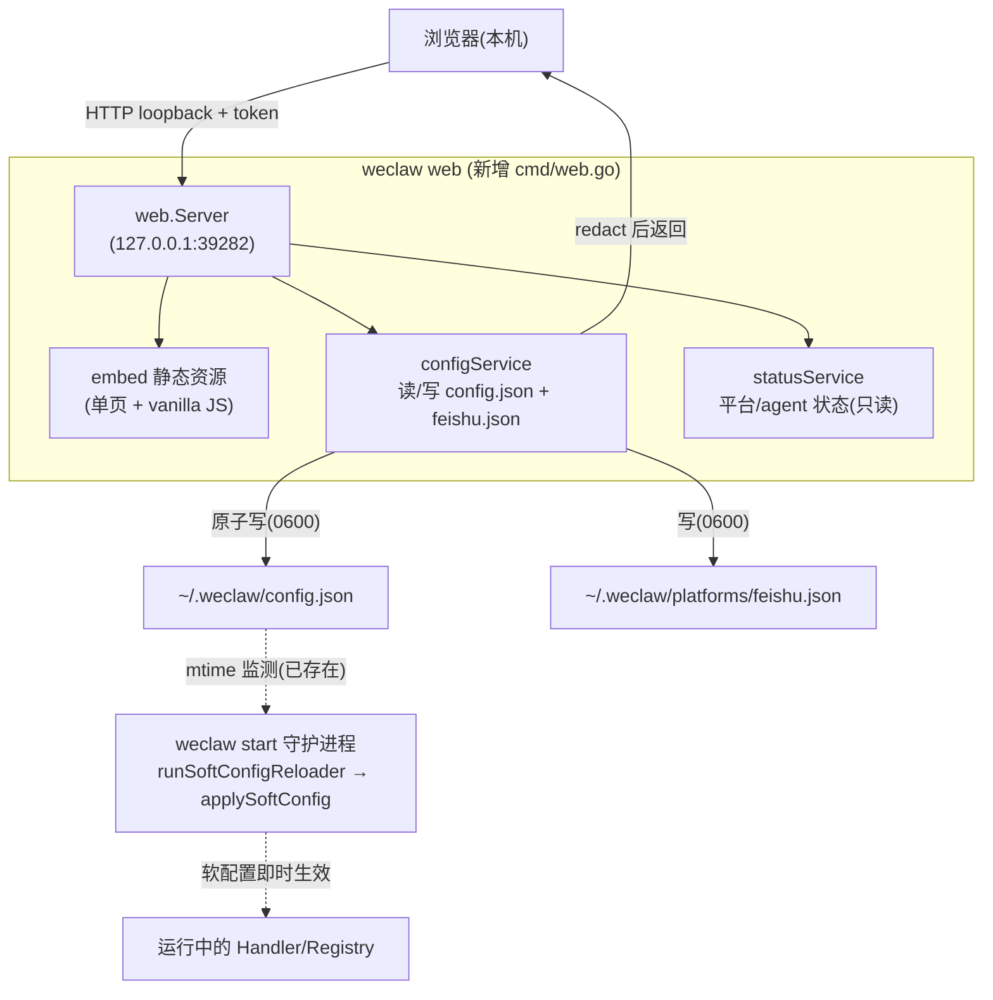

# Design Document: Web 配置面板（`weclaw web`）

## Overview

weclaw 目前只能通过手编 `~/.weclaw/config.json` + 扫码登录 + `weclaw feishu login` CLI 来配置。对新用户而言，飞书 `app_id`/`app_secret`、`platforms` 维度、`allowed_users`、`allowed_workspace_roots`、`rate_limit_per_minute` 等都要手写 JSON，门槛高、易错。

本设计新增 `weclaw web` 命令：在**本机回环地址**启动一个轻量配置面板，可视化查看与修改配置、写入飞书凭证、查看运行状态，并借助现有的**软配置热重载**机制让大部分修改无需重启即时生效。

设计的第一性原则是**安全**：面板能读写包含 shell-capable agent 配置和密钥的文件，一旦暴露等于交出整台机器。因此：默认只绑 loopback、密钥只写不回显、非回环监听强制 token、配置写入复用既有校验与原子保存。

> 本文档为纯设计文档，不修改代码。代码块为目标设计示意（接口签名 + 端点契约 + 伪代码）。

## 现状对接（As-Is 事实，设计据此衔接）

- **主配置**：`~/.weclaw/config.json`，`config.Load()` / `config.Save()`（`0600`，`MarshalIndent`）。字段：`default_agent`、`api_addr`、`api_token`、`save_dir`、`allowed_workspace_roots`、`rate_limit_per_minute`、`audit_log`/`audit_log_path`、`progress`、`agents{...}`、`platforms{wechat,feishu}`。
- **飞书凭证**：`~/.weclaw/platforms/feishu.json`（`feishu.SaveCredentials`/`LoadCredentials`，`0600`），支持 `WECLAW_FEISHU_APP_ID/SECRET` 环境变量覆盖。
- **微信凭证**：`~/.weclaw/accounts/*.json`，由 `ilink` 扫码登录写入（`weclaw login`）。Web 面板**不做扫码**（二维码交互复杂），仅展示状态并引导用户在终端 `weclaw login`。
- **软配置热重载**：`cmd/start.go` 的 `runSoftConfigReloader` 每 2s 监测 `config.json` mtime，变更后 `config.Load()` 并 `applySoftConfig` 应用：`progress`、`default_agent`、`allowed_users`、`allowed_workspace_roots`、`rate_limit_per_minute`、平台 progress/default agent。**平台启用状态与凭证不热重载**（涉及长连接生命周期，需重启）。
- **发送 API**：`api/server.go` 已有 loopback 判定 `isLoopbackListenAddr`、token 常量时间比较 `constantTimeEqual`、`X-WeClaw-Token`/`Bearer` 解析——Web 面板复用同款鉴权与回环判定。

**关键衔接点**：Web 面板只要**原子写回 `config.json`**，正在运行的 `weclaw start` 守护进程就会在 2s 内自动热重载软配置。平台启用/凭证类改动则提示"需重启 `weclaw restart`"。

## Architecture



**部署形态**：`weclaw web` 是**独立命令**，与 `weclaw start` 解耦——即使守护进程没在跑也能编辑配置（保存后下次 `start` 生效）；在跑则靠 mtime 热重载即时生效。这与 cc-connect 的 `cc-connect web`（只配置、不启动服务）一致。

**为什么不并进发送 API（`api/server.go`）**：发送 API 随 `weclaw start` 生命周期存在且默认开放发送能力；配置面板权限更敏感、且需在 daemon 未运行时也能用。两者分开端口、分开命令，职责清晰、攻击面独立。复用 `api` 包里已有的鉴权/回环工具函数（提取为可共享 helper）。

## Components and Interfaces

新增 `web` 包 + `cmd/web.go`。

| 组件 | 包 | 职责 |
|------|----|------|
| `web.Server` | `web` | HTTP 服务：静态资源 + JSON API + 鉴权中间件 |
| `configService` | `web` | 读取(脱敏)/校验/原子写回 `config.json` 与 `feishu.json` |
| `statusService` | `web` | 只读汇总平台启用、凭证存在性、agent 列表（不含密钥） |
| 静态前端 | `web/static`（`go:embed`） | 单页 + 原生 JS，无构建步骤 |
| `cmd/web.go` | `cmd` | `weclaw web` 命令：解析 flag、生成/读取 token、起服务、打开浏览器 |

### 命令与启动（LLD）

```
weclaw web                      # 默认 127.0.0.1:39282，自动生成会话 token，打印带 token 的本地 URL 并尝试打开浏览器
weclaw web --addr 127.0.0.1:39282
weclaw web --token <token>      # 显式 token；非回环监听时必填
weclaw web --no-open            # 不自动打开浏览器
```

```go
// cmd/web.go (LLD)
func runWeb(cmd *cobra.Command, args []string) error {
    addr := resolveWebAddr(webAddrFlag)            // 默认 127.0.0.1:39282
    token := resolveWebToken(webTokenFlag)         // 显式 > 自动生成(回环时)
    srv := web.NewServer(web.Options{Addr: addr, Token: token})
    if err := srv.Validate(); err != nil {         // 非回环且无 token → 拒绝启动
        return err
    }
    url := fmt.Sprintf("http://%s/?token=%s", addr, token) // 仅本地打印
    if !webNoOpenFlag { _ = openBrowser(url) }
    fmt.Printf("WeClaw 配置面板: %s\n", url)
    return srv.Run(ctx)
}
```

### 鉴权中间件（LLD，复用 api 包思路）

```go
// web/auth.go
// 1) 回环判定复用 api.IsLoopbackListenAddr（提取为导出 helper）
// 2) token 优先级：显式 flag > 自动生成(仅回环可自动)；非回环必须显式
// 3) 浏览器侧：首屏用 ?token= 注入，存入内存(sessionStorage)，后续请求带 X-WeClaw-Token
// 4) 同源防护：校验 Origin/Referer 为本服务地址，拒绝跨站请求(防 DNS rebinding/CSRF)
func (s *Server) authMiddleware(next http.Handler) http.Handler {
    return http.HandlerFunc(func(w http.ResponseWriter, r *http.Request) {
        if !s.sameOrigin(r) { http.Error(w, "forbidden origin", 403); return }
        if !constantTimeEqual(tokenFromRequest(r), s.token) { http.Error(w, "unauthorized", 401); return }
        next.ServeHTTP(w, r)
    })
}
```

### HTTP API 契约

| Method/Path | 用途 | 请求 | 响应 |
|-------------|------|------|------|
| `GET /api/config` | 读取脱敏配置 | — | `Config`（密钥字段被掩码/替换为存在性标记） |
| `PUT /api/config` | 校验并保存配置 | 脱敏 `Config`（密钥占位表示"不改"） | `{status, restart_required}` |
| `POST /api/feishu/credentials` | 写飞书 app_id/secret | `{app_id, app_secret}` | `{status}`（secret 只写不回显） |
| `GET /api/status` | 运行/连接状态 | — | 平台启用、凭证存在性、agent 列表、daemon 是否在跑 |
| `POST /api/validate/feishu` | 校验飞书凭证有效性 | `{app_id, app_secret?}` | `{ok, message}`（复用 `feishu.ValidateCredentials`） |
| `GET /` , `/static/*` | 前端页面/资源 | — | embed 静态 |

### 密钥脱敏与写回（核心安全逻辑，LLD）

```go
// web/config_service.go
const secretMask = "__WECLAW_UNCHANGED__"

// 读取时：把所有密钥字段替换为掩码或存在性标记，绝不返回明文。
func redactConfig(cfg *config.Config) configView {
    v := toView(cfg)
    if cfg.APIToken != "" { v.APIToken = secretMask }
    for name, ag := range cfg.Agents {
        if ag.APIKey != "" { v.Agents[name].APIKey = secretMask }
        v.Agents[name].Env = redactEnvValues(ag.Env) // 值替换为掩码，键保留
    }
    return v // feishu app_secret 不在 config.json，单独走 /api/feishu/credentials
}

// 写回时：掩码值表示"保持原值不变"，仅非掩码字段覆盖；写前 config 级校验 + 原子写。
func (s *configService) save(view configView) (restartRequired bool, err error) {
    current, _ := config.Load()
    merged := mergeView(current, view, secretMask) // 掩码字段沿用 current 的密钥
    if err := validateConfig(merged); err != nil { return false, err }
    restartRequired = platformTopologyChanged(current, merged) // 平台启用/凭证类变更需重启
    return restartRequired, atomicSaveConfig(merged)           // 临时文件 + rename，0600
}
```

### 前端（最小实现）

- `go:embed` 嵌入一个单页 `index.html` + 一个 `app.js`（原生 JS，无打包）。
- 卡片式：平台卡（wechat 状态/feishu 凭证与开关）、agent 卡（type/command/model/env）、安全卡（allowed_users、allowed_workspace_roots、rate_limit、audit）。
- 保存 → `PUT /api/config`；若 `restart_required` 提示"运行 `weclaw restart` 生效"，否则提示"已即时生效"。
- 微信卡：仅显示账号状态，附文案"在终端运行 `weclaw login` 扫码添加"。

## 能力边界（明确不做）

1. **不做微信扫码登录**：二维码流是终端交互，面板只展示状态并引导 `weclaw login`。
2. **不回显任何密钥**：`api_token`、agent `api_key`/`env` 值、飞书 `app_secret` 一律掩码；写回用占位"保持不变"。
3. **不热重载平台拓扑**：平台 enable/凭证类改动写盘后提示重启；软配置（progress/default_agent/allowed_users/workspace_roots/rate_limit）靠现有 mtime 重载即时生效。
4. **默认仅本机**：默认绑 `127.0.0.1`；绑非回环必须显式 token，并默认拒绝跨站 Origin。

## Data Models

```go
// web/view.go —— 面向前端的脱敏视图，独立于 config.Config 以控制暴露字段
type configView struct {
    DefaultAgent          string                 `json:"default_agent"`
    APIAddr               string                 `json:"api_addr"`
    APIToken              string                 `json:"api_token"`       // 掩码或空
    SaveDir               string                 `json:"save_dir"`
    AllowedWorkspaceRoots []string               `json:"allowed_workspace_roots"`
    RateLimitPerMinute    int                    `json:"rate_limit_per_minute"`
    AuditLog              *bool                  `json:"audit_log"`
    Progress              config.ProgressConfig  `json:"progress"`
    Agents                map[string]agentView   `json:"agents"`
    Platforms             map[string]config.PlatformConfig `json:"platforms"`
}

type agentView struct {
    Type, Command, Model, Effort string
    Args   []string
    Env    map[string]string // 值掩码
    APIKey string            // 掩码或空
    // ... 其余非密钥字段透传
}

type statusView struct {
    DaemonRunning bool
    Platforms     []platformStatus // name, enabled, credentialsPresent, allowedUsersCount
    Agents        []agentStatus    // name, type, command/endpoint(无密钥)
}
```

## Error Handling

| 条件 | 处理 |
|------|------|
| 非回环监听且无 token | `Validate()` 启动即失败，提示加 `--token` |
| 跨站 Origin/Referer | 403，防 DNS rebinding/CSRF |
| token 不匹配 | 401（常量时间比较） |
| `PUT /api/config` 校验失败 | 400 + 字段级原因，不写盘 |
| 写盘失败 | 原子写：临时文件+rename，失败不破坏原 `config.json` |
| 飞书凭证校验失败 | `/api/validate/feishu` 返回 `{ok:false,message}`（复用 `ValidateCredentials` 的权限引导） |

## Testing Strategy

- **脱敏单测**：`redactConfig` 把所有密钥字段掩码；`GET /api/config` 响应中不含任何明文密钥（含 agent env 值）。
- **写回保密单测**：`PUT` 传掩码值时密钥保持原值；传新值时覆盖；非法配置被拒不写盘。
- **原子写单测**：写入中途失败不破坏原文件。
- **鉴权单测**：无 token/错误 token → 401；跨站 Origin → 403；非回环无 token → `Validate` 失败。
- **restart_required 判定单测**：仅平台 enable/凭证类变更触发；软配置变更不触发。
- **热重载联动（集成）**：写 `config.json` 后运行中的 `applySoftConfig` 能拾取（与现有软重载测试对接）。

## Correctness Properties

### Property 1: 密钥不外泄
任意 `GET /api/config` / `/api/status` 响应**绝不**包含明文 `api_token`、agent `api_key`、env 值、飞书 `app_secret`。

### Property 2: 掩码即不变
写回时字段值等于掩码常量 ⇒ 落盘后该密钥与写回前**完全一致**。

### Property 3: 回环默认
未显式配置时服务**只**绑回环地址。

### Property 4: 非回环必鉴权
绑定非回环地址时，无 token **必定**拒绝启动。

### Property 5: 原子保存
保存失败时 `config.json` 保持修改前内容（不出现半写）。

### Property 6: 软配置即时性
写回仅含软配置变更时，运行中的守护进程在一个 mtime 周期内应用，无需重启。

## 安全考量（一等公民）

- 面板可改 agent 命令/env/工作目录白名单——等于可改"谁能在本机跑什么"。因此默认仅本机、强制鉴权、密钥只写不回显、同源防护，缺一不可。
- token 自动生成仅在回环场景；非回环必须用户显式提供，避免"无意暴露公网"。
- 写盘一律 `0600`，与现有凭证文件权限一致；日志不打印密钥与 token。
- 面板不引入任何把配置/密钥外发的出站请求；`/api/validate/feishu` 只调用飞书官方 token 校验端点（与现有 `ValidateCredentials` 同源）。

## 分阶段实施建议

- **阶段 1**：`web` 包 + `cmd/web.go`，鉴权中间件 + 回环/同源防护 + `GET/PUT /api/config`（含脱敏与原子写）+ 最小静态页（安全卡 + agent 卡）。复用 `api` 包鉴权 helper（先提取为导出函数）。
- **阶段 2**：飞书凭证写入与校验（`/api/feishu/credentials`、`/api/validate/feishu`）、`GET /api/status`、平台卡与微信状态引导。
- **阶段 3**：体验打磨（保存即时/重启提示、表单校验、i18n 可选）。每阶段 `go build/vet/test ./...` 全绿，且新增脱敏/鉴权/原子写测试。

## 开放问题（实现前确认）

1. 默认端口用 `39282`（同 cc-connect）还是 weclaw 自己的（如 `18012`）？
2. `weclaw web` 是否需要在 daemon 未运行时也能"试启动飞书校验"——倾向只做凭证有效性校验，不拉长连接。
3. 微信账号管理是否要在面板内提供"触发 `weclaw login`"的按钮（需要把二维码渲染到网页）——建议阶段 1 先不做，仅状态 + 终端引导。
