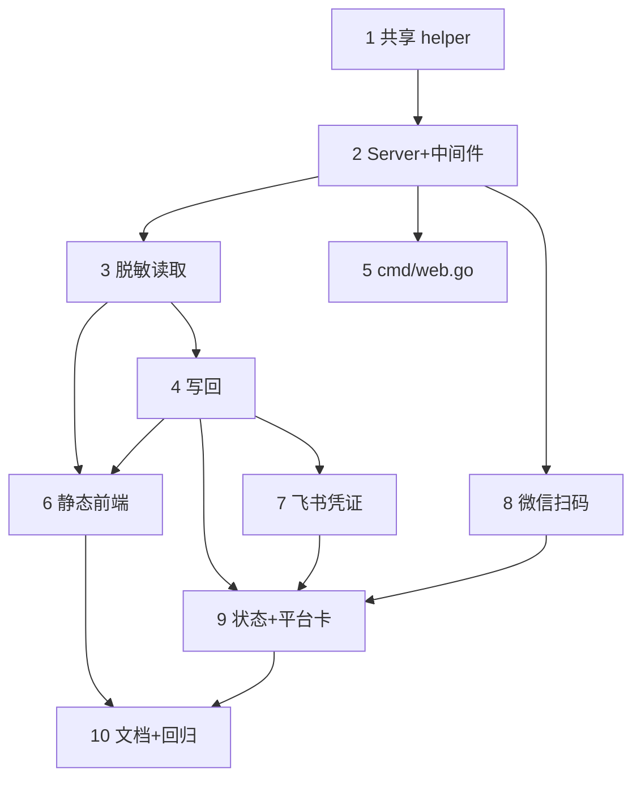

# Implementation Plan — Web 配置面板

## Overview

实现 `weclaw web` 本机配置面板：新增 `web` 包 + `cmd/web.go`，复用 `api` 包鉴权/回环 helper 与现有 config/feishu/ilink 原语。分三阶段，每阶段 `go build/vet/test ./...`（含 `-race`）全绿。安全优先：回环默认、强制鉴权、密钥只写不回显、原子写。

## Tasks

### 阶段 1：核心配置读写 + 鉴权骨架

- [x] 1. 提取共享鉴权/回环 helper（`web` 包自带与 api 一致的 loopback/token 工具，避免改动已测试的 api 代码）
- [x] 2. `web.Server` 骨架 + 鉴权/同源中间件
- [x] 3. 脱敏视图与读取端点
- [x] 4. 写回端点（保密 + 校验 + 原子 + restart_required）
- [x] 5. `cmd/web.go` 命令接线
- [x] 6. 最小静态前端（安全卡 + agent 卡）

### 阶段 2：飞书凭证 + 微信扫码 + 状态

- [x] 7. 飞书凭证写入与轻量校验
- [x] 8. 微信面板内扫码登录（二维码本机渲染 PNG，不外发第三方）
- [x] 9. 状态端点 + 平台卡前端

### 阶段 3：收尾

- [x] 10. 文档与全量回归（README 增 `weclaw web` 用法与安全说明）

## Task Dependency Graph



```json
{
  "waves": [
    { "wave": 1, "tasks": ["1"] },
    { "wave": 2, "tasks": ["2"] },
    { "wave": 3, "tasks": ["3", "5", "8"] },
    { "wave": 4, "tasks": ["4"] },
    { "wave": 5, "tasks": ["6", "7"] },
    { "wave": 6, "tasks": ["9"] },
    { "wave": 7, "tasks": ["10"] }
  ]
}
```

## Notes

- 复用而非重写：鉴权/回环用 `api` 包、配置读写用 `config` 包、飞书凭证用 `feishu` 包、扫码用 `ilink` 原语。
- 密钥三处来源（config.api_token / agent.api_key+env / feishu.app_secret）都必须脱敏；feishu secret 单独走凭证端点，不进 `config.json`。
- 平台拓扑变更（含新增微信账号、平台 enable、凭证）提示 `weclaw restart`；软配置靠现有 mtime 重载即时生效。
- 前端无构建步骤（原生 JS + embed），保持仓库零前端工具链依赖。
