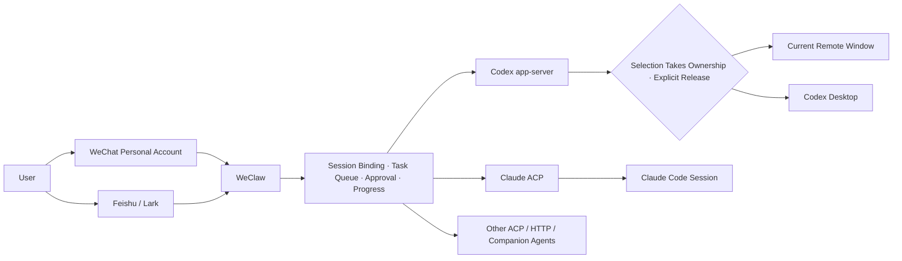

# WeClaw

[Chinese](README_CN.md)

[](https://github.com/TingRuDeng/weclaw/actions/workflows/ci.yml)
[](https://github.com/TingRuDeng/weclaw/releases/latest)
[](go.mod)
[](https://github.com/TingRuDeng/weclaw/releases/latest)
[](LICENSE)

Remote-control local Codex and Claude from WeChat or Feishu. Keep real workspace and session context and receive live progress, approvals, and results. Selecting an existing Codex session or creating one gives the current remote chat window ownership; `/cx owner desktop` explicitly releases it to Codex Desktop.

> Official releases support **macOS Apple Silicon / Intel (darwin/arm64 and darwin/amd64)** plus **Linux arm64 / amd64**. Windows assets are not currently published.

## Why WeClaw

- **Take over local work remotely**: continue Codex and Claude sessions from WeChat or Feishu after leaving your computer.
- **Keep the original context**: reuse Codex workspaces/threads and Claude ACP sessions instead of starting a new conversation for every message.
- **See progress and receive results**: Feishu uses CardKit updates, while WeChat provides typing state and task results.
- **Use explicit ownership**: selecting or creating a Codex session gives the current remote chat window ownership; `/cx owner desktop` explicitly releases it and prevents competing remote windows.
- **Configure security boundaries**: user allowlists, workspace roots, admin access, audit logs, and Codex permission levels are independent controls.

## Quick Start

Prerequisite: install the agents you plan to use. Codex uses `codex`, and Claude uses `claude`. When the one-line installer detects Claude CLI, it installs and configures a pinned `claude-agent-acp` version.

```bash
# Install the actively maintained distribution
curl -sSL https://raw.githubusercontent.com/TingRuDeng/weclaw/main/install.sh | sh

# Check agents, platform credentials, and access control
weclaw doctor

# Connect WeChat or Feishu as needed
weclaw wechat login
weclaw feishu add

# Start the background service
weclaw start
weclaw status
```

The configuration file is `~/.weclaw/config.json`, the runtime log is `~/.weclaw/weclaw.log`, and the default audit log is `~/.weclaw/audit.log`.

## Core Workflows

### Start a Codex Task Remotely

```text
/cwd /path/to/project
/cx ls                 # List existing sessions
/cx <number>           # Select a session and take ownership; Feishu also supports session cards
# Or send /cx new      # Create a session and take ownership
Inspect the current project and fix the failing tests
```

After selecting an existing session or sending `/cx new`, send the task directly. Without a valid session binding, a regular message only asks the user to select a session or send `/cx new`; it never creates or takes ownership of a session implicitly.

### Take Over and Return a Codex Desktop Session

```text
/cx ls                 # List existing local workspaces and threads
/cx <number>           # Select the current list item; selecting a thread takes ownership
/cx owner              # Inspect owner, runtime location, and task state
/cx owner desktop      # Explicitly release ownership to Codex Desktop when idle
/cx owner remote       # Reacquire from the current WeChat or Feishu window after release
```

Session selection or creation first persists the current window's session binding and ownership, then synchronizes the runtime. A reachable Desktop remains the runtime. A Desktop timeout, disconnect, rollout/checkpoint read failure, or stale conflict does not prove that another writer exists, so explicit selection, `/cx owner remote`, or a regular message from a persisted remote owner recovers the WeClaw app-server. Desktop and WeClaw turns may coexist on the same thread; WeClaw records that condition instead of locking the whole session, while still serializing its own remote writes per thread. Regular messages trust persisted ownership and never create or take over unauthorized sessions implicitly. After a restart leaves the runtime binding unknown, the first regular message from the owning remote window lazily restores the runtime channel and continues writing. `/cx owner desktop` still commits the release first, and an active remote task must finish or be stopped with `/stop` before release.

### Reuse Claude Code Sessions

```text
/cc ls
/cc switch <number|sessionId>
/cc new
/cc status
/cc owner
/cc owner local
/cc owner remote
/cc quota
/cc cli
```

Claude uses ACP `session/list`, `session/resume`, and `session/new` to manage real sessions. Selecting or creating a session, choosing it from a Feishu card, or using global `/new` while Claude is the default agent first persists the current remote window as owner. `session/list` is the session-directory source of truth; WeClaw's persisted control intent is the remote-write source of truth. If `session/resume` fails, the binding is marked runtime-unavailable without reverting to the previous agent or session or releasing ownership; regular writes stay blocked until recovery succeeds. Bindings and control intent are restored before the next message after WeClaw restarts.

If ACP has not persisted an empty session immediately after `/cc new`, `/cc ls` marks the acquired binding as the “current new session.” This entry is display-only until the first message makes it part of the normal catalog, and it never bypasses `/cc switch` validation against `session/list`.

`/cc owner local` explicitly releases remote control, while `/cc owner remote` reacquires it after the native Claude CLI has ended. `/cc cli` releases remote control before opening the native CLI; do not reacquire while that CLI is still active. Tasks running in an independent Claude CLI are outside WeClaw's runtime, so they cannot be observed, streamed, guided with `/guide`, or stopped remotely. Legacy state where multiple windows reference one session migrates to unclaimed instead of silently choosing a winner. Remote Claude ACP tasks support `/stop` and queued continuation, but not `/guide`.

### Control a Running Task

- Send one regular message while a task is active: queue it and run it automatically after the current task succeeds or fails.
- `/cancel`: remove the queued message without stopping the active task.
- `/guide`: steer the active Codex task with the queued message; Claude does not support it.
- `/stop`: stop the task running in the current chat window.
- `/ps`: list tasks running for the current user.

## How It Works



WeClaw uses the `platform` abstraction to share commands, sessions, tasks, and approvals, then renders text, typing state, or Feishu cards according to platform capabilities. The main Codex path uses its native app-server protocol. Claude is ACP-only for remote access; native `claude` is only used to hand off an idle session locally.

## Capability Matrix

| Capability | WeChat Personal Account | Feishu / Lark |
| --- | :---: | :---: |
| Text, images, and files | Yes | Yes |
| Live progress | Typing state + text | CardKit updates |
| Interactive choices and approvals | Numbered or text choices | Native buttons and cards |
| Group chat | Direct messages only | Yes, requires @bot by default |
| Multiple accounts / bots | Yes | Yes |
| Proactive send | Yes | Yes, text only today |
| User authorization codes | Yes | Yes |

| Agent | Remote Backend | Session Reuse | Model / Reasoning | Local Handoff |
| --- | --- | :---: | :---: | --- |
| Codex | app-server | Workspace + thread | Yes | Codex CLI / Desktop |
| Claude | ACP | ACP session | Yes | Native Claude CLI |
| OpenCode | Companion | Depends on local connection | Agent-dependent | Visible terminal |
| Other agents | ACP / HTTP / Companion | Protocol-dependent | Agent-dependent | Configuration-dependent |

## Chat Commands

| Command | Description |
| --- | --- |
| `/help`, `/status` | Show help and WeClaw runtime status |
| `/cwd [path]` | Show or switch the working directory; regular users are confined to allowed workspace roots |
| `/new` | Explicitly create a session for the current default agent; also take ownership when Codex is the default |
| `/model`, `/reasoning` | Show or change the current session model and reasoning effort |
| `/mode [default|yolo]` | Show or change Codex approval behavior for the current conversation; bare `/mode` opens a Feishu choice card |
| `/progress [mode]` | Show or change progress mode |
| `/ps`, `/stop` | List or stop current tasks |
| `/cancel`, `/guide` | Remove a queued message or steer the active Codex task |
| `/cx help`, `/cc help` | Show complete Codex or Claude session commands |
| `/cx <number>`, `/cx switch <number>` | Select a Codex session in the current workspace and take ownership |
| `/cx new` | Create a Codex session in the current workspace and take ownership |
| `/cx owner remote`, `/cx owner desktop` | Reacquire after release, or explicitly release to Codex Desktop |
| `/update`, `/restart [--force]` | Remotely update or restart WeClaw as an administrator |

<details>
<summary>Common Codex commands</summary>

Select and take ownership: `/cx <number>`, `/cx switch <session>`, `/cx cd <workspace>` when that workspace has one session, and `/cx new`.

Ownership: `/cx owner` shows status, `/cx owner desktop` explicitly releases, and `/cx owner remote` reacquires after release.

Other commands: `/cx ls`, `/cx ..`, `/cx cd <workspace|..>`, `/cx pwd`, `/cx status`, `/cx quota`, `/cx model status|ls`, `/cx cli`, `/cx app`, `/cx clean`, `/cx detach`.

</details>

<details>
<summary>Common Claude commands</summary>

`/cc ls`, `/cc switch <number|sessionId>`, `/cc new`, `/cc pwd`, `/cc status`, `/cc quota`, `/cc model status|ls`, `/cc cli`.

`/cc quota` reuses the local Claude Code OAuth login to read the 5-hour, 7-day, and model-scoped limits without sending a model request. WeClaw first supports Claude Code's legacy Keychain/credentials file and its Anthropic usage endpoint, then falls back to a short-lived native `get_usage` control query when those credentials are unavailable or the request fails. The token is kept in memory, sent only to the fixed Anthropic endpoint, never logged or persisted, and never forwarded through redirects. These credential, endpoint, and structured-control contracts are not stable public APIs and may change in later Claude Code releases. API key, Bedrock, Vertex, and sessions without profile scope report that subscription limits are unavailable.

</details>

## Platform Setup

### WeChat

```bash
weclaw wechat login
weclaw wechat users pending
weclaw wechat users approve-code <authorization-code> [--admin]
```

An unauthorized WeChat user receives a short-lived authorization code. An empty `allowed_users` list rejects everyone by default.

### Feishu

```bash
weclaw feishu add
weclaw feishu status --name <bot-name>
weclaw feishu users pending
weclaw feishu users approve-code <authorization-code> [--bot <name|app_id>] [--admin]
```

`weclaw feishu add` saves credentials interactively and updates `platforms.feishu.bots[]`. The `app_secret` is stored only in a separate credential file, never in `config.json`. Each bot can have its own user allowlist, default agent, and progress mode.

<details>
<summary>Minimum Feishu application permissions</summary>

Tenant scopes: `im:message.p2p_msg:readonly`, `im:message.group_at_msg:readonly`, `im:message.group_at_msg.include_bot:readonly`, `im:message:send_as_bot`, `im:resource`, `im:chat`, `cardkit:card:read`, `cardkit:card:write`, `application:bot.basic_info:read`, and `application:bot.menu:write`. WeClaw runtime does not require user scopes. Publish a new Feishu application version and complete approval after changing permissions.

</details>

<details>
<summary>Recommended Feishu menu</summary>

- Common: `/help`, `/status`, `/model`, `/reasoning`, `/cwd`
- Codex: `/cx ls`, `/cx status`, `/cx owner`, `/cx new`, `/cx quota`
- Claude: `/cc ls`, `/cc status`, `/cc new`, `/cc pwd`, `/cc quota`, `/cc model ls`
- Control: `/ps`, `/cancel`, `/guide`, `/stop`, `/restart`

</details>

## Configuration and Security

Use the local panel or CLI before editing JSON manually:

```bash
weclaw web
weclaw config agent --name claude
weclaw config permission --agent codex --level default
weclaw doctor
```

`weclaw web` binds to `127.0.0.1:39282` by default, injects the token through a URL fragment that is never sent to the server, and opens the browser. Soft settings such as agents, progress, allowlists, administrators, and workspace roots support hot reload. Platform enablement, credentials, or account topology changes require a restart. The built-in server has no TLS: non-loopback listeners are rejected by default and require an explicit `--allow-insecure-http` opt-in on a trusted LAN (a strong random token is still generated when `--token` is omitted); use an HTTPS tunnel or reverse proxy for public access.

Key security rules:

- An empty platform `allowed_users` list rejects everyone by default.
- `admin_users` grants only WeClaw management access; the user must still belong to the relevant platform allowlist.
- Regular users may only `/cwd` into `allowed_workspace_roots` and their descendants; administrators are exempt.
- A non-loopback `api_addr` requires `api_token`.
- Audit logging is enabled by default and never records secrets.
- Codex `permission_level` accepts `default`, `auto_review`, and `full_access`; the effective default is `default`.

| Codex Permission Level | Behavior |
| --- | --- |
| `default` | `workspace-write` + on-request approval + user confirmation |
| `auto_review` | Keeps the sandbox and lets Codex review escalation requests |
| `full_access` | `danger-full-access` + no approval; trusted environments only |

## Run and Update

```bash
weclaw start                 # Start in the background
weclaw start --foreground    # Run in the foreground for debugging
weclaw status
weclaw restart
weclaw restart --force       # Explicitly interrupt active tasks
weclaw stop
weclaw update
weclaw update --restart
weclaw version
```

`weclaw update` returns immediately when the installed version is already current. Configuration and agent preflight runs only after installing a new version or when `update --restart` is explicitly requested. `restart` and `update --restart` finish preflight before stopping the old service, and a normal restart does not interrupt active tasks. Update official installations with `weclaw update`; never overwrite the binary in PATH with a local build.

## Build from Source

```bash
git clone https://github.com/TingRuDeng/weclaw.git
cd weclaw
go build -o weclaw .
./weclaw --help
```

The repository currently uses Go 1.26.5. No publicly pullable container image is currently published in sync with this maintained distribution.

## Upstream and License

This repository is an actively maintained fork of [fastclaw-ai/weclaw](https://github.com/fastclaw-ai/weclaw) and its WeChat integration is inspired by [@tencent-weixin/openclaw-weixin](https://npmx.dev/package/@tencent-weixin/openclaw-weixin). Follow the project license and relevant platform terms, and only use accounts and devices you are authorized to control.

[Contributors](https://github.com/TingRuDeng/weclaw/graphs/contributors) · [Releases](https://github.com/TingRuDeng/weclaw/releases) · [Star History](https://star-history.com/#TingRuDeng/weclaw&Timeline)

License: [AGPL-3.0-or-later](LICENSE)
