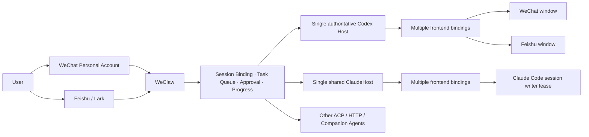

# WeClaw

[Chinese](README_CN.md)

[](https://github.com/TingRuDeng/weclaw/actions/workflows/ci.yml)
[](https://github.com/TingRuDeng/weclaw/releases/latest)
[](go.mod)
[](https://github.com/TingRuDeng/weclaw/releases/latest)
[](LICENSE)

Use local Codex and Claude remotely from WeChat or Feishu while keeping real workspace and session context, live progress, approvals, and results. Codex always has one authoritative Host; Codex App, the controlled CLI, WeChat, and Feishu can continue the same thread as equal input frontends.

> Official releases support **macOS Apple Silicon / Intel (darwin/arm64 and darwin/amd64)** plus **Linux arm64 / amd64**. Windows assets are not currently published.

## Why WeClaw

- **Take over local work remotely**: continue Codex and Claude sessions from WeChat or Feishu after leaving your computer.
- **Keep the original context**: reuse Codex workspaces/threads and Claude ACP sessions instead of starting a new conversation for every message.
- **See progress and receive results**: Feishu uses CardKit updates, while WeChat provides typing state and task results.
- **Use one Codex runtime boundary**: either Codex App or the shared app-server is the Host; active-turn inputs follow app-server acceptance order, while writer leases serialize new turns.
- **Configure security boundaries**: user allowlists, workspace roots, admin access, audit logs, and Codex permission levels are independent controls.

## Quick Start

After verifying the WeClaw binary, the one-line installer runs a read-only dependency check. On an interactive terminal it then lists missing components, their purpose, and linked prerequisites; installation starts only after the user selects components and confirms the complete plan. Codex uses OpenAI's official standalone installation and does not require Node.js/npm. Remote Claude operation requires both `claude` and the pinned `claude-agent-acp`; its current installation path requires Node.js 22+.

```bash
# Install the actively maintained distribution
curl -fsSL --proto '=https' --tlsv1.2 https://raw.githubusercontent.com/TingRuDeng/weclaw/main/install.sh | sh

# If GitHub is unreachable, fetch the same installer and verified mirror assets from Gitee
curl -fsSL --proto '=https' --tlsv1.2 https://gitee.com/jimdeng891/weclaw/raw/main/install.sh | WECLAW_SOURCE=gitee sh

# Check agents, platform credentials, and access control
weclaw doctor

# Select missing dependencies interactively; confirm before any system or official installer runs
weclaw doctor --fix

# Connect WeChat or Feishu as needed
weclaw wechat login
weclaw feishu add

# Start the background service
weclaw start
weclaw status
```

The configuration file is `~/.weclaw/config.json`, the runtime log is `~/.weclaw/weclaw.log`, and the default audit log is `~/.weclaw/audit.log`.

## Core Workflows

### Start a Codex Task Remotely

```text
/cwd /path/to/project
/cx ls                 # List existing sessions
/cx <number>           # Select and bind a session; Feishu also supports session cards
# Or send /cx new      # Create and bind a session
/cx rename current New name
Inspect the current project and fix the failing tests
```

After selecting an existing session or sending `/cx new`, send the task directly. Without a valid session binding, a regular message only asks the user to select a session or send `/cx new`; it never creates or binds a session implicitly.

### Use Codex App and WeClaw Together

```text
/cx ls                 # List existing local workspaces and threads
/cx <number>           # Bind this frontend window to the selected thread
/cx status             # Inspect the current workspace, session, task, account, and runtime
```

With the default `codex_host_mode: auto` on macOS, WeClaw uses protected Desktop IPC when Codex App is already running and does not start a second app-server. When the App is absent, it connects to or starts the official standalone daemon, with the WeClaw-managed Host as the compatibility backend. If a shared Host is already active, WeClaw switches to a newly detected App only after every thread is globally idle and no writer lease exists. An ambiguous App endpoint or non-idle Host fails closed and never falls back to parallel writes.

The App Host supports selecting existing sessions, turns, progress, approvals, `/stop`, and current-thread model or reasoning changes. After Feishu or WeChat binds a thread that is already running in the App, a regular message goes directly into the active turn instead of waiting in a private continuation queue. Desktop IPC does not currently expose session creation, archive, or rename, the complete model list, account management, or quota APIs. Perform those operations in Codex App and select the resulting session with `/cx ls`; `/cx new` and `/cx rename` fail clearly in App mode without deleting the current binding.

`/cx app`, `/cx cli`, `/cx attach`, and `/cx detach` remain disabled because chat commands cannot launch another local process. Use the controlled terminal entrypoint instead:

```bash
weclaw codex cli
weclaw codex cli resume <thread-id>
```

This command uses only the official standalone Codex binary and pins `--remote` to the unique official daemon socket. It allows only the interactive TUI and its `resume`, `fork`, and `archive` operations; custom `--remote`, non-interactive, and management subcommands are rejected. When WeClaw is stopped and Codex App is absent, the command may start the daemon directly. When the service is running, the CLI must first ask that process through a loopback-only control endpoint to prepare the Host using its already-resolved topology, then prove that the returned socket exactly matches the local configuration. Desktop, a managed Host, an unreachable service control endpoint, or ambiguous Host identity all fail closed. Legacy Codex `type: cli` configuration migrates to the shared app-server, and the old independent `codex exec` session mode is removed.

Queued follow-ups that have not been sent from Codex App or the CLI remain local client drafts. They join the shared ordering only after the app-server accepts them; WeClaw does not treat drafts as submitted work or send them automatically.

### Switch Codex OAuth Accounts Safely

WeClaw can save multiple authenticated Codex ChatGPT OAuth accounts and switch the host-level identity of the single shared app-server. A switch never changes a workspace, thread, or frontend binding and never replays the previous message; the next message uses the new account.

```bash
weclaw codex account list
weclaw codex account current
weclaw codex account save <label> [--replace] [--allow-file-store]
weclaw codex account use <id-or-label> [--yes]
weclaw codex account remove <id-or-label>
weclaw codex account doctor
```

The account index is isolated by a host ID derived from `CODEX_HOME + app-server socket` and stored under `~/.weclaw/codex-accounts/<host-id>/`. It contains only labels, masked email addresses, fingerprints, and secret references. Complete OAuth snapshots go to macOS Keychain or Linux Secret Service first. A `0600` file fallback is permitted only when the local user explicitly passes `--allow-file-store`. API keys, PATs, Bedrock, and other authentication modes are rejected. If Keychain or Secret Service cannot delete an old secret after a profile replacement or removal, the index retains a pending-cleanup record, retries it during later account transactions, and makes `doctor` report it instead of silently leaving OAuth material behind.

To collect several profiles, sign Codex into each target account and run `save`. If Codex App later switches to an already saved profile, `/cx status` and the account commands show the pending target. The next real task reconciles it only when the shared Host is globally idle. If the Host already uses the target, WeClaw updates only the profile index and Host metadata; otherwise it performs a controlled restart. Active tasks, writer leases, or unknown threads leave all state unchanged and return busy. An unknown local account is never imported implicitly or allowed to overwrite an existing profile; stop WeClaw and save it offline first.

While WeClaw is running, `save` accepts only the account actually used by the shared Host when it matches `auth.json`, and the CLI must use the local control API for account operations. If the process exists but that API is unavailable, the CLI fails closed instead of editing authentication directly. With the service stopped, `use` only projects authentication atomically and updates the active profile for the next start.

An online `use` first rejects active tasks, active or uncertain writer leases, and every active or unknown thread. It persists a switch journal before stopping the real managed Host, projects the target authentication, starts the unique Host, and verifies both account identity and rate limits. A target startup or verification failure restores the previous authentication and Host. A mid-switch process exit or rollback failure remains fail-closed after restart instead of becoming writable when memory resets. Online `save` likewise commits the profile index and Host identity metadata as one compensated operation. WeClaw never terminates a legacy or otherwise unverified app-server; run `weclaw codex account doctor`. To clear an unsafe journal, stop the service, explicitly run offline `use`, then start it again.

Use `/cx account` or `/cx account status` from Feishu or WeChat to inspect the masked current profile. Only an administrator in a direct chat may list profiles or run `/cx account use <id-or-label>`. A Feishu list selection adds a five-minute confirmation card scoped to the operator, route, target profile, and list revision. A WeClaw host has one globally active Codex account, not one account per chat window.

### Reuse Claude Code Sessions

```text
/cc ls
/cc switch <number|sessionId>
/cc new
/cc rename current <name>
/cc status
/cc quota
```

Claude uses one process-resident shared ClaudeHost for real ACP sessions: each WeClaw service starts one `claude-agent-acp` process, while WeChat, Feishu, and other frontends persist only their own workspace/session bindings. `session/list` is the directory source of truth. Multiple frontends may bind the same session, the host performs only one effective `session/resume` for it, and a session-scoped writer lease is acquired only when a prompt starts. Another frontend cannot append work to the current writer's queue and receives an explicit busy result until that task ends.

Selecting or creating a session, choosing it from a Feishu card, or using global `/new` while Claude is selected changes only the current frontend binding. It never overwrites or releases another frontend. A failed `session/resume`, ACP disconnect, or ClaudeHost startup marks that binding runtime-unavailable without reverting the selected agent/session or clearing the binding; regular writes stay blocked until recovery succeeds. After a WeClaw restart, durable bindings return as `pending_resume` and the shared runtime is restored on real use.

If ACP has not persisted an empty session immediately after `/cc new`, `/cc ls` marks the acquired binding as the “current new session.” This entry is display-only until the first message makes it part of the normal catalog, and it never bypasses `/cc switch` validation against `session/list`.

`/cc owner` and `/cc cli` are disabled. ClaudeHost no longer has a frontend-exclusive owner, and an independent `claude --resume` would bypass the session writer lease and create a second writer. Legacy `remote`, `local`, and `unclaimed` control intents are discarded on load while every frontend binding is retained. Native `claude` is used only as a short-lived, prompt-free fallback for `/cc quota`, never for session writes. Claude tasks support `/stop` and one queued continuation from the same frontend, but not `/guide`.

### Manage Workspaces and Session Names

An administrator may register or hide existing working directories from a direct chat with `/cx workspace add <path>` and `/cx workspace remove <number|path>`; Claude uses the corresponding `/cc workspace ...` commands. Entries are isolated by the configured Agent name in `~/.weclaw/workspace-registry.json`. `remove` hides a directory only from WeClaw navigation: it never deletes source files, Codex threads, Claude sessions, or history, and a later `add` makes it visible again. Registering a path outside the allowlist does not expand a regular user's `allowed_workspace_roots` access.

Administrators can also hide an idle, unbound session from a direct chat with `/cx session remove <number|threadId>` or `/cc session remove <number|sessionId>`. Use the corresponding `session restore <stable-id>` command to make it visible again. This changes only WeClaw's navigation overlay; it never archives or deletes Agent sessions or history, and it fails closed while any frontend remains bound or task state is active or uncertain.

Users who can access the target workspace may run `/cx rename current|<number> <name>` or `/cc rename current|<number> <name>` to change the Agent-global session name. Names are single-line text of at most 120 Unicode code points. Codex writes through the unique shared app-server and verifies the result; Claude reuses the same ClaudeHost and session writer lease only after the ACP adapter advertises `rename` at runtime. Rename never changes any frontend binding, and a busy or unverifiable operation fails explicitly and asks the user to refresh the list.

### Control a Running Task

- Send a regular message while Codex is active: submit it immediately to the current app-server turn without creating another turn or private queue.
- Send a regular message while Claude is active: queue at most one continuation and run it after the current task ends.
- `/cancel`: remove a queued message when one actually exists, without stopping the active task.
- `/guide`: submit an actually queued Codex message to the current task; normal active-turn input does not need this command.
- `/stop`: stop the task running in the current chat window.
- `/ps`: list tasks running for the current user.

Feishu opens a compact contextual card only when a message actually enters the compatibility pending queue; normal Codex active-turn input does not show a queue card. A Claude continuation runs automatically after the current task unless the user changes that handling. The card is bound to the bot account, operator, chat route, active task, and exact queued-message revision, so an expired card cannot alter a later task or replacement message. Button results replace the same card instead of creating a separate command-result message.

Native Codex App Server plan, tool, and file signals are normalized into structured progress events. Running and terminal states with the same event ID update in place, while raw command output, tool arguments, and diffs never enter the card. `commandExecution` lifecycle events are omitted from progress; command approvals that require user action remain independently visible. Codex user-visible messages explicitly marked as `commentary` accumulate in source order with their complete text in the same timeline and participate in automatic card continuation; Claude interim notes remain in the separate **Current note** section. Final answers and Codex messages with an unknown phase never enter the task card. Stale or late watcher events cannot overwrite a terminal task state.

As soon as a native task card is created, WeClaw atomically records its recoverable reference in `~/.weclaw/state/terminal-outbox.json`. At task termination, the Feishu card changes only to completed, failed, or stopped while preserving its progress and approvals; the complete final result is delivered independently as a new static Markdown result card whose title identifies the Agent and workspace. Long results are capacity-checked and split into consecutively numbered cards. Card checkpoints and result cards record separate success states and are attempted and retried independently, so a failure or stall on one path does not block the other and a restart recovers only unfinished work. An ambiguous network response is retried with the same UUID instead of falling back to text and creating a duplicate; platforms without rich-result support retain the idempotent text path. If the process exits while the task is active, the next process updates the original card to a stopped “task interrupted” terminal and independently delivers the stopped result. Feishu CardKit checkpoints and result-card segments use stable UUIDs, while WeChat chunks use stable deduplication keys. Delivery is at-least-once rather than cross-platform exactly-once. Attachments and remote images remain outside the v1 outbox and use the existing validated best-effort path.

When `save_dir` is configured, a message containing only one URL triggers link archiving. WeChat articles are fetched directly; every other URL is first sent in full to the third-party Jina Reader service, with a direct WeClaw fetch only if Jina fails. The URL path, query, and fragment are therefore disclosed to Jina. Do not use this feature for private links containing signatures, credentials, or other sensitive data.

Operators can inspect the redacted queue with `weclaw outbox status [--json]` and wake one or all pending deliveries with `weclaw outbox redrive [entry-id]`. Redrive is online-only, preserves attempt counters and payloads, and fails closed when the service API is unreachable. `weclaw doctor` also reports unreadable, pending, or capacity-exhausted outbox state.

### Query End-to-End Traces

WeClaw records fixed-field events for the platform message, task, Agent turn, structured progress, reply, and terminal outbox in `~/.weclaw/state/trace.jsonl`. Route keys are stored only as irreversible digests, common credentials are removed from diagnostic text, and the `0600` file keeps three rotated 10 MiB backups.

```bash
weclaw trace <trace-id>
weclaw trace --message-id <platform-message-id>
weclaw trace --task-id <task-id> --limit 200
weclaw trace --thread-id <thread-id> --turn-id <turn-id> --json
```

While the service is running, this command queries the API-token-protected, actual-loopback `/api/traces` endpoint. It fails closed if the process is alive but the API cannot be reached. With the service stopped, it reads the local trace files without modifying them.

Codex wire data is excluded by default. Set `WECLAW_CODEX_PROTOCOL_TRACE=1` temporarily to record method, request ID, thread/turn, sequence, and connection epoch metadata. `WECLAW_CODEX_PROTOCOL_TRACE_PAYLOAD=1` additionally records recursively redacted, size-bounded JSON payloads. Those payloads may still contain user prompts or file content, so disable the option after diagnosis.

## How It Works


```mermaid
flowchart LR
    User[User] --> WeChat[WeChat Personal Account]
    User --> Feishu[Feishu / Lark]
    WeChat --> Bridge[WeClaw]
    Feishu --> Bridge
    Bridge --> Core[Session Binding · Task Queue · Approval · Progress]
    Core --> Codex[Single authoritative Codex Host]
    Core --> Claude[Single shared ClaudeHost]
    Core --> Other[Other ACP / HTTP / Companion Agents]
    Codex --> Bindings[Multiple frontend bindings]
    Bindings --> WeChatClient[WeChat window]
    Bindings --> FeishuClient[Feishu window]
    Claude --> ClaudeBindings[Multiple frontend bindings]
    ClaudeBindings --> Session[Claude Code session writer lease]
```

WeClaw uses the `platform` abstraction to share commands, sessions, tasks, and approvals, then renders text, typing state, or Feishu cards according to platform capabilities. The main Codex path uses its native app-server protocol. Claude uses one process-resident ACP ClaudeHost; native `claude` is only a prompt-free quota-query fallback.

## Capability Matrix

| Capability | WeChat Personal Account | Feishu / Lark |
| --- | :---: | :---: |
| Text, images, and files | Yes | Yes |
| Live progress | Typing state + text | CardKit updates |
| Interactive choices and approvals | Numbered or text choices | Native buttons and cards |
| Group chat | Direct messages only | Yes, requires @bot by default |
| Multiple accounts / bots | Yes | Yes |
| Proactive send | Yes | Yes, text only today |
| User authorization codes | Yes | Yes |

| Agent | Remote Backend | Session Reuse | Model / Reasoning | Independent Writer |
| --- | --- | :---: | :---: | --- |
| Codex | Codex App IPC / shared app-server | Workspace + thread | Yes | Controlled CLI reuses the daemon; no independent writer |
| Claude | Single shared ClaudeHost (ACP) | ACP session + writer lease | Yes | Disabled |
| OpenCode | Companion | Depends on local connection | Agent-dependent | Visible terminal |
| Other agents | ACP / HTTP / Companion | Protocol-dependent | Agent-dependent | Configuration-dependent |

## Chat Commands

| Command | Description |
| --- | --- |
| `/help`, `/status` | Show help and WeClaw runtime status |
| `/cwd [path]` | Show or switch the current frontend workspace; switching also updates Agent default cwd values, and regular users are confined to allowed workspace roots |
| `/new` | Explicitly create a session for the current default agent; also bind it when Codex is the default |
| `/model`, `/reasoning` | Show or change the bound session configuration, or the new-session defaults when no session is bound |
| `/fast [on|off]` | Show or change the bound Codex session speed, or the new-session default when no session is bound |
| `/mode [default|yolo]` | Show or change Agent approval behavior; group chats isolate the setting by actor, and bare `/mode` opens a Feishu choice card. Switching to yolo releases that actor's existing approvals in the current route and closes sent approval cards as auto-approved; later automatic approvals do not open a separate card and are appended to the task card when available |
| `/approve <code>`, `/deny <code>` | Allow or deny the matching approval when card buttons are unavailable; codes are actor-, window-, and expiry-bound |
| `/progress [mode]` | Show progress mode; only administrators may change the account-level mode |
| `/ps`, `/stop` | List or stop current tasks |
| `/cancel`, `/guide` | Handle an actually queued message; regular Codex active-turn input is sent directly |
| `/cx help`, `/cc help` | Show complete Codex or Claude session commands |
| `/cx <number>`, `/cx switch <number>` | Select and bind a Codex session in the current workspace |
| `/cx new` | Create and bind a Codex session in the current workspace |
| `/cx archive current`, `/cx archive <number>` | Archive the current or listed idle Codex session while preserving its history |
| `/cx rename current\|<number> <name>` | Rename the current or listed Codex session without changing frontend bindings |
| `/cx session remove <number\|threadId>`, `/cx session restore <threadId>` | Hide or restore Codex session navigation from an administrator direct chat without archiving or deleting history |
| `/cx workspace add <path>`, `/cx workspace remove <number\|path>` | Register or hide a Codex working directory from an administrator direct chat |
| `/cc rename current\|<number> <name>` | Rename a Claude session when the adapter advertises support, without changing frontend bindings |
| `/cc session remove <number\|sessionId>`, `/cc session restore <sessionId>` | Hide or restore Claude session navigation from an administrator direct chat without deleting history |
| `/cc workspace add <path>`, `/cc workspace remove <number\|path>` | Register or hide a Claude working directory from an administrator direct chat |
| `/cx account`, `/cx account status` | Inspect the host-level Codex account; administrator direct messages may select and switch |
| `/update`, `/restart [--force]` | Remotely update or restart WeClaw from an administrator direct message |

<details>
<summary>Common Codex commands</summary>

Select and bind: `/cx <number>`, `/cx switch <session>`, `/cx cd <workspace>` when that workspace has one session, and `/cx new`.

Archive: `/cx archive current` archives the bound session; after entering a workspace session list, `/cx archive <number>` archives that entry. Only idle sessions with no other WeClaw frontend binding can be archived. History is preserved and can be restored from the Codex App archive.

Workspaces and names: `/cx workspace add <path>` and `/cx workspace remove <number|path>` require an administrator direct chat. `/cx rename current|<number> <name>` renames the current or listed idle session. Desktop follower mode has no rename write operation, so rename it in Codex App instead.

Runtime boundary: `/cx status` is a compact view of the current workspace, session, task, account, and runtime. Use `/cx pwd` for the full path, `/cx account status` for account diagnostics, and `/cx quota` for usage limits.

Other commands: `/cx whoami`, `/cx ls`, `/cx ..`, `/cx cd <workspace|..>`, `/cx pwd`, `/cx status`, `/cx quota`, `/cx account`, `/cx account status`, `/cx account use <profile>`, `/cx model status|ls`, and `/cx clean`. `/cx model status` shows defaults for newly created Codex sessions; use `/model`, `/reasoning`, and `/fast` for the bound session. Fast availability is read from the current model catalog and unsupported accounts or models fail explicitly.

</details>

<details>
<summary>Common Claude commands</summary>

`/cc whoami`, `/cc ls`, `/cc cd <number|..>`, `/cc switch <number|sessionId>`, `/cc new`, `/cc rename current|<number> <name>`, `/cc workspace add|remove`, `/cc pwd`, `/cc status`, `/cc quota`, `/cc model status|ls|reset`. `/cc cd` enters a workspace or returns to the workspace list. `/cc status` is the unified binding, shared-ClaudeHost, and writer view. `/cc model status` shows defaults for newly created Claude sessions, while `/cc model reset` clears them; use `/model` and `/reasoning` for the bound session. `/cc owner` and `/cc cli` are disabled.

`/cc quota` reuses the local Claude Code OAuth login to read the 5-hour, 7-day, and model-scoped limits without sending a model request. WeClaw first supports Claude Code's legacy Keychain/credentials file and its Anthropic usage endpoint, then falls back to a short-lived native `get_usage` control query when those credentials are unavailable or the request fails. The token is kept in memory, sent only to the fixed Anthropic endpoint, never logged or persisted, and never forwarded through redirects. These credential, endpoint, and structured-control contracts are not stable public APIs and may change in later Claude Code releases. API key, Bedrock, Vertex, and sessions without profile scope report that subscription limits are unavailable.

</details>

## Platform Setup

### WeChat

```bash
weclaw wechat login
weclaw wechat users pending
weclaw wechat users approve-code <authorization-code> [--admin]
```

An unauthorized WeChat user receives a short-lived authorization code. An empty `allowed_users` list rejects everyone by default.

### Feishu

```bash
weclaw feishu add
weclaw feishu status --name <bot-name>
weclaw feishu users pending
weclaw feishu users approve-code <authorization-code> [--bot <name|app_id>] [--admin]
```

`weclaw feishu add` saves credentials interactively and updates `platforms.feishu.bots[]`. The `app_secret` is stored only in a separate credential file, never in `config.json`. Each bot can have its own user allowlist, default agent, and progress mode.

<details>
<summary>Minimum Feishu application permissions</summary>

Tenant scopes: `im:message.p2p_msg:readonly`, `im:message.group_at_msg:readonly`, `im:message.group_at_msg.include_bot:readonly`, `im:message:readonly`, `im:message:send_as_bot`, `im:resource`, `im:chat`, `cardkit:card:read`, `cardkit:card:write`, `application:bot.basic_info:read`, and `application:bot.menu:write`. The `im:message:readonly` scope is required to read image and file resources attached to messages. WeClaw runtime does not require user scopes. Publish a new Feishu application version and complete approval after changing permissions.

</details>

<details>
<summary>Recommended Feishu menu</summary>

- Common: `/help`, `/status`, `/ps`, `/stop`
- Codex: `/cx ls`, `/cx status`, `/cx new`, `/cx account`
- Claude: `/cc ls`, `/cc status`, `/cc new`, `/cc quota`
- Settings: `/model`, `/reasoning`, `/fast`, `/mode`

Keep `/guide` and `/cancel` out of the permanent menu: Feishu presents them only when a message is actually queued. Regular Codex active-turn input is sent directly and does not open a queue card; `/help` remains the fallback command index.

</details>

## Configuration and Security

Use the local panel or CLI before editing JSON manually:

```bash
weclaw web
weclaw config agent --name claude
weclaw config permission --agent codex --level default
weclaw doctor
```

`stream` mode has no WeClaw timeline item-count limit by default, equivalent to `stream_timeline_limit: 0`. Override it with a positive integer at the global, Agent, platform, or Feishu bot-account `progress` layer to retain only the latest N entries. An entry is either a semantically merged plan, tool, or file event with a stable ID, or one user-visible Codex commentary message—not a command lifecycle, raw protocol event, reasoning trace, token delta, command output, or tool log. Explicit `commentary` messages enter the timeline immediately. If the Codex runtime omits `phase`, WeClaw holds one completed message until later activity proves it is intermediate; the last message still pending at normal completion remains the final answer and is not copied into the progress card:

```json
{
  "progress": {
    "mode": "stream",
    "stream_timeline_limit": 0
  }
}
```

Unlimited items do not bypass platform payload limits. Before the complete Feishu card JSON approaches a conservative internal soft limit, WeClaw freezes the current segment and opens another progress card. Earlier cards retain their displayed history; at termination the latest card changes status without replacing its current segment. Codex commentary keeps its complete text and counts as timeline entries; structured plan, tool, and file summaries remain compacted to 180 characters. Claude's current note does not count toward the timeline limit and remains compacted to 180 characters per update. The complete final result is sent as a new static Markdown result card rather than replacing the progress card, and early progress is not silently truncated.

Before the Agent produces its first effective non-command progress event, a Feishu task card body shows only `思考中.....`; synthetic timer copy such as “waiting for Agent” or “connection healthy” does not replace it. After a Codex commentary, Claude message, plan, file change, or tool summary arrives, the same card shows the accumulated user-visible replies and safe structured progress, with `思考中.....` kept once at the bottom. Completion, failure, or stop removes that active indicator while preserving the terminal state, existing process content, and approval records. Uninformative Codex command-execution lifecycle entries stay hidden; internal reasoning and status heartbeats do not unlock the waiting card, while real approvals remain visible.

`weclaw web` binds to `127.0.0.1:39282` by default, injects the token through a URL fragment that is never sent to the server, and opens the browser. Soft settings such as agents, progress, allowlists, administrators, and workspace roots support hot reload. Platform enablement, credentials, or account topology changes require a restart. The built-in server has no TLS: non-loopback listeners are rejected by default and require an explicit `--allow-insecure-http` opt-in on a trusted LAN (a strong random token is still generated when `--token` is omitted); use an HTTPS tunnel or reverse proxy for public access.

`weclaw doctor` is read-only by default. In addition to the existing configuration checks, it inspects `sqlite3`, Linux `bubblewrap`, Node.js/npm, Codex CLI `app-server` support, Claude Code CLI, and the Claude ACP adapter. Missing runtime dependencies for a configured Agent are blocking failures; missing optional Agents or dependencies that affect only the `/cx` catalog or Codex Linux sandbox are warnings.

When a controlling terminal exists, first installation connects the same `weclaw doctor --fix` wizard through `/dev/tty`, so dependency choices cannot consume the `curl | sh` script input. Without a controlling terminal the installer performs only the read-only check and prints follow-up commands. Set `WECLAW_SKIP_DEPENDENCY_SETUP=1` to skip both the check and wizard explicitly. Non-interactive dependency installation must be a separate explicit command with both components and consent, for example `weclaw doctor --fix --components sqlite3,bubblewrap --yes`; it never defaults to installing everything.

`weclaw doctor --fix` labels component roles: SQLite and Linux bubblewrap are optional enhancements, Codex and Claude are optional Agents, Node.js/npm are prerequisites only for Claude, and Claude ACP is required after selecting Claude. Supported component names are `sqlite3`, `bubblewrap`, `nodejs`, `npm`, `codex`, `claude`, and `claude-acp`. Selecting Codex uses OpenAI's official standalone installer only; selecting Claude or Claude ACP selects the CLI, adapter, and Node.js/npm. The full command and privilege plan is shown before execution, and pressing Enter or declining confirmation installs nothing.

The Codex installer is downloaded to a private temporary file and then executed with fixed arguments and `CODEX_NON_INTERACTIVE=1`; Doctor does not use `curl | sh` or dynamic shell composition. System dependencies use only a detected `apt-get`, `dnf`, or Homebrew installation. Linux privilege escalation is an explicit `sudo` command. npm installation never uses `sudo npm`: non-root users use the `~/.local` prefix, and the repair process temporarily prepends `~/.local/bin` while it rechecks capabilities and saves absolute Agent paths, then restores the original PATH. WeClaw does not add third-party Node repositories or replace nvm, mise, or another version manager. If the system package still does not satisfy Claude's selected Node.js requirement, repair stops before npm runs and reports the real failure.

After installation, WeClaw repeats the same capability probes and saves newly discovered Agent configuration only after verification. It never performs Codex or Claude login; run the corresponding CLI to complete official authentication. A successful Claude ACP check proves only that the `initialize` handshake works. It does not probe `session/list` or `session/resume`; use the real session commands to verify listing and recovery.

Key security rules:

- An empty platform `allowed_users` list rejects everyone by default.
- `admin_users` grants only WeClaw management access; the user must still belong to the relevant platform allowlist.
- Regular users may only `/cwd` into `allowed_workspace_roots` and their descendants; administrators are exempt.
- A non-loopback `api_addr` requires `api_token`.
- Loopback listeners may omit `api_token`, but other local processes can then call administrative endpoints; `weclaw doctor` reports this risk, and a random token is still recommended.
- Audit logging is enabled by default and never records secrets.
- Codex `permission_level` accepts `default`, `auto_review`, and `full_access`; the effective default is `default`.
- Codex manages the shared Unix socket automatically. Set `app_server_socket` only for multi-process or `run_as_user` deployments; its parent must be owned by the target user and no more permissive than `0700`.
- `codex_host_mode` accepts `auto`, `daemon`, and `managed`. The default `auto` selects `daemon` only when `CODEX_HOME` contains the official control socket or an executable standalone Codex; otherwise it uses the compatible `managed` backend. Explicit `daemon` fails when the standalone install is missing, the socket is unmanaged, or lifecycle validation fails, and never starts a second Host as a fallback. Daemon mode owns its socket and process through the official lifecycle commands and cannot be combined with `app_server_socket` or `run_as_user`.
- Native Codex shared app-server configurations default to `codex_auto_update: incompatible`. Only an upstream error that explicitly identifies a newer/incompatible state schema or version may authorize `codex update`, and only for the compatible `managed` backend while no writer lease exists. A generic `failed to initialize sqlite state runtime`, database contention or corruption, socket-readiness timeout, caller cancellation, ordinary exit, or connection failure is not update evidence. Official daemon mode is not updated by WeClaw. Set the policy to `off` to disable it; failures and unchanged versions stay fail-closed and never fall back to another Agent.

| Codex Permission Level | Behavior |
| --- | --- |
| `default` | `workspace-write` + on-request approval + user confirmation |
| `auto_review` | Keeps the sandbox and lets Codex review escalation requests |
| `full_access` | `danger-full-access` + no approval; trusted environments only |

## Run and Update

```bash
weclaw start                 # Start in the background
weclaw start --foreground    # Run in the foreground for debugging
weclaw status
weclaw restart
weclaw restart --force       # Explicitly interrupt active tasks
weclaw stop
weclaw update
weclaw update --source gitee  # Explicit Gitee mirror for restricted networks
weclaw update --restart
weclaw version
```

Update sources are `auto` (default), `github`, and `gitee`. Use `--source` for one command, set `"update_source": "gitee"` in `~/.weclaw/config.json` for a persistent choice, or override it with `WECLAW_UPDATE_SOURCE`. `auto` falls back from GitHub to Gitee only for DNS, connection, TLS, timeout, or HTTP 5xx failures. HTTP 4xx, invalid versions, and SHA-256 failures stop immediately instead of being hidden by a mirror fallback. The updater also rejects a stale mirror that would downgrade the installed stable version.

`weclaw update` returns immediately when the installed version is already current. Configuration and agent preflight runs only after installing a new version or when `update --restart` is explicitly requested. `restart` and `update --restart` finish preflight and atomically enter drain mode through the loopback control API before stopping the old service: a normal restart rejects active tasks, while `--force` cancels them and waits for terminal delivery. A systemd-managed instance remains owned by systemd instead of spawning a private daemon. Even a direct `systemctl restart` that bypasses CLI preflight closes leftover task cards through SIGTERM draining or startup recovery. If preflight fails after installing a new version, WeClaw restores the previous binary. During `update --restart`, safety-check, shutdown, or startup failures likewise restore the previous binary and restart the previous service if it had already stopped; rollback failures are reported together with the original update error. Without an explicit `--restart`, `weclaw update` replaces only the binary and never restarts the service. Update official installations with `weclaw update`; never overwrite the binary in PATH with a local build.

## Build from Source

```bash
git clone https://github.com/TingRuDeng/weclaw.git
cd weclaw
go build -o weclaw .
./weclaw --help
```

The repository currently uses Go 1.26.5. No publicly pullable container image is currently published in sync with this maintained distribution.

`scripts/release.sh` is the only authoritative stable-release entrypoint. The manual GitHub Actions Release workflow checks out clean `main` and delegates to that script instead of maintaining a second test, build, or upload pipeline. GitHub Release remains authoritative for versions and builds. Only after that release is public and verified are the four binaries mirrored to [Gitee](https://gitee.com/jimdeng891/weclaw) as reversible `.gz` attachments alongside the original `checksums.txt`; the installer and updater still verify the unpacked files against the authoritative GitHub checksums. A mirror failure visibly fails the release job without deleting the already verified GitHub Release; the manual `Repair Gitee Mirror` workflow resumes missing attachments from that GitHub Release and verifies them again.

## Upstream and License

This repository is an actively maintained fork of [fastclaw-ai/weclaw](https://github.com/fastclaw-ai/weclaw) and its WeChat integration is inspired by [@tencent-weixin/openclaw-weixin](https://npmx.dev/package/@tencent-weixin/openclaw-weixin). Follow the project license and relevant platform terms, and only use accounts and devices you are authorized to control.

[Contributors](https://github.com/TingRuDeng/weclaw/graphs/contributors) · [Releases](https://github.com/TingRuDeng/weclaw/releases) · [Star History](https://star-history.com/#TingRuDeng/weclaw&Timeline)

License: [AGPL-3.0-or-later](LICENSE)
