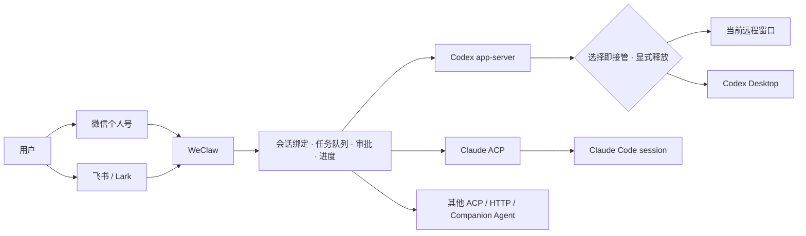

# WeClaw

[English](README.md)

[](https://github.com/TingRuDeng/weclaw/actions/workflows/ci.yml)
[](https://github.com/TingRuDeng/weclaw/releases/latest)
[](go.mod)
[](https://github.com/TingRuDeng/weclaw/releases/latest)
[](LICENSE)

通过微信和飞书远程接管本机 Codex、Claude：复用真实工作空间与会话上下文，实时回传进度、审批和结果；选择已有 Codex 会话或新建会话即由当前远程窗口接管，发送 `/cx owner desktop` 可显式释放给 Codex Desktop。

> 当前正式 Release 支持 **macOS Apple Silicon / Intel（darwin/arm64、darwin/amd64）** 和 **Linux arm64 / amd64**。Windows 暂不提供正式资产。

## 为什么使用 WeClaw

- **远程接管本地任务**：离开电脑后，从微信或飞书继续 Codex、Claude 会话。
- **上下文不中断**：复用 Codex workspace/thread 和 Claude ACP session，不把每条消息当成新对话。
- **过程可见、结果可达**：飞书使用 CardKit 实时更新，微信提供输入状态和任务结果。
- **控制权明确**：选择或新建 Codex 会话即由当前远程窗口接管；`/cx owner desktop` 显式释放，避免多个远程窗口争用。
- **安全边界可配置**：用户白名单、工作目录白名单、管理员权限、审计日志和 Codex 权限档位均可独立配置。

## 快速开始

前置条件：本机已安装需要使用的 Agent。Codex 使用 `codex`，Claude 使用 `claude`；一键安装检测到 Claude CLI 后会安装并配置固定版本的 `claude-agent-acp`。

```bash
# 安装当前维护版
curl -sSL https://raw.githubusercontent.com/TingRuDeng/weclaw/main/install.sh | sh

# 检查 Agent、平台凭证和访问控制
weclaw doctor

# 按需接入微信或飞书
weclaw wechat login
weclaw feishu add

# 启动后台服务
weclaw start
weclaw status
```

配置文件位于 `~/.weclaw/config.json`，运行日志位于 `~/.weclaw/weclaw.log`，审计日志默认位于 `~/.weclaw/audit.log`。

## 核心工作流

### 从远程窗口开始 Codex 任务

```text
/cwd /path/to/project
/cx ls                 # 查看已有会话
/cx <编号>             # 选择会话并接管；飞书也可点击会话卡片
# 或发送 /cx new       # 新建会话并接管
检查当前项目并修复测试失败
```

选择已有会话或发送 `/cx new` 后即可直接发送任务。没有有效会话绑定时，普通消息只会提示选择会话或发送 `/cx new`，不会隐式创建或接管会话。

### 接管并归还 Codex Desktop 会话

```text
/cx ls                 # 查看本机已有 workspace 和 thread
/cx <编号>             # 选择当前列表项；选中 thread 后立即接管
/cx owner              # 查看当前控制方、运行位置和任务状态
/cx owner desktop      # 空闲后显式释放给 Codex Desktop
/cx owner remote       # 释放后由当前微信或飞书窗口重新接管
```

会话选择或新建会先持久化当前窗口的会话绑定和所有权，再同步运行通道。Desktop 可达时继续通过 Desktop 运行；Desktop 探测超时、断线或遗留冲突不能证明存在另一 writer，显式选择或 `/cx owner remote` 会校验 rollout 后恢复 WeClaw app-server。Desktop 与 WeClaw 的 turn 可以在同一 thread 并存，WeClaw 只记录并存状态，不再把整个会话锁成冲突；WeClaw 自身仍会串行同一 thread 的远程写入。普通消息只信任已持久化的所有权和已建立的运行绑定，不会自行探测或接管；重启后若运行绑定尚未恢复，重新选择会话或发送 `/cx owner remote` 即可恢复。`/cx owner desktop` 仍会先提交释放，远程任务执行中必须先等待完成或发送 `/stop`。

### 复用 Claude Code 会话

```text
/cc ls
/cc switch <编号|sessionId>
/cc new
/cc status
/cc owner
/cc owner local
/cc owner remote
/cc quota
/cc cli
```

Claude 通过 ACP `session/list`、`session/resume` 和 `session/new` 管理真实 session。选择、新建、飞书卡片切换或默认 Claude 的全局 `/new` 都会先把当前远程窗口持久化为 owner；`session/list` 是会话目录事实源，WeClaw 持久化的 control intent 是远程写入事实源。`session/resume` 失败只会把绑定标记为运行通道不可用，不会切回旧 Agent、旧 session 或释放 owner；普通消息在恢复成功前保持禁止写入。重启 WeClaw 后会在下一条消息前恢复绑定和控制意图。

`/cc new` 后如果 ACP 目录还没有持久化空会话，`/cc ls` 会把当前已接管的绑定标记为“当前新会话”。该条目只用于导航展示；发送首条消息后会进入正常目录，并且始终不能绕过 `/cc switch` 的 `session/list` 校验。

`/cc owner local` 只显式释放远程控制，`/cc owner remote` 在确认本地 Claude CLI 已结束后重新接管。`/cc cli` 会先释放远程控制再打开原生 CLI；本地 CLI 结束前不要重新接管。独立 Claude CLI 中的任务不属于 WeClaw 运行态，因此没有远程观察、进度回传、`/guide` 或远程停止能力。旧版状态若有多个窗口指向同一 session，会迁移为未认领状态，不会静默选择赢家。Claude ACP 远程任务支持 `/stop` 和排队续跑，不支持 `/guide`。

### 控制运行中任务

- 运行中发送一条普通消息：暂存，并在当前任务成功或失败后自动续跑。
- `/cancel`：撤回暂存消息，不停止当前任务。
- `/guide`：把暂存消息作为 Codex 当前任务的引导信息；Claude 不支持。
- `/stop`：停止当前窗口正在运行的任务。
- `/ps`：查看当前用户运行中的任务。

## 工作原理



WeClaw 通过 `platform` 抽象统一命令、会话、任务和审批，再按平台能力输出文本、输入状态或飞书卡片。Codex 主路径使用原生 app-server 协议；Claude 远程后端只使用 ACP，原生 `claude` 仅用于空闲 session 的本地交接。

## 能力矩阵

| 能力 | 微信个人号 | 飞书 / Lark |
| --- | :---: | :---: |
| 文本、图片、文件 | ✅ | ✅ |
| 实时进度 | 输入状态 + 文本 | CardKit 卡片更新 |
| 交互选择与审批 | 编号或文本 | 原生按钮和卡片 |
| 群聊 | 仅单聊 | ✅，默认需要 @bot |
| 多账号 / 多机器人 | ✅ | ✅ |
| 主动发送 | ✅ | ✅，当前为文本 |
| 用户授权码 | ✅ | ✅ |

| Agent | 远程后端 | 会话复用 | 模型 / 推理强度 | 本地交接 |
| --- | --- | :---: | :---: | --- |
| Codex | app-server | workspace + thread | ✅ | Codex CLI / Desktop |
| Claude | ACP | ACP session | ✅ | 原生 Claude CLI |
| OpenCode | Companion | 取决于本地连接 | 取决于 Agent | 可见终端 |
| 其他 Agent | ACP / HTTP / Companion | 取决于协议能力 | 取决于 Agent | 取决于配置 |

## 聊天命令

| 命令 | 说明 |
| --- | --- |
| `/help`、`/status` | 查看帮助和 WeClaw 运行态 |
| `/cwd [路径]` | 查看或切换工作目录；普通用户受工作目录白名单限制 |
| `/new` | 为当前默认 Agent 明确新建会话；默认 Agent 为 Codex 时同时接管 |
| `/model`、`/reasoning` | 查看或切换当前会话的模型和推理强度 |
| `/mode [default|yolo]` | 查看或切换当前窗口的 Codex 审批方式；飞书无参数 `/mode` 会弹出选择卡 |
| `/progress [模式]` | 查看或切换进度模式 |
| `/ps`、`/stop` | 查看或停止当前任务 |
| `/cancel`、`/guide` | 撤回暂存消息，或引导 Codex 当前任务 |
| `/cx help`、`/cc help` | 查看 Codex、Claude 完整会话命令 |
| `/cx <编号>`、`/cx switch <编号>` | 选择当前工作空间的 Codex 会话并接管 |
| `/cx new` | 新建当前工作空间的 Codex 会话并接管 |
| `/cx owner remote`、`/cx owner desktop` | 释放后重新接管，或显式释放给 Codex Desktop |
| `/update`、`/restart [--force]` | 管理员远程更新或重启 WeClaw |

<details>
<summary>Codex 常用命令</summary>

选择即接管：`/cx <编号>`、`/cx switch <会话>`、进入仅有一个会话的 `/cx cd <工作空间>`、`/cx new`。

控制权：`/cx owner` 查看状态，`/cx owner desktop` 显式释放，`/cx owner remote` 在释放后重新接管。

其他：`/cx ls`、`/cx ..`、`/cx cd <工作空间|..>`、`/cx pwd`、`/cx status`、`/cx quota`、`/cx model status|ls`、`/cx cli`、`/cx app`、`/cx clean`、`/cx detach`。

</details>

<details>
<summary>Claude 常用命令</summary>

`/cc ls`、`/cc switch <编号|sessionId>`、`/cc new`、`/cc pwd`、`/cc status`、`/cc quota`、`/cc model status|ls`、`/cc cli`。

`/cc quota` 复用本机 Claude Code OAuth 登录读取 5 小时、7 天和模型分项额度，且不发送模型请求；WeClaw 会优先兼容 Claude Code 旧版 Keychain/凭据文件并请求其 Anthropic 用量接口，凭据不可读或请求失败时再回退到短生命周期的 Claude 原生 `get_usage` 控制查询。Token 只在内存中发送到固定的 Anthropic 地址，不写日志、不持久化，也不会跟随重定向。相关凭据格式、用量接口和结构化控制能力都不是稳定公开契约，后续 Claude Code 版本可能调整；API key、Bedrock、Vertex 或缺少 profile 权限时只会返回“订阅额度不可用”。

</details>

## 平台接入

### 微信

```bash
weclaw wechat login
weclaw wechat users pending
weclaw wechat users approve-code <授权码> [--admin]
```

微信未授权用户会收到短期授权码。`allowed_users` 为空时默认拒绝所有用户。

### 飞书

```bash
weclaw feishu add
weclaw feishu status --name <bot名称>
weclaw feishu users pending
weclaw feishu users approve-code <授权码> [--bot <名称|app_id>] [--admin]
```

`weclaw feishu add` 交互式保存凭证，并更新 `platforms.feishu.bots[]`；`app_secret` 只写入独立凭证文件，不进入 `config.json`。每个机器人可以独立配置用户白名单、默认 Agent 和进度模式。

<details>
<summary>飞书应用最小权限</summary>

Tenant scopes：`im:message.p2p_msg:readonly`、`im:message.group_at_msg:readonly`、`im:message.group_at_msg.include_bot:readonly`、`im:message:send_as_bot`、`im:resource`、`im:chat`、`cardkit:card:read`、`cardkit:card:write`、`application:bot.basic_info:read`、`application:bot.menu:write`。WeClaw 运行时不需要 user scopes。修改权限后必须重新发布飞书应用版本并完成审批。

</details>

<details>
<summary>飞书推荐菜单</summary>

- 常用：`/help`、`/status`、`/ps`、`/stop`
- Codex：`/cx ls`、`/cx status`、`/cx new`
- Claude：`/cc ls`、`/cc status`、`/cc new`、`/cc quota`
- 设置：`/model`、`/reasoning`、`/mode`

推荐使用飞书 7.22 及以上版本的悬浮菜单，并将每个菜单项的响应动作配置为“发送文字消息”。应用菜单只保留高频入口；`/help` 在飞书中按“常用与任务、Codex、Claude、设置与进度”分级展示其余命令，管理员还会看到独立的“管理员”分类。

悬浮菜单最多支持 5 个主菜单、每个主菜单 10 个子菜单，上述配置可直接使用；如需兼容最多 3 个主菜单、每个主菜单 5 个子菜单的可切换菜单，请移除“设置”主菜单，通过 `/help` 进入设置命令。机器人菜单仅在单聊中展示，群聊仍需直接发送命令。限制与配置步骤见[飞书官方机器人菜单使用指南](https://open.feishu.cn/document/uAjLw4CM/ukTMukTMukTM/bot-v3/bot-customized-menu)。

</details>

## 配置与安全

推荐先使用本地面板或命令行配置：

```bash
weclaw web
weclaw config agent --name claude
weclaw config permission --agent codex --level default
weclaw doctor
```

`weclaw web` 默认只监听 `127.0.0.1:39282`，通过不会发送到服务端的 URL fragment 注入 token，并打开浏览器。Agent、进度、白名单、管理员和工作目录等软配置支持热重载；平台启用、凭证或账号拓扑变化需要重启。内置服务不提供 TLS；非回环监听默认拒绝，确需在可信内网暴露时必须显式使用 `--allow-insecure-http`（未指定 `--token` 时仍会自动生成强随机 token），公网访问应通过 HTTPS 隧道或反向代理。

关键安全规则：

- 平台 `allowed_users` 为空时默认拒绝所有用户。
- `admin_users` 只授予 WeClaw 管理权限；用户仍须位于对应平台白名单。
- 普通用户只能 `/cwd` 到 `allowed_workspace_roots` 及其子目录；管理员不受该限制。
- 非回环 `api_addr` 必须配置 `api_token`。
- 审计日志默认开启，不记录密钥。
- Codex `permission_level` 支持 `default`、`auto_review`、`full_access`；默认档位为 `default`。

| Codex 权限档位 | 行为 |
| --- | --- |
| `default` | `workspace-write` + 按需审批 + 用户确认 |
| `auto_review` | 不扩大 sandbox，由 Codex 自动审查越界审批 |
| `full_access` | `danger-full-access` + 不审批，仅限可信环境 |

## 运行与更新

```bash
weclaw start                 # 后台启动
weclaw start --foreground    # 前台调试
weclaw status
weclaw restart
weclaw restart --force       # 明确中断运行中任务
weclaw stop
weclaw update
weclaw update --restart
weclaw version
```

`weclaw update` 在当前已是最新版时会立即返回；只有实际安装新版本，或显式使用 `update --restart` 时才执行配置与 Agent 预检。`restart` 和 `update --restart` 会在停止旧服务前完成预检，普通重启不会中断正在运行的任务。正式安装更新必须使用 `weclaw update`，不要用本地构建产物覆盖 PATH 中的二进制。

## 从源码构建

```bash
git clone https://github.com/TingRuDeng/weclaw.git
cd weclaw
go build -o weclaw .
./weclaw --help
```

仓库当前使用 Go 1.26.5。当前没有发布可公开拉取、且与本维护版同步的容器镜像。

## 上游与许可

本仓库基于 [fastclaw-ai/weclaw](https://github.com/fastclaw-ai/weclaw) 持续维护，并参考 [@tencent-weixin/openclaw-weixin](https://npmx.dev/package/@tencent-weixin/openclaw-weixin) 的微信接入实现。请遵守项目许可证、相关平台条款，仅在你有权控制的账号和设备上使用。

[贡献者](https://github.com/TingRuDeng/weclaw/graphs/contributors) · [版本发布](https://github.com/TingRuDeng/weclaw/releases) · [Star 趋势](https://star-history.com/#TingRuDeng/weclaw&Timeline)

许可证：[AGPL-3.0-or-later](LICENSE)
