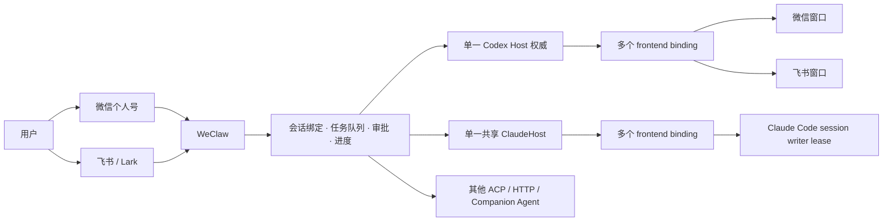

# WeClaw

[English](README.md)

[](https://github.com/TingRuDeng/weclaw/actions/workflows/ci.yml)
[](https://github.com/TingRuDeng/weclaw/releases/latest)
[](go.mod)
[](https://github.com/TingRuDeng/weclaw/releases/latest)
[](LICENSE)

通过微信和飞书远程使用本机 Codex、Claude：复用真实工作空间与会话上下文，实时回传进度、审批和结果。Codex 始终只保留一个 Host 写入权威；完整多前端共享模式下，Codex App、受控 CLI、微信和飞书都连接同一个已验证的 official daemon，并从同一 thread 继续任务。

> 当前正式构建与上传只提供 **macOS Apple Silicon（darwin/arm64）** 和 **Linux amd64** 二进制；其他平台不提供正式二进制或自更新支持。

## 为什么使用 WeClaw

- **远程同步本地任务**：离开电脑后，从微信或飞书继续 Codex、Claude 会话。
- **上下文不中断**：复用 Codex workspace/thread 和 Claude ACP session，不把每条消息当成新对话。
- **过程可见、结果可达**：飞书使用 CardKit 实时更新，微信提供输入状态和任务结果。
- **单一 Codex 运行边界**：已验证的 official daemon 是完整共享模式的唯一 Host；App 只是前端和历史视图，活动 turn 的输入按 app-server 接受顺序处理，新 turn 由 writer lease 串行化。
- **安全边界可配置**：平台或机器人用户白名单、工作目录白名单、审计日志和 Codex 权限档位均可独立配置；个人的多个已授权账号具有相同管理能力。

## 快速开始

一键安装完成二进制校验后会先运行只读依赖检查；交互终端随后列出缺失组件、用途和联动前置项，只有用户选择并再次确认后才依次安装。Codex 使用 OpenAI 官方 standalone 安装，不依赖 Node.js/npm；Claude 远程运行同时需要 `claude` 与固定版本的 `claude-agent-acp`，当前安装链要求 Node.js 22+。

```bash
# 安装当前维护版
curl -fsSL --proto '=https' --tlsv1.2 https://raw.githubusercontent.com/TingRuDeng/weclaw/main/install.sh | sh

# Apple Silicon Mac 或 Debian amd64 在 GitHub 不可达时，从 Gitee 取得同一安装脚本和已校验镜像资产
curl -fsSL --proto '=https' --tlsv1.2 https://gitee.com/jimdeng891/weclaw/raw/main/install.sh | WECLAW_SOURCE=gitee sh

# 检查 Agent、平台凭证和访问控制
weclaw doctor

# 交互选择并安装缺失依赖；执行系统或官方安装命令前再次确认
weclaw doctor --fix

# 按需接入微信或飞书
weclaw wechat login
weclaw feishu add

# 启动后台服务
weclaw start
weclaw status
```

配置文件位于 `~/.weclaw/config.json`，运行日志位于 `~/.weclaw/weclaw.log`，审计日志默认位于 `~/.weclaw/audit.log`。

## 核心工作流

### 从远程窗口开始 Codex 任务

```text
/cwd /path/to/project
/cx ls                 # 查看已有会话
/cx <编号>             # 选择并绑定会话；飞书也可点击会话卡片
# 或发送 /cx new       # 新建并绑定会话
/cx rename current 新名称
检查当前项目并修复测试失败
```

选择已有会话或发送 `/cx new` 后即可直接发送任务。没有有效会话绑定时，普通消息只会提示选择会话或发送 `/cx new`，不会隐式创建或绑定会话。

### 在飞书与 Codex App / 受控 CLI 间同步同一任务

```text
/cx ls                 # 查看本机已有 workspace 和 thread
/cx <编号>             # 将当前窗口绑定到选中的 thread
/cx status             # 查看当前工作空间、会话、任务、账号和运行状态
/cx release            # 只解除当前飞书窗口绑定，本地任务继续运行
```

macOS 默认 `codex_host_mode: auto` 在构造 Agent 时固定 Host 拓扑：固定 control socket 上已有已验证 daemon，或 `CODEX_HOME` 中可用 official standalone 时，都选择 official daemon 作为唯一 Host。即使 Codex App 已运行，App 的历史可见性也不会把 Host authority 切换到 Desktop。只有 standalone 不可用时，`auto` 才保留 App 私有 Host 或 WeClaw-managed Host 的兼容路径；该路径不承诺 App、CLI 和飞书的完整多前端共享，也不会为了伪同步启动第二个 Host。显式 `daemon` 模式可使用 Desktop IPC 做前端探测和协调，但绝不允许选择 App Host；daemon 启动或身份验证失败时保持失败关闭。

需要把多前端共享作为强制能力时，在原生 Codex Agent 上设置 `"codex_multi_frontend": true`。该开关把有效 Host 模式固定为 `daemon`，同时启用 macOS App daemon 复用；official standalone 缺失时，`weclaw doctor` 报阻断错误，`weclaw start` 也会在平台启动前失败并提示 `weclaw doctor --fix --components codex`，不会回退 managed。文件存在后，启动流程还会在平台注册前同步启动并验证 daemon、App 复用和 Host 身份，任一步失败都不会先开放消息入口。它不能与 `codex_host_mode: managed`、自定义 `app_server_socket`、`run_as_user` 或 `codex_app_reuse_daemon: false` 并用。省略该字段保留旧版 `auto` 行为；显式设为 `false` 时，配置规范化不会再次打开 App daemon 复用。

shared managed Host、official daemon 和受控 `weclaw codex cli` 在启动、接管或协调停止前都会执行一次只读多 Host 预检：普通模式检查当前有效 UID；配置 `run_as_user` 时还检查目标 UID，以及只用于识别 sudo 包装进程的 root UID。macOS 通过 `kern.procargs2`、Linux 通过 `/proc/<pid>/cmdline` 读取候选进程的原始 argv，避免路径空格或参数边界造成误判；随后把 Node 包装进程和原生子进程按 PGID 聚合，并且只放行已由受保护 metadata 或 official lifecycle PID 验证的权威进程组。额外 `codex app-server`、进程表或候选原始参数不可读、权威身份无法确认都会让本次操作失败关闭；错误只显示脱敏分类、PGID 和有界 PID，不输出完整命令。`codex --remote`、帮助、daemon、proxy、schema generation 等 tooling 和近似命令不算 Host。只读预检本身不会停止任何进程；启动后复核若发现竞态，兼容 managed 路径只回收本次明确由 WeClaw 创建的新 Host，绝不会按名称结束既有 Codex App 或未知进程。该检查只证明扫描时点，没有替代跨 socket/CODEX_HOME 的持续全局锁；外部程序在扫描后另启 Host 仍会在下一次门禁被发现。

这里的“Codex App 与 daemon 同时存在”以 App 已经连接同一个官方 daemon 为前提。原生 Codex shared app-server 配置会默认写入 `codex_app_reuse_daemon: true`：WeClaw 先验证官方 daemon、固定 control socket 与 App 使用的 `CODEX_HOME` 完全一致，再通过当前 macOS 用户的 launchd 环境为后续启动的 App 启用官方 local-daemon 入口；不会修改 App 包或签名。已经运行且仍带私有 `app-server` 子进程的 App 不会被强退，Codex Agent 会失败关闭并要求完整退出、重新打开 App。首次升级到此版本时因此需要重启 App 一次；如果重启后仍回退私有 Host，应同步更新 Codex App 与 standalone CLI，并清除冲突的 `CODEX_CLI_PATH` 或 `CODEX_APP_SERVER_FORCE_CLI=1` 启动覆盖。连接 daemon 后，App 展示的是该 daemon 的会话目录；若 WeClaw 配置了独立 `CODEX_SQLITE_HOME`，界面目录可能与升级前 App 私有 Host 不同，但原目录不会被删除。显式设为 `false` 会撤销 WeClaw 管理的 launchd 开关，同样只在 App 下次启动后生效。

常见且重点支持的协作形态是“飞书 + Codex App”或“飞书 + 受控 Codex CLI”，前提是各端均已连接同一 verified official daemon。飞书绑定空闲 thread 后，App 或 CLI 稍后启动任务会自动开始同步；选择正在运行的会话时，WeClaw 先回填已有的可见自然语言进度，再持续同步后续进度。普通消息携带当前 `turnId` 直接加入 active turn，thread 空闲时才开始下一 turn。完整共享模式也允许 App、CLI 和飞书同时打开同一 thread；上游仍按请求接受顺序处理，WeClaw 不宣称客户端级排他或精确归属。

会话选择是持久化的两阶段接管。第一阶段 `preparing` 只表示当前 route 的 workspace/thread 意图已保存，不表示可写或同步成功；普通消息在此期间失败关闭。WeClaw 必须验证精确 Host generation，读取权威历史，并在目标 turn 活动时先建立原生进度卡和 exact-turn observer，才通过 revision/turn/generation CAS 提交 `ready` 并显示“已切换并绑定”。其中任一步失败都保留 `preparing` 意图并后台幂等重试；原切换结果卡只在真正 `ready` 后原地收敛，卡片更新失败与运行通道恢复独立重试。

多个已绑定的飞书 route 可同时观察同一 thread：每个 route 独立接收进度、审批或问答展示和唯一终态结果。审批与结构化问答按 `(thread, turn, request)` 绑定单决策 broker；任一前端处理后，其他展示收敛为“已由其他前端处理”，不会重复提交。WeClaw 重启时按 Host authority、历史与待处理交互回放、observer readiness、terminal outbox 的顺序恢复；未重新达到 `ready` 的 route 不会提前投递受保护结果。durable follower 还会记录当前机器人 `allowed_users` 实际命中的授权身份；撤权会清除该 route 的 follower 并阻止尚未投递的受保护结果。`/cx release` 只在 durable release tombstone 保存成功后才停止当前 route 的观察和交互投递，并把现有进度卡冻结为非终态；持久化失败则保留原绑定。它不 interrupt active turn、不重启 Host、不影响其他 route，也不保留只读观察。

历史 thread 不再绑定创建时使用的 provider。选择或续写已有会话时，WeClaw 会读取当前 Codex Host 对该 workspace 生效的 `model_provider`；若与 thread 元数据不同，会在所有已知任务空闲且没有 writer lease 时备份并只迁移该 thread 的 rollout、`state_5.sqlite` 和可选 local catalog，再用同一 thread ID 和显式 provider 执行 resume。用户消息、可见回复、工具调用和结果会保留；无法跨 provider 使用的加密 reasoning 与 compaction 状态会删除。目标 thread 仍在运行时不会中断，当前 turn 的引导仍进入它已经使用的 provider；下一个新 turn 会先完成迁移。已加载但空闲的 App/shared Host 可以受控重启后继续。迁移记录保存在 `CODEX_HOME/backups/weclaw-provider-migration/`，任何身份、路径、状态或 resume 核验不确定都会失败关闭。

当 Codex App 作为同一 official daemon 的 frontend 时，飞书可以选择已有会话、继续 active turn、接收进度与交互、执行 `/stop`，并修改当前 thread 的模型和推理强度。App 中已经运行的 thread 达到 `ready` 后，飞书普通消息直接进入当前 turn，不先暂存或开始第二 turn。App 仍使用私有 app-server 时属于兼容路径，不宣称完整共享；应完全退出并重开 App，让它重新连接已验证 daemon，而不是热迁移 active turn。

同一 official daemon 上的审批和结构化问答会向所有 ready observer 展示，但只允许 broker 接受一次决策。Codex App 或其他 route 先处理后，official daemon 的 `serverRequest/resolved` 会让飞书等待者幂等结束，不发默认拒绝或重复回应。状态暂时不可读时保持失败关闭，保留会话绑定和待处理请求；只有写入后断线或等待响应超时才属于“交付状态未知”。兼容 Desktop IPC 路径的五分钟等待同样只触发带 revision 屏障的状态复核，绝不自动拒绝。

App 进程、安全 IPC 或历史可见都只是 frontend 证据，不代表 WeClaw route 已达到 `ready`，也不能改变 official daemon authority。精确错误 `no-client-found: thread stream owner became unavailable` 属于 App 私有 Host 的兼容 Desktop IPC 路径：WeClaw 会保留 `preparing` 绑定并幂等重试，不会启动第二 Host 或伪报接管成功。完整共享模式下应先确认 App 已完全重开并连接同一 official daemon，再用 `/cx status` 检查目标 route 是否 ready；原会话不需要删除或重建。

`/cx app`、`/cx cli`、`/cx attach` 和 `/cx detach` 仍停用，因为消息命令不能在本机启动额外进程。本机终端使用受控入口：

```bash
weclaw codex cli
weclaw codex cli resume <thread-id>
```

该命令只使用官方 standalone Codex，并把 `--remote` 固定到唯一 official daemon socket；只允许交互 TUI 及其 `resume`、`fork`、`archive` 操作，不接受自定义 `--remote`、非交互或管理子命令。服务未运行且 Codex App 不存在时，它可以直接受控启动 daemon；服务正在运行时，CLI 必须先通过仅限本机的控制接口让该服务按自身已解析的拓扑准备 Host，并核对返回 socket 与本地配置完全一致。App 是当前 Host、managed Host、服务控制接口不可达或 Host 身份不明确时都会拒绝；仅有 App 可见不再单独构成拒绝理由，但服务必须已证明 daemon 是 WeClaw 权威。旧 `type: cli` Codex 配置会迁移为共享 app-server，旧 `codex exec` 独立会话模式不再保留。

Codex App 和 CLI 中尚未发送的 queued follow-up 仍是各自客户端的本地草稿。只有输入被 app-server 接受后，才进入所有入口共享的顺序；WeClaw 不会把草稿当成已提交任务或自动代发。

### 安全切换 Codex OAuth 账号

WeClaw 可以保存多个已认证的 Codex ChatGPT OAuth 账号，并切换唯一共享 app-server 的主机级身份。账号切换不会修改 workspace、thread 或窗口 binding，也不会重放上一条消息；切换后的下一条消息才使用新账号。

```bash
weclaw codex account list
weclaw codex account current
weclaw codex account save <标签> [--replace] [--allow-file-store]
weclaw codex account use <ID或标签> [--yes]
weclaw codex account remove <ID或标签>
weclaw codex account doctor
```

账号索引按 `CODEX_HOME + app-server socket` 计算的 host ID 隔离，保存在 `~/.weclaw/codex-accounts/<host-id>/`；索引只含标签、脱敏邮箱、指纹和 secret 引用。完整 OAuth 快照优先进入 macOS Keychain 或 Linux Secret Service。只有本机用户显式传入 `--allow-file-store` 时，系统凭据库失败才会降级到 `0600` 文件。API key、PAT、Bedrock 和其他认证模式不会保存。替换或删除 profile 后若系统凭据库暂时无法删除旧 secret，索引会保留待清理记录并在后续账号事务重试，`doctor` 会明确报告而不是静默遗留。

保存多个账号时，先让 Codex 登录目标账号，再执行 `save`。如果 Codex App 随后切换到一个已经保存的账号，`/cx status` 和账号命令会显示待同步目标；下一次真实任务会在共享 Host 全局空闲时自动收敛。Host 已经使用目标账号时只更新 profile 索引和 Host 元数据，否则执行受控重启；有活动任务、writer lease 或 unknown thread 时保持原状态并明确返回 busy。尚未保存的本地账号不会被隐式导入或覆盖现有 profile，必须先停掉 WeClaw，再执行离线 `save`。

服务运行时，`save` 只接受共享 Host 当前实际使用且与 `auth.json` 一致的账号，CLI 也必须通过本机控制 API 协调账号操作；服务存在但 API 不可达时会失败关闭，不会直接改认证文件。服务停止时 `use` 只原子投影认证并更新活动 profile，下次启动生效。

在线 `use` 会先拒绝正在执行的任务、活动或不确定 writer lease，以及任何 active/unknown thread；随后在索引写入切换 journal，停止真实受管 Host、投影目标认证、启动唯一 Host，并核对账号和额度。目标启动或验证失败时自动恢复旧认证和旧 Host；中途进程退出或回滚失败会在重启后继续保持禁止写入，不能因内存重置伪装恢复。在线 `save` 也会把 profile 索引与 Host 身份元数据一起提交，任一侧失败就补偿另一侧。旧版遗留或无法证明身份的 app-server 不会被终止，请先运行 `weclaw codex account doctor`；需要解除不安全 journal 时，停服后显式执行一次离线 `use` 再启动服务。

飞书或微信可用 `/cx account`、`/cx account status` 查看脱敏的当前账号。当前平台或机器人的 `allowed_users` 身份可在私聊中查看账号列表或执行 `/cx account use <ID或标签>`；飞书列表选择还会显示一次绑定操作者、窗口、目标 profile 和列表 revision 的 5 分钟确认卡。一个 WeClaw 主机只有一个全局活动 Codex 账号，不按聊天窗口分别切换。

### 复用 Claude Code 会话

```text
/cc ls
/cc switch <编号|sessionId>
/cc new
/cc rename current <名称>
/cc status
/cc quota
```

Claude 通过一个进程驻留的共享 ClaudeHost 管理真实 ACP session：同一 WeClaw 服务只启动一个 `claude-agent-acp` 进程，微信、飞书等前端只保存各自的 workspace/session binding。`session/list` 是目录事实源；多个窗口可以绑定同一 session，ClaudeHost 对同一 session 只执行一次有效 `session/resume`，真正发送 prompt 时再按 session 获取唯一 writer lease。另一个窗口在任务结束前会收到“session 正忙”，不能把消息追加到当前 writer 的任务队列。

选择、新建、飞书卡片切换或默认 Claude 的全局 `/new` 都只修改当前窗口 binding，不会覆盖或释放其他窗口。`session/resume`、ACP 连接或 ClaudeHost 启动失败只会把当前 binding 标记为运行通道不可用，不会切回旧 Agent、旧 session 或清除 binding；普通消息在恢复成功前保持禁止写入。重启 WeClaw 后，持久化 binding 先恢复为 `pending_resume`，由下一次真实使用恢复共享运行通道。

`/cc new` 后如果 ACP 目录还没有持久化空会话，`/cc ls` 会把当前已绑定的空会话标记为“当前新会话”。该条目只用于导航展示；发送首条消息后会进入正常目录，并且始终不能绕过 `/cc switch` 的 `session/list` 校验。

`/cc owner` 和 `/cc cli` 已停用：ClaudeHost 不再维护窗口级独占 owner，而独立 `claude --resume` 会绕过 session writer lease，重新产生第二个 writer。旧版状态文件中的 `remote`、`local`、`unclaimed` control intent 会在加载时丢弃，原有多窗口 binding 全部保留。原生 `claude` 命令仅可作为 `/cc quota` 的短生命周期额度查询回退，不参与会话写入。Claude 任务支持 `/stop` 和同一窗口的一条排队续跑，不支持 `/guide`。

### 管理工作空间与会话名称

当前平台或机器人的 `allowed_users` 身份可在机器人私聊中登记或隐藏已有工作目录：`/cx workspace add <路径>`、`/cx workspace remove <编号|路径>`，Claude 使用对应的 `/cc workspace ...`。登记记录按实际 Agent 名称保存在 `~/.weclaw/workspace-registry.json`；`remove` 只从 WeClaw 导航隐藏目录，不删除源码、Codex thread、Claude session 或历史，重新 `add` 会解除隐藏。

已授权身份还可在私聊中使用 `/cx session remove <编号|threadId>` 或 `/cc session remove <编号|sessionId>` 隐藏空闲且未被任何窗口绑定的会话；对应的 `session restore <稳定ID>` 会恢复导航可见性。该操作只写入 WeClaw 导航覆盖层，不归档或删除 Agent 会话与历史；仍有绑定、运行中任务或状态未确认时会失败关闭。

有权访问目标工作空间的用户可用 `/cx rename current|<编号> <名称>` 或 `/cc rename current|<编号> <名称>` 修改 Agent 的全局会话名称；名称最长 120 个 Unicode 字符且只能是单行文本。Codex 通过唯一共享 app-server 写入并读回确认；Claude 仅在当前 ACP adapter 实时公布 `rename` 命令后，复用同一 ClaudeHost 和 session writer lease 执行。重命名不改变任何窗口 binding，目标忙碌或结果无法确认时会明确失败并要求重新查看列表。

### 控制运行中任务

- Codex 运行中发送普通消息：立即进入当前 app-server turn，不新开 turn，也不进入 WeClaw 私有队列。
- Claude 运行中发送普通消息：最多暂存一条，并在当前任务结束后自动续跑。
- `/cancel`：撤回确实存在的暂存消息，不停止当前任务。
- `/guide`：把确实存在的 Codex 暂存消息发送到当前任务；正常活动 turn 输入无需使用。
- `/cx release`：持久化当前 route 的 release tombstone 后停止该窗口同步；本地任务、Host 和其他 route 继续运行。
- `/stop`：停止当前绑定 thread 的全局 active turn；本地 Codex 和当前消息窗口会同时受到影响。
- `/ps`：查看当前用户运行中的任务。

飞书只在消息确实进入兼容 pending 队列时显示紧凑操作卡；Codex 正常活动 turn 的补充输入不会显示暂存卡。Claude 的暂存消息无需点击，默认在当前任务结束后自动执行。卡片同时绑定机器人账号、操作者、消息窗口、活动任务和该条暂存消息的 revision；旧卡片不能操作后来任务或替换后的消息。点击结果会直接更新原卡片，不再另发一条命令结果。

飞书启用原生进度卡时，每条被 Codex 活动 turn 成功接受的补充输入都会在该消息下创建一张独立接力卡；上一张卡随即显示“已转移”并折叠，后续进度和终态只进入最新卡。接力成功以新卡本身作为确认，不再额外发送成功文字；没有原生进度卡的平台继续使用原有文字反馈。迁卡失败只提示“引导已送达，但任务卡迁移失败”，不会把同一条引导再次发送给 Codex。

Codex App Server 的原生计划、工具与文件事件会先归一为结构化进展；同一事件 ID 的运行与完成状态在任务卡中原位更新，原始命令输出、工具参数和 diff 不会写入卡片。`commandExecution` 生命周期不进入进度卡，真正需要用户处理的命令审批仍会独立展示。Codex 明确标记为 `commentary` 的用户可见中间说明会立即累计进时间线；若当前 Codex 版本未提供 `phase`，WeClaw 会暂存一条已完成消息，后续仍有执行活动时再把上一条确认为中间说明。正常完成前仍待判定的最后一条消息视为最终回答，不写入进度卡。所有中间说明都按顺序保留完整正文并与结构化进展一起参与自动续卡；Claude 的中间说明继续显示在独立“当前说明”区域。任务进入完成、失败或停止终态后，旧事件和晚到 watcher 不会再覆盖终态。

原生任务卡创建后会立即把可恢复的卡片引用原子写入 `~/.weclaw/state/terminal-outbox.json`。任务结束时，飞书卡片只收敛为完成、失败或停止状态并保留已有进度与审批；完整最终结果通过新的静态 Markdown 结果卡独立交付，标题显示 Agent 与工作空间，超长正文会按容量预检拆成连续编号的卡片。卡片 checkpoint 与结果卡分别记录成功状态、并行尝试和幂等重试，一路失败或阻塞不会阻止另一路。对仍有 durable binding 的 Codex active turn，新进程先固定 Host authority，再恢复历史与待处理交互、建立 exact-turn observer 并提交 `ready`，最后才释放对应 terminal outbox；因此旧卡不会在观察恢复前被误报中断或提前投递终态。进程重启后只恢复尚未成功的部分，网络结果不明确时不会改发文本造成重复。其他无法恢复观察的任务仍按既有中断恢复规则处理。飞书 CardKit checkpoint 与结果卡分段使用稳定 UUID，微信文本分片也使用稳定去重键；交付语义是 at-least-once，不承诺跨平台 exactly-once。附件和远程图片暂不进入 outbox，仍按原有安全校验和 best-effort 路径发送。

运维人员可用 `weclaw outbox status [--json]` 查看脱敏积压，并用 `weclaw outbox redrive [entry-id]` 提前唤醒一个或全部待投递项。`redrive` 仅支持服务运行时通过真实 loopback API 执行，不重置重试次数或修改正文；API 不可达时失败关闭。`weclaw doctor` 也会报告 outbox 文件不可读、存在积压或容量耗尽。

配置 `save_dir` 后，单独发送一个 URL 会触发链接归档。微信文章直接抓取；其他 URL 会先把完整目标 URL 交给第三方 Jina Reader 处理，Jina 失败时再由 WeClaw 直接抓取。URL 中的路径、查询参数和片段都会随请求发送给 Jina，请勿用此功能提交带签名、凭据或其他敏感信息的私有链接。

### 查询端到端 Trace

WeClaw 默认把平台消息、任务、Agent turn、结构化进展、回复和终态 outbox 的固定字段事件写入 `~/.weclaw/state/trace.jsonl`。路由键只保存不可逆摘要，诊断文本会清理常见凭据；文件为 `0600`，达到 10 MiB 后保留 3 个轮转备份。

```bash
weclaw trace <trace-id>
weclaw trace --message-id <平台消息ID>
weclaw trace --task-id <任务ID> --limit 200
weclaw trace --thread-id <threadID> --turn-id <turnID> --json
```

服务运行时，命令只通过受 API token 保护的真实 loopback `/api/traces` 查询；服务存在但 API 不可达时不会绕过运行时直接读取文件。服务停止后允许只读查询本地 Trace。

Codex 线协议默认不进入 Trace。临时排障可设置 `WECLAW_CODEX_PROTOCOL_TRACE=1` 记录 method、request ID、thread/turn、sequence 和 connection epoch；只有设置 `WECLAW_CODEX_PROTOCOL_TRACE_PAYLOAD=1` 才会额外记录递归脱敏且有长度上限的 JSON 正文。正文仍可能包含用户提示词或文件内容，排障结束后应关闭该选项。

## 工作原理


```mermaid
flowchart LR
    User[用户] --> WeChat[微信个人号]
    User --> Feishu[飞书 / Lark]
    WeChat --> Bridge[WeClaw]
    Feishu --> Bridge
    Bridge --> Core[会话绑定 · 任务队列 · 审批 · 进度]
    Core --> Codex[单一 Codex Host 权威]
    Core --> Claude[单一共享 ClaudeHost]
    Core --> Other[其他 ACP / HTTP / Companion Agent]
    Codex --> Bindings[多个 frontend binding]
    Bindings --> WeChatClient[微信窗口]
    Bindings --> FeishuClient[飞书窗口]
    Claude --> ClaudeBindings[多个 frontend binding]
    ClaudeBindings --> Session[Claude Code session writer lease]
```

WeClaw 通过 `platform` 抽象统一命令、会话、任务和审批，再按平台能力输出文本、输入状态或飞书卡片。Codex 主路径使用原生 app-server 协议；Claude 远程后端使用进程驻留的单一 ACP ClaudeHost，原生 `claude` 仅用于无提示词的额度查询回退。

## 能力矩阵

| 能力 | 微信个人号 | 飞书 / Lark |
| --- | :---: | :---: |
| 文本、图片、文件 | ✅ | ✅ |
| 实时进度 | 输入状态 + 文本 | CardKit 卡片更新 |
| 交互选择与审批 | 编号或文本 | 原生按钮和卡片 |
| 群聊 | 仅单聊 | ✅，默认需要 @bot |
| 多账号 / 多机器人 | ✅ | ✅ |
| 主动发送 | ✅ | ✅，当前为文本 |
| 用户授权码 | ✅ | ✅ |

| Agent | 远程后端 | 会话复用 | 模型 / 推理强度 | 独立 writer |
| --- | --- | :---: | :---: | --- |
| Codex | Codex App IPC / 共享 app-server | workspace + thread | ✅ | 受控 CLI 复用 daemon，不启动独立 writer |
| Claude | 单一共享 ClaudeHost（ACP） | ACP session + writer lease | ✅ | 禁止 |
| OpenCode | Companion | 取决于本地连接 | 取决于 Agent | 可见终端 |
| 其他 Agent | ACP / HTTP / Companion | 取决于协议能力 | 取决于 Agent | 取决于配置 |

## 聊天命令

| 命令 | 说明 |
| --- | --- |
| `/help`、`/status` | 查看帮助，或查看包含 WeClaw 版本号的运行态 |
| `/cwd [路径]` | 查看或切换当前窗口工作目录；切换会同步 Agent 默认 cwd，未获 Registry 授权能力的兼容入口受工作目录白名单限制 |
| `/new` | 为当前默认 Agent 明确新建会话；默认 Agent 为 Codex 时同时绑定 |
| `/model`、`/reasoning` | 已绑定时查看或切换当前会话配置；未绑定时查看或切换新会话默认值 |
| `/fast [on|off]` | 查看或切换当前 Codex 会话速度；未绑定时切换新会话默认速度 |
| `/mode [default|yolo]` | 查看或切换 Agent 授权处理方式；群聊按当前操作者隔离，飞书无参数 `/mode` 会弹出选择卡。切换到 yolo 会放行该操作者在当前窗口的既有待审批，并把已发审批卡收敛为自动批准终态；后续自动审批不再单独弹卡，有任务卡时追加记录 |
| `/approve <短码>`、`/deny <短码>` | 审批按钮不可用时允许或拒绝对应操作；短码与操作者、窗口和有效期绑定 |
| `/progress [模式]` | 查看进度模式；当前平台或机器人 `allowed_users` 身份可修改账号级模式 |
| `/ps`、`/stop` | 查看任务，或停止当前绑定 thread 的全局 active turn |
| `/cancel`、`/guide` | 处理确实存在的暂存消息；Codex 活动 turn 的普通输入会直接发送 |
| `/cx help`、`/cc help` | 查看 Codex、Claude 完整会话命令 |
| `/cx <编号>`、`/cx switch <编号>` | 选择并绑定当前工作空间的 Codex 会话 |
| `/cx new` | 新建并绑定当前工作空间的 Codex 会话 |
| `/cx release` | 只解除当前消息窗口的 Codex 绑定并停止同步；本地任务继续运行 |
| `/cx archive current`、`/cx archive <编号>` | 归档当前或列表中的空闲 Codex 会话；保留历史，不做硬删除 |
| `/cx rename current\|<编号> <名称>` | 重命名当前或列表中的 Codex 会话，不改变任何窗口 binding |
| `/cx session remove <编号\|threadId>`、`/cx session restore <threadId>` | 已授权账号私聊隐藏或恢复 WeClaw 中的 Codex 会话导航，不归档或删除历史 |
| `/cx workspace add <路径>`、`/cx workspace remove <编号\|路径>` | 已授权账号私聊登记或从 WeClaw 导航隐藏 Codex 工作目录 |
| `/cc rename current\|<编号> <名称>` | 在 adapter 公布能力后重命名 Claude 会话，不改变任何窗口 binding |
| `/cc session remove <编号\|sessionId>`、`/cc session restore <sessionId>` | 已授权账号私聊隐藏或恢复 WeClaw 中的 Claude 会话导航，不删除历史 |
| `/cc workspace add <路径>`、`/cc workspace remove <编号\|路径>` | 已授权账号私聊登记或从 WeClaw 导航隐藏 Claude 工作目录 |
| `/cx account`、`/cx account status` | 查看主机级 Codex 账号；已授权账号私聊可选择和切换 |
| `/update`、`/restart [--force]` | 已授权账号在机器人私聊中远程更新或重启 WeClaw |

<details>
<summary>Codex 常用命令</summary>

选择并绑定：`/cx <编号>`、`/cx switch <会话>`、进入仅有一个会话的 `/cx cd <工作空间>`、`/cx new`。解除当前窗口绑定但不停止本地任务：`/cx release`。

归档：`/cx archive current` 归档当前绑定会话；进入工作空间会话列表后可用 `/cx archive <编号>` 归档指定会话。归档只允许空闲且未被其他 WeClaw 窗口绑定的会话，历史仍保留，可在 Codex App 的归档列表恢复。

工作空间与名称：`/cx workspace add <路径>`、`/cx workspace remove <编号|路径>` 仅限当前平台或机器人 `allowed_users` 身份的私聊；`/cx rename current|<编号> <名称>` 重命名当前或列表中的空闲会话。Desktop follower 模式不提供重命名写接口，需在 Codex App 内完成。

运行边界：`/cx status` 紧凑展示当前工作空间、会话、任务、账号和运行状态；完整路径使用 `/cx pwd`，账号诊断使用 `/cx account status`，额度使用 `/cx quota`。

其他：`/cx whoami`、`/cx ls`、`/cx ..`、`/cx cd <工作空间|..>`、`/cx pwd`、`/cx status`、`/cx quota`、`/cx account`、`/cx account status`、`/cx account use <账号>`、`/cx model status|ls`、`/cx clean`。其中 `/cx model status` 查看后续新建 Codex 会话的默认配置；当前绑定会话请用 `/model`、`/reasoning`、`/fast`。Fast 是否可用以当前模型目录为准，不支持的账号或模型会明确拒绝。

</details>

<details>
<summary>Claude 常用命令</summary>

`/cc whoami`、`/cc ls`、`/cc cd <编号|..>`、`/cc switch <编号|sessionId>`、`/cc new`、`/cc rename current|<编号> <名称>`、`/cc workspace add|remove`、`/cc pwd`、`/cc status`、`/cc quota`、`/cc model status|ls|reset`。其中 `/cc cd` 进入工作空间或返回工作空间列表；`/cc status` 统一展示 binding、共享 ClaudeHost 和 writer 状态；`/cc model status` 查看后续新建 Claude 会话的默认配置，`/cc model reset` 清除该默认配置，当前绑定会话请用 `/model`、`/reasoning`。`/cc owner`、`/cc cli` 已停用。

`/cc quota` 复用本机 Claude Code OAuth 登录读取 5 小时、7 天和模型分项额度，且不发送模型请求；WeClaw 会优先兼容 Claude Code 旧版 Keychain/凭据文件并请求其 Anthropic 用量接口，凭据不可读或请求失败时再回退到短生命周期的 Claude 原生 `get_usage` 控制查询。Token 只在内存中发送到固定的 Anthropic 地址，不写日志、不持久化，也不会跟随重定向。相关凭据格式、用量接口和结构化控制能力都不是稳定公开契约，后续 Claude Code 版本可能调整；API key、Bedrock、Vertex 或缺少 profile 权限时只会返回“订阅额度不可用”。

</details>

## 平台接入

### 微信

```bash
weclaw wechat login
weclaw wechat users pending
weclaw wechat users approve-code <授权码>
```

微信未授权用户会收到短期授权码。`allowed_users` 为空时默认拒绝所有用户。

### 飞书

```bash
weclaw feishu add
weclaw feishu status --name <bot名称>
weclaw feishu users pending
weclaw feishu users approve-code <授权码> [--bot <名称|app_id>]
```

`weclaw feishu add` 交互式保存凭证，并更新 `platforms.feishu.bots[]`；`app_secret` 只写入独立凭证文件，不进入 `config.json`。每个机器人可以独立配置用户白名单、默认 Agent 和进度模式。飞书聊天中的 `/feishu users ...` 只能管理收到该消息的机器人；本地 `approve`、`approve-code` 和 `revoke` 在配置多个机器人时必须显式传入 `--bot <名称|app_id>`，只有单机器人时可省略。

<details>
<summary>飞书应用最小权限</summary>

Tenant scopes：`im:message.p2p_msg:readonly`、`im:message.group_at_msg:readonly`、`im:message.group_at_msg.include_bot:readonly`、`im:message:readonly`、`im:message:send_as_bot`、`im:resource`、`im:chat`、`cardkit:card:read`、`cardkit:card:write`、`application:bot.basic_info:read`、`application:bot.menu:write`。其中 `im:message:readonly` 用于读取消息中的图片和文件资源。WeClaw 运行时不需要 user scopes。修改权限后必须重新发布飞书应用版本并完成审批。

</details>

<details>
<summary>飞书推荐菜单</summary>

- 常用：`/help`、`/status`、`/ps`、`/stop`
- Codex：`/cx ls`、`/cx status`、`/cx new`、`/cx account`
- Claude：`/cc ls`、`/cc status`、`/cc new`、`/cc quota`
- 设置：`/model`、`/reasoning`、`/fast`、`/mode`

推荐使用飞书 7.22 及以上版本的悬浮菜单，并将每个菜单项的响应动作配置为“发送文字消息”。应用菜单只保留高频入口；`/guide` 和 `/cancel` 不进入常驻菜单，只在消息确实暂存时由上下文操作卡提供。Codex 活动 turn 的普通输入直接发送，不显示暂存卡；`/help` 仍按“常用与任务、Codex、Claude、设置与进度”分级展示完整命令，`/help manage` 展示已授权账号可用的管理操作。

悬浮菜单最多支持 5 个主菜单、每个主菜单 10 个子菜单，上述配置可直接使用；如需兼容最多 3 个主菜单、每个主菜单 5 个子菜单的可切换菜单，请移除“设置”主菜单，通过 `/help` 进入设置命令。机器人菜单仅在单聊中展示，群聊仍需直接发送命令。限制与配置步骤见[飞书官方机器人菜单使用指南](https://open.feishu.cn/document/uAjLw4CM/ukTMukTMukTM/bot-v3/bot-customized-menu)。

</details>

## 配置与安全

推荐先使用本地面板或命令行配置：

```bash
weclaw web
weclaw config agent --name claude
weclaw config permission --agent codex --level default
weclaw doctor
```

`stream` 模式默认不设置 WeClaw 时间线条数上限，等价于 `stream_timeline_limit: 0`。可在全局、Agent、平台或飞书机器人账号的 `progress` 中用正整数覆盖为“只保留最近 N 条”。这里的“一条”是按稳定 ID 合并后的计划、工具或文件进度，或一条 Codex 用户可见 commentary；不是命令生命周期、原始协议事件、推理、逐 token 输出、命令输出或工具日志：

```json
{
  "progress": {
    "mode": "stream",
    "stream_timeline_limit": 0
  }
}
```

不限条数不等于不限平台载荷。飞书会在完整卡片 JSON 接近内部保守软上限时自动冻结当前段并发送下一张进度卡，旧卡保留已显示历史，最新卡在任务结束时只更新状态并保留当前分段。Codex commentary 保留完整正文并计入时间线；计划、工具和文件等结构化摘要仍按 180 个字符收敛。Claude 的“当前说明”不计入时间线条数，并继续按 180 个字符收敛。完整最终结果另发为静态 Markdown 结果卡，不会替换进度卡或静默截断早期进度。

飞书任务卡在 Agent 产生第一条有效非命令进度前，正文只显示 `思考中.....`，不会用“等待 Agent”“连接正常”等定时文案覆盖。收到 Codex commentary、Claude message、计划、文件修改或工具摘要后，同一卡片默认实时展示当前分段最近 5 条经过语义合并的进度，并把 `思考中.....` 保留在正文最底部；点击底部“展开完整进度”后，同一正文区域切换为当前分段从第一条到当前的完整时间线，后续更新继续追加或按稳定 ID 原位更新。展开态底部只显示“收起完整进度”，收起后回到最新 5 条，不会出现顶部预览与下方完整进度两份重复正文。容量预检仍按完整展开卡片计算，不能用默认预览绕过自动续卡。完成、失败、停止或转移时卡片自动收起，并移除活跃提示，同时保留已有过程和审批记录。无信息量的 Codex 命令执行生命周期不展示，内部推理与状态心跳也不会解除等待态，真正需要处理的审批仍正常显示。

`weclaw web` 默认只监听 `127.0.0.1:39282`，通过不会发送到服务端的 URL fragment 注入 token，并打开浏览器。Agent、进度、平台或机器人白名单和工作目录等软配置支持热重载；平台启用、凭证或账号拓扑变化需要重启。配置页会携带版本指纹；如果后台配置已被命令行或消息端修改，旧页面保存会明确提示冲突，需要重新加载后再提交，避免覆盖最新白名单。内置服务不提供 TLS；非回环监听默认拒绝，确需在可信内网暴露时必须显式使用 `--allow-insecure-http`（未指定 `--token` 时仍会自动生成强随机 token），公网访问应通过 HTTPS 隧道或反向代理。

`weclaw doctor` 默认只读，除现有配置外还检查 `sqlite3`、Linux `bubblewrap`、Node.js/npm、Codex CLI 的 `app-server` 能力、official standalone、Claude Code CLI 和 Claude ACP adapter。启用 `codex_multi_frontend` 后 standalone 缺失是阻断错误；未启用严格共享时，缺失 standalone 仍只是 managed 兼容模式警告。其他已配置 Agent 的运行依赖缺失同样是阻断错误；未配置 Agent 或仅影响 `/cx` 会话目录、Codex Linux 沙箱的依赖缺失是警告。

首次安装在有控制终端时通过 `/dev/tty` 进入同一个 `weclaw doctor --fix` 向导，不会让 `curl | sh` 的脚本输入被依赖选择消费。没有控制终端时只运行只读检查并打印后续命令；可用 `WECLAW_SKIP_DEPENDENCY_SETUP=1` 显式跳过该检查与向导。非交互安装依赖必须单独同时指定组件和确认，例如 `weclaw doctor --fix --components sqlite3,bubblewrap --yes`，不会默认安装全部组件。

`weclaw doctor --fix` 用角色标签展示缺失项：SQLite、Linux bubblewrap 属于可选增强，Codex/Claude 属于可选 Agent，Node.js/npm 只作为 Claude 安装前置，Claude ACP 是选择 Claude 后的必要组件。可选组件名为 `sqlite3`、`bubblewrap`、`nodejs`、`npm`、`codex`、`claude`、`claude-acp`；选择 Codex 只使用 OpenAI 官方 standalone 安装器，选择 Claude 或 Claude ACP 才会联动 CLI、adapter 与 Node.js/npm。执行前会完整显示安装命令和权限影响，直接回车或拒绝确认都不安装。

Codex 安装脚本先下载到独立临时文件，再以 `CODEX_NON_INTERACTIVE=1` 和固定参数执行，不使用 `curl | sh` 或动态 shell 拼接。系统依赖只使用已识别的 `apt-get`、`dnf` 或 Homebrew，Linux 需要提权时显式调用 `sudo`；npm 安装禁止 `sudo npm`，普通用户固定使用 `~/.local` prefix，并在当前修复进程中临时加入 `~/.local/bin` 以完成重检和绝对路径配置，退出后恢复原 PATH。WeClaw 不添加第三方 Node 软件源，也不替换 nvm、mise 等版本管理器；系统包安装后仍不满足所选 Claude 依赖的 Node.js 版本要求时，会在执行 npm 前失败并保留真实错误。

安装后会重新探测同一能力，只有验证通过才自动发现并保存新 Agent。Codex 和 Claude 的登录不会自动执行，仍需用户运行对应 CLI 完成官方认证。`weclaw doctor` 对 Claude ACP 的成功检查只证明 `initialize` 握手可用，不会探测 `session/list` 或 `session/resume`；真实会话列举和恢复仍以对应命令的运行结果为准。

关键安全规则：

- 平台 `allowed_users` 为空时默认拒绝所有用户。
- 当前平台或机器人 `allowed_users` 是远程访问的唯一身份来源；其中每个身份具有相同的 WeClaw 管理能力，机器人账号之间不能串权。
- 旧配置中的顶层 `admin_users` 只会由启动与 `doctor` 告警并忽略，不自动迁移，也不会扩大任何 `allowed_users`；该值仅为配置文件兼容回写而保留，Web 不展示也不可编辑。
- `allowed_users` 身份不受 `allowed_workspace_roots` 限制；未携带 Registry 授权能力的兼容或内部入口只能 `/cwd` 到白名单及其子目录。
- 非回环 `api_addr` 必须配置 `api_token`。
- 回环地址允许不配置 `api_token`，但本机其他进程将可调用管理接口，`weclaw doctor` 会持续告警；推荐仍配置随机 Token。
- 审计日志默认开启，不记录密钥。
- Codex `permission_level` 支持 `default`、`auto_review`、`full_access`；默认档位为 `default`。
- Codex 默认自动管理共享 Unix socket；仅在多进程或 `run_as_user` 部署中配置 `app_server_socket`，其父目录必须归目标用户所有且权限不宽于 `0700`。
- `codex_multi_frontend: true` 是完整共享的用户意图开关：它强制 official daemon、要求 standalone 已安装并禁止兼容回退；省略时继续使用旧版 `auto` 兼容策略。
- `codex_host_mode` 支持 `auto`、`daemon`、`managed`。macOS 默认 `auto` 在官方 daemon 已运行或 standalone 可用时直接固定为 `daemon`，不会因 App 已运行而改选 Desktop Host；只有 standalone 不可用时才进入 App 私有 Host 或 `managed` 的兼容路径。显式 `daemon` 在 macOS 保留 Desktop IPC 协调，但不允许切换到 App Host；它不回退，且不能与 `app_server_socket` 或 `run_as_user` 混用。不启用 Desktop 协调的平台同样按“官方 daemon 可用则使用，否则 managed”选择。官方 socket 身份不明、App 私有 IPC 不可达或 Host authority 无法证明时都失败关闭，不静默启动第二个 Host。
- shared managed Host、official daemon、受控 `weclaw codex cli` 及协调停止在变更 Host 状态前执行受检 UID 范围内的多 Host 只读预检；`run_as_user` 模式会额外覆盖目标 UID 和 sudo wrapper 的 root UID。额外 `app-server`、进程表或候选原始参数不可读时失败关闭，只报告脱敏 PGID/PID，且不按进程名停止既有或未知进程。该检查是时点门禁，不是持续全局锁。
- 原生 Codex 的 `auto`/`daemon` 配置默认写入 `codex_app_reuse_daemon: true`。该字段只在 macOS 生效，并只管理后续 App 启动使用的 launchd 环境；官方 daemon 尚未验证、App 与 WeClaw 的 `CODEX_HOME`/control socket 不一致、存在强制 CLI 覆盖，或已运行 App 仍持有私有 `app-server` 时都会失败关闭。WeClaw 不会为此退出 App；首次启用后完整重启 App 一次。
- 原生 Codex shared app-server 默认使用 `codex_auto_update: incompatible`：只有上游错误明确指出状态库 schema/version 与当前 CLI 不兼容，且没有 writer lease 时，兼容 `managed` 模式才调用官方 `codex update` 并验证版本真实变化。通用 `failed to initialize sqlite state runtime`、数据库锁争用、损坏、socket 就绪超时、调用方取消、普通进程退出和连接错误都不是升级证据。官方 `daemon` 模式不由 WeClaw 更新 CLI。设为 `off` 可完全禁用；失败或版本未变化时保持不可写，不回退其他 Agent。

| Codex 权限档位 | 行为 |
| --- | --- |
| `default` | `workspace-write` + 按需审批 + 用户确认 |
| `auto_review` | `workspace-write` + 按需审批，由 Codex reviewer 自动审查越界请求 |
| `full_access` | `danger-full-access` + 不审批，仅限可信且隔离良好的环境 |

脚本化配置应显式指定档位，例如 `weclaw config permission --agent codex --level full_access`，然后执行 `weclaw restart`。该命令会写入 `permission_level`，并清空会优先覆盖档位映射的 `approval_policy`、`approval_reviewer`、`sandbox_mode`；直接手工编辑 JSON 时则必须自行处理这些高级覆盖。运行中的 Codex Agent 不会热切换权限，重启后新 Host/会话才使用新值。

`auto_review` 不会扩大 `workspace-write` sandbox；WeClaw 只把 `approvalsReviewer=auto_review` 交给 Codex，也不会把审查服务错误或拒绝转换成允许。聊天中的 `/mode yolo` 是另一层临时行为：只在当前 WeClaw 进程内按真实操作者和窗口 route 隔离，重启后清除，并且不会改变全局 sandbox 或 `permission_level`。`full_access` 也不会让 WeClaw 变成 root 或绕过操作系统权限；systemd 以哪个用户运行，Codex 就最多拥有该用户本来可访问的文件范围，例如 `.git` 仍须对该服务用户可写。

## 运行与更新

```bash
weclaw start                 # 后台启动
weclaw start --foreground    # 前台调试
weclaw status
weclaw restart
weclaw restart --force       # 明确中断运行中任务
weclaw stop
weclaw update
weclaw update --source gitee  # Apple Silicon Mac 或 Debian amd64 在 GitHub 不可达时显式使用 Gitee
weclaw update --restart
weclaw version
```

更新来源支持 `auto`（默认）、`github` 和 `gitee`。Gitee 二进制镜像提供 `darwin/arm64` 与 `linux/amd64`。可用 `--source` 临时指定，在 `~/.weclaw/config.json` 写入 `"update_source": "gitee"` 持久指定，或用 `WECLAW_UPDATE_SOURCE` 覆盖。`auto` 只在 DNS、连接、TLS、超时或 HTTP 5xx 时从 GitHub 切换 Gitee；4xx、版本格式或 SHA-256 异常会直接失败，不通过换源掩盖完整性问题。Gitee 镜像落后时更新器也会拒绝降级。

`weclaw update` 在当前已是最新版时会立即返回；只有实际安装新版本，或显式使用 `update --restart` 时才执行配置与 Agent 预检。`stop`、`restart` 和 `update --restart` 都通过本机 `/api/runtime/restart/prepare` 使用同一套 Host 安全事务：先持有排他的 Codex frontend 租约，关闭消息准入并排空任务，再确认 Codex App 已完整退出、没有受控 `weclaw codex cli`、writer lease 或活动/未知 thread，最后停止身份验证通过的 official daemon 或 WeClaw-managed Host。`stop` 只有在事务准备成功后才向 WeClaw 发送 `SIGTERM`；准备失败时服务保持运行，外层停止失败时先重建旧 Host 并恢复消息准入。直接的 `SIGINT`/`SIGTERM`（包括 systemd stop 或消息桥异常退出）也会在进程内尝试同一事务；若外部停止已经不可撤销但 Host 状态不安全或不可确认，WeClaw 会退出并明确记录保留 Host 的原因，不会强杀它。仓库自带的 `service/weclaw.service` 使用 `KillMode=process`，让 systemd 只向 WeClaw 主进程发信号、由上述事务管理 Host；自定义 unit 也必须保留该设置，不能使用默认的 `control-group`。Codex App 或受控 CLI 仍在运行时 CLI 管理命令会在停止 WeClaw 前明确拒绝；WeClaw 只用受保护 IPC 和同用户主进程名做保守存在性探测，不会按进程名终止或自动退出 Codex App，强制排空也只中断 WeClaw 自己的任务，不能绕过这些 Host 安全门禁。后续服务启动必须在平台监听前读取受保护的事务状态、启动唯一 Host，并验证 Host generation 已变化；验证失败保持不可写。systemd 托管实例继续由 systemd 停止或重启，不会另起私有后台进程。实际安装新版本后的预检失败时，WeClaw 会恢复旧二进制；使用 `update --restart` 时，后续安全检查、停止或启动阶段失败也会恢复旧二进制，若旧服务已停止还会重新启动旧版本，回滚失败会与原始更新错误一起报告。未显式传入 `--restart` 的 `weclaw update` 只更新二进制，不重启服务。正式安装更新必须使用 `weclaw update`，不要用本地构建产物覆盖 PATH 中的二进制。

若 WeClaw 服务本来就未运行，`weclaw restart` 保留“检查 App/受控 CLI 后直接启动”的兼容语义；没有旧服务可执行上述 loopback Host 事务时，不宣称已轮换独立存在的外部 Host。
从尚不支持该协调端点的旧版本首次升级时，PATH 中的新二进制与内存中仍运行的旧服务具有不同能力。新 CLI 收到协调端点的 HTTP 404 时会在触碰任何进程前失败关闭，显示运行中服务版本和一次性迁移步骤，不把纯文本 `404 page not found` 误解析成 JSON，也不向不存在的事务发送补偿请求。先等待所有任务完成并完整退出 Codex App 和受控 CLI，再依次执行 `weclaw stop`、`weclaw start`、`weclaw restart`：第一次启动把服务进程切到新版本，最后一次重启才执行完整 Host 停止和 generation 验证。不能把中间的离线启动宣称为已完成协调事务。

## 从源码构建

```bash
git clone https://github.com/TingRuDeng/weclaw.git
cd weclaw
go build -o weclaw .
./weclaw --help
```

仓库当前使用 Go 1.26.6。当前没有发布可公开拉取、且与本维护版同步的容器镜像。

正式发布以 `scripts/release.sh` 为唯一权威入口；GitHub Actions 的手动 Release workflow 也只从 clean `main` 调用该脚本，不维护第二套测试、构建或上传逻辑。GitHub Release 是版本与构建的权威来源，CI 与发布脚本只构建并上传 `weclaw_darwin_arm64`、`weclaw_linux_amd64` 和原始 `checksums.txt`。正式 Release 验证通过后，把两项二进制的可还原 `.gz` 表示和同一份原始摘要镜像到 [Gitee](https://gitee.com/jimdeng891/weclaw)。镜像上传后只核对最终附件名称和数量，不再重复回下载；安装器和更新器仍按权威摘要校验所选二进制。镜像失败会让发布任务明确失败，但不会删除已经公开并验证的 GitHub Release；可用手动 `Repair Gitee Mirror` workflow 从 GitHub Release 幂等续传缺失附件并重新核对清单。

## 上游与许可

本仓库基于 [fastclaw-ai/weclaw](https://github.com/fastclaw-ai/weclaw) 持续维护，并参考 [@tencent-weixin/openclaw-weixin](https://npmx.dev/package/@tencent-weixin/openclaw-weixin) 的微信接入实现。请遵守项目许可证、相关平台条款，仅在你有权控制的账号和设备上使用。

[贡献者](https://github.com/TingRuDeng/weclaw/graphs/contributors) · [版本发布](https://github.com/TingRuDeng/weclaw/releases) · [Star 趋势](https://star-history.com/#TingRuDeng/weclaw&Timeline)

许可证：[AGPL-3.0-or-later](LICENSE)
