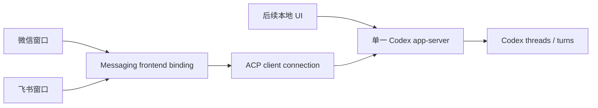

# Codex 单一 app-server、多前端设计

## 状态

当前权威设计。取代 2026-07-15 的“选择即独占接管”方案。

## 目标

- 本机任一时刻只由一个 WeClaw 管理的原生 `codex app-server` 提供 Codex 运行能力。
- 微信、飞书和后续本地 UI 都是前端客户端；前端只保存 workspace/thread 绑定。
- 多个前端可以绑定同一个 thread，但同一个 thread 同时只执行一个写 turn。
- 运行通道断开、重连、超时或旧状态迁移不能清除前端绑定，也不能伪造 writer 冲突。
- 旧版 Desktop/Companion/CLI 第二 writer 入口必须显式停用或迁移。

## 非目标

- 不把当前独立运行的 Codex Desktop 自动改造成共享 host 客户端。
- 不通过 Desktop IPC、rollout 或进程探测推断前端所有权。
- 不允许普通消息在没有显式 binding 时隐式创建 thread。
- 不改变 Claude 的 owner-first ACP/CLI 交接模型。

## 拓扑

`agent/codex_app_server_host.go` 负责 host 边界：

1. 解析稳定 Unix socket；显式 `app_server_socket` 优先。
2. 连接已存在且 owner 合法的 socket，并通过标准 HTTP Upgrade 建立 WebSocket-over-UDS；每个 JSON-RPC 消息使用一个 WebSocket frame，禁止直接读写 JSONL。
3. 不存在 live host 时清理同 owner 的 stale socket，并启动 `codex app-server --listen unix://...`。
4. stale socket 清理和 host 启动必须持有 socket 目录内的跨进程文件锁；等待者取得锁后先重新连接，不能直接删除赢家刚建立的 socket。
5. host 启动 context 与触发它的前端请求解耦；只有拥有 host 进程的 `ACPAgent.Stop` 才终止进程。
6. 仅连接既有 host 的客户端不记录 PID，也不能终止 host。

默认 socket 位于 WeClaw 状态目录的 `runtime/` 下。若完整路径超过 Darwin `sockaddr_un` 安全上限，使用原目标路径的稳定哈希落到真实系统临时目录下的 `weclaw-<uid>/`；macOS 将 `/tmp` 解析为 `/private/tmp`，避免 Codex 拒绝目录链中的软链接。目录必须为真实目录、owner 合法且禁止 group/other 访问。显式配置的超长路径直接报错，不能静默改写管理员配置。

## 状态模型

### Frontend binding

持久化事实只有：

- route/binding key
- active workspace
- selected thread

`messaging/codex_remote_selection_store.go` 使用 copy-on-write + CAS 提交单个前端的绑定。不同前端互不释放、互不覆盖；同一前端切换失败时回滚到 after-image 仍匹配的旧绑定。

状态文件版本为 v4。v1-v3 的 `Controls` 只用于兼容反序列化，加载后丢弃并重写，不能再参与授权判断。

### Runtime availability

Runtime 只回答共享 host 当前能否服务：

- `weclaw_runtime`：已由共享 host 确认，可开始 writer lease。
- `unknown`：通道未确认或已断开，不可写，但 binding 保留。
- `conflict`、`desktop`：只供显式注入的旧 Desktop bridge 测试兼容；生产共享模式不能由 probe 或 watcher进入这些状态。

### Writer lease

`agent/codex_runtime_lease.go` 按 thread 串行 turn：

- lease 与 frontend route、旧 owner revision 无关。
- runtime 必须为 `weclaw_runtime`。
- 已有 lease 时第二个 turn 返回 writer busy；不会清除第二个前端的 binding。
- Complete、Fail、Stop 或取消最终都必须释放同一 lease；晚到状态不能覆盖新代次。
- 客户端断线或交付状态未知时必须保留 fail-closed lease；只有 rollout 或重连后的 `thread/read` 明确确认同一 turn 终态后才能释放。

## 绑定与执行顺序

### 选择或切换

1. 获取当前 frontend binding 锁。
2. 校验 workspace/thread 和活动任务边界。
3. 原子提交 frontend binding。
4. 持久化该窗口选中的 Agent。
5. 将 frontend conversation 映射到共享 app-server thread。
6. 若 runtime 同步失败，返回“运行通道暂不可用（窗口绑定已保留）”。

其他前端正在该 thread 执行任务不阻止绑定；真正开始 turn 时由 writer lease 串行化。

### 普通消息

1. 必须已有 frontend binding。
2. 每次已准入 turn 前重新确认 `conversationID -> threadID` 映射，避免其他前端最近的绑定污染当前映射。
3. 连接或恢复共享 host。
4. 获取 thread writer lease。
5. 启动 turn，并在唯一终态释放 lease。

### 新建会话

`/cx new` 先创建 thread，再提交当前 frontend binding。创建、绑定或 runtime 映射失败时不得破坏原 binding；已创建但未绑定的 thread 可以留在真实 Codex 目录中，不得伪装成全部成功。

## 命令契约

- `/cx ls`、`/cx cd`、`/cx switch`、`/cx new`：浏览、选择或创建 frontend binding。
- `/cx status`：显示共享 host、workspace、thread 和 frontend 角色。
- `/cx owner`：只读兼容状态，不再移交 writer。
- `/cx app`、`/cx cli`、`/cx attach`、`/cx detach`：拒绝并说明第二 writer 风险。
- 旧 `type: companion` Codex 配置无论 `auto_launch` 值如何都迁移为 ACP app-server；`weclaw companion --agent codex` 明确拒绝。

## 故障边界

- socket 连接失败：保留 binding；允许下一次操作重连或重启 host。
- turn 观察流断开：保留 binding、active turn 和 writer lease；其他前端继续收到 writer busy，直到权威终态收敛。
- host 启动失败：暴露经过清洗的真实错误；SQLite 状态初始化错误仍进入有限重试。
- 持久化失败：内存 binding 不提交；不能继续 runtime 映射。
- 同 thread writer busy：只拒绝本次 turn；不产生 owner 卡片或 conflict 状态。
- host client recovery：只断开当前 client，不终止其他客户端正在使用的 host。
- host owner 停止：终止其启动的 host；其他客户端必须感知断线并按正常重连路径恢复。
- 两个前端并发首次连接：由跨进程启动锁选出唯一启动者；等待者复用赢家的 socket。

## 验证契约

至少覆盖：

- 两个 ACP client 通过同一 Unix socket 的 WebSocket 连接看到同一 thread；测试 server 必须执行真实 HTTP Upgrade，裸 NDJSON fake 不具备回归价值。
- 两个独立客户端的 host 启动临界区必须串行，后取得锁者重新连接而不是启动第二 host。
- 已存在 host 的客户端不拥有 PID，不能终止 host。
- 非 socket、符号链接、错误 owner 或不安全目录被拒绝。
- 默认长路径稳定回退，显式长路径失败。
- 两个不同 frontend 同时绑定同一 thread。
- 同一 thread 的第二 writer 被拒绝，lease 释放后可继续。
- turn 已接受后连接断开不能释放 lease；rollout 确认终态或重连读取到匹配终态后才可继续写。
- v1-v3 owner 状态迁移后不再影响 v4 binding。
- `/cx app|cli|attach|detach` 和 Codex Companion 都不能启动第二 writer。
- runtime 失败保留 binding，持久化失败回滚，切换失败不破坏原会话。
