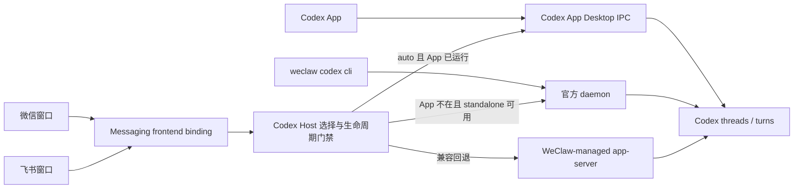

# Codex 单一 Host、多前端设计

## 状态

当前权威设计。取代 2026-07-15 的“选择即独占接管”方案。

## 目标

- 本机任一时刻只允许一个 Codex Host 成为写入权威；该 Host 可以是 Codex App、官方 standalone daemon 或 WeClaw-managed 兼容 Host。
- Codex App、受控 Codex CLI、微信和飞书都是平等输入入口；消息前端只保存 workspace/thread 绑定。
- 多个前端可以绑定或打开同一个 thread；已有活动 turn 时，后续输入直接提交到该 turn，只有新建 turn 才由 writer lease 串行化。
- 全局输入顺序以 app-server 接受请求为起点；Desktop 或 CLI 尚未发送的 queued follow-up 仍是客户端本地草稿，不进入全局顺序。
- 运行通道断开、重连、超时或旧状态迁移不能清除前端绑定，也不能伪造 writer 冲突。
- Host 切换必须证明全局空闲并持有 admission、writer lease 与 lifecycle lock 门禁；无法证明时失败关闭。
- Companion、`codex exec` 等独立会话 writer 必须显式停用或迁移；本地 TUI 只能通过固定 `--remote` 复用官方 daemon。

## 非目标

- 不修改 Codex App 本身，也不让 WeClaw 管理或终止 App 进程。
- 不把进程存在等同于 IPC 可用；App 存在但受保护 IPC 不可达时不得回退启动第二个 Host。
- 不允许普通消息在没有显式 binding 时隐式创建 thread。
- 不把 Desktop 或 CLI 尚未发送的草稿伪装成 app-server 已接受输入，也不替客户端自动提交草稿。
- 不把 Desktop follower 未暴露的 thread/start、archive、model/list、账号或额度能力伪装为可用。
- 本文不定义 Claude 运行拓扑；Claude 已独立收敛为单一 ClaudeHost、多前端 binding，当前约束以 `docs/AI_CONTEXT.md` 为准。

## 拓扑

```mermaid
flowchart LR
    W[微信窗口] --> M[Messaging frontend binding]
    F[飞书窗口] --> M
    A[Codex App] --> D[Codex App Desktop IPC]
    L[weclaw codex cli] --> O[官方 daemon]
    M --> R[Codex Host 选择与生命周期门禁]
    R -->|auto 且 App 已运行| D
    R -->|App 不在且 standalone 可用| O
    R -->|兼容回退| C[WeClaw-managed app-server]
    D --> T[Codex threads / turns]
    O --> T
    C --> T
```

### Host 选择

`codex_host_mode` 接受 `auto`、`daemon` 和 `managed`：

1. macOS 默认 `auto` 先检查固定 control socket 上是否已有官方 daemon，并用官方 lifecycle `version` 验证其身份。验证通过的运行中 daemon 保持唯一 Host，即使 Codex App 同时存在也不切换到 Desktop IPC。
2. 没有运行中的 daemon 时，App 已运行则由 `agent/codex_desktop_connector.go` 通过受保护 Desktop IPC 复用 App Host；App 不在时，`auto` 在 `CODEX_HOME` 存在可执行 standalone Codex 时使用 `agent/codex_daemon_host.go`，否则使用 WeClaw-managed 兼容路径。control socket 存在但身份验证失败时必须失败关闭，不能回退 Desktop 或 managed。
3. 显式 `daemon` 只使用官方生命周期命令和固定 control socket，不允许自定义 `app_server_socket` 或 `run_as_user`，失败时不回退 managed。
4. 显式 `managed` 使用 `agent/codex_app_server_host.go` 管理兼容 Host，不主动接入 Desktop。

`weclaw codex cli` 只在官方 daemon 拓扑中可用。它使用官方 standalone Codex 二进制并固定传入当前 control socket 的 `--remote unix://...`；只允许交互 TUI 及其 `resume`、`fork`、`archive` 操作，不接受自定义 `--remote`、非交互或管理子命令。WeClaw 服务未运行且 App 不存在时可以直接受控启动 daemon；服务运行时，CLI 先调用仅限 loopback 的 `POST /api/codex/cli/prepare`，由服务内同一个 Agent 在 admission/gate 内按启动时已经解析的拓扑准备 Host，再核对返回 socket 与客户端解析值一致。Desktop 可见、managed Host、控制接口不可达或 Host 身份不明确时都失败关闭。

WeClaw-managed Host 已运行后若探测到 App，只能在所有 thread 全局 idle、没有 active/uncertain writer lease，并串行持有 gate 与 socket lifecycle lock 时切换。官方 daemon 已运行时不执行该切换，App 作为平等前端复用 daemon。停止结果、daemon 或 App 状态、IPC 身份任一不可确认，当前 runtime 都进入不可写状态，不能并行保留两个 Host。

### Shared Host 边界

`agent/codex_app_server_host.go` 与 `agent/codex_daemon_host.go` 共同负责 shared Host 边界：

1. 解析稳定 Unix socket；显式 `app_server_socket` 优先。
2. 连接已存在且 owner 合法的 socket，并通过标准 HTTP Upgrade 建立 WebSocket-over-UDS；每个 JSON-RPC 消息使用一个 WebSocket frame，禁止直接读写 JSONL。
3. managed 路径在不存在 live host 时清理同 owner 的 stale socket，并启动 `codex app-server --listen unix://...`；daemon 路径只调用官方 lifecycle。
4. stale socket 清理和 host 启动必须持有 socket 目录内的跨进程文件锁；等待者取得锁后先重新连接，不能直接删除赢家刚建立的 socket。
5. host 启动 context 与触发它的前端请求解耦；只有拥有 managed host 进程的 `ACPAgent.Stop` 才终止进程，daemon 停止必须走官方 lifecycle。
6. 仅连接既有 host 的客户端不记录 PID，也不能终止 host。

managed 默认 socket 位于 WeClaw 状态目录的 `runtime/` 下。若完整路径超过 Darwin `sockaddr_un` 安全上限，使用原目标路径的稳定哈希落到真实系统临时目录下的 `weclaw-<uid>/`；macOS 将 `/tmp` 解析为 `/private/tmp`，避免 Codex 拒绝目录链中的软链接。目录必须为真实目录、owner 合法且禁止 group/other 访问。显式配置的超长路径直接报错。daemon 固定使用 `CODEX_HOME/app-server-control/app-server-control.sock`，不能被自定义 socket 覆盖。

### Desktop follower 边界

`agent/codex_desktop_connector.go` 和 `agent/codex_desktop_runtime.go` 只连接已验证的 App IPC endpoint，并把 Desktop 作为唯一 Host 权威。它支持读取已有 thread、启动/观察 turn、steer、interrupt、审批、用户输入和当前 thread settings；不提供新建/归档 thread、完整模型列表、账号或额度操作。上述缺失能力必须提示用户在 Codex App 执行，不能静默启动 shared Host 补齐。

Desktop 的 `thread-queued-followups-changed` 只同步 App 客户端拥有的未发送草稿。WeClaw 保留其 connection epoch 并随 snapshot/patch 更新，但不能回写这些草稿，也不能把它们视为已接受输入、writer lease 或待自动续跑任务。

## 状态模型

### Frontend binding

持久化事实只有：

- route/binding key
- active workspace
- selected thread

`messaging/codex_remote_selection_store.go` 使用 copy-on-write + CAS 提交单个前端的绑定。不同前端互不释放、互不覆盖；同一前端切换失败时回滚到 after-image 仍匹配的旧绑定。

状态文件版本为 v5。v1-v3 的 `Controls` 只用于兼容反序列化，加载后丢弃并重写，不能再参与授权判断。

### Runtime availability

Runtime 只回答共享 host 当前能否服务：

- `weclaw`：官方 daemon 或 managed shared Host 已确认，可开始 writer lease。
- `desktop`：Codex App IPC 已确认，App 是当前唯一写入权威，可开始 writer lease。
- `unknown`：通道未确认或已断开，不可写，但 binding 保留。
- `conflict`：观察到无法归属于当前权威 Host 的活动或状态冲突，不可写，必须由权威终态证据收敛。

### Writer lease

`agent/codex_runtime_lease.go` 按 thread 串行 turn：

- lease 与 frontend route、旧 owner revision 无关。
- runtime 必须为 `weclaw` 或 `desktop`，且 lease 绑定当前 Host generation。
- 已有 lease 时第二个 `turn/start` 返回 writer busy；指向该活动 turn 的普通输入使用 `turn/steer`，不会创建第二个 lease，也不会清除其他前端的 binding。
- Complete、Fail、Stop 或取消最终都必须释放同一 lease；晚到状态不能覆盖新代次。
- 客户端断线或交付状态未知时必须保留 fail-closed lease；只有 rollout 或重连后的 `thread/read` 明确确认同一 turn 终态后才能释放。

## 绑定与执行顺序

### 选择或切换

1. 获取当前 frontend binding 锁。
2. 校验 workspace/thread 和活动任务边界。
3. 原子提交 frontend binding。
4. 持久化该窗口选中的 Agent。
5. 将 frontend conversation 映射到共享 app-server thread。
6. 若 runtime 同步失败，返回“运行通道暂不可用（窗口绑定已保留）”。

其他前端正在该 thread 执行任务不阻止绑定；真正开始 turn 时由 writer lease 串行化。

### 普通消息

1. 必须已有 frontend binding。
2. 每次已准入 turn 前重新确认 `conversationID -> threadID` 映射，避免其他前端最近的绑定污染当前映射。
3. 连接或恢复当前唯一 Host；`auto` 下先确认已运行且验证通过的 daemon，再按 Desktop/daemon 启动/managed 顺序确认权威。
4. 若 thread 已有活动 turn，登记结果 observer，并立即使用 `turn/steer` 提交消息；不进入 WeClaw 私有 pending queue，也不新建 turn。
5. 若 thread 空闲，获取 thread writer lease，启动 turn，并在唯一终态释放 lease。

Codex App 与受控 CLI 也直接向同一 Host 提交输入。app-server 的接受顺序是各入口共享的顺序边界；TUI 内尚未发送的 queued follow-up 仍留在该客户端本地。

### 新建会话

`/cx new` 先创建 thread，再提交当前 frontend binding。创建、绑定或 runtime 映射失败时不得破坏原 binding；已创建但未绑定的 thread 可以留在真实 Codex 目录中，不得伪装成全部成功。

## 命令契约

- `/cx ls`、`/cx cd`、`/cx switch`、`/cx new`：浏览、选择或创建 frontend binding。
- `/cx status`：显示当前 Host、workspace、thread 和 frontend binding 状态。
- `/cx status` 在 Desktop 模式显示 `Codex App`；`/cx owner` 已删除，不再移交 writer。
- `/cx app`、`/cx cli`、`/cx attach`、`/cx detach`：聊天命令继续拒绝启动本机进程。
- `weclaw codex cli [Codex TUI 参数]`：只连接或受控启动官方 daemon，并把 `--remote` 固定到唯一 control socket；服务运行时先由 loopback 控制接口准备并核对 Host，Desktop、managed、控制接口不可达或不明确拓扑下拒绝。
- 旧 `type: companion` 和原生 `type: cli` Codex 配置迁移为 ACP app-server；`weclaw companion --agent codex` 与旧 `codex exec` 会话模式明确拒绝。
- Desktop Host 下 `/cx new`、归档、账号、额度和完整模型目录明确提示在 App 执行；已有 thread 的 `/model`、`/reasoning` 走 Desktop follower settings 能力。

## 故障边界

- socket 连接失败：保留 binding；允许下一次操作重连或重启 host。
- 官方 daemon control socket 已存在但 lifecycle 身份或运行状态无法验证：保留 binding 并失败关闭，不得切换 Desktop 或 managed。
- App 进程或 IPC endpoint 存在但安全连接失败：保留 binding 并失败关闭，不得回退 daemon/managed。
- turn 观察流断开：保留 binding、active turn 和 writer lease；其他前端继续收到 writer busy，直到权威终态收敛。
- host 启动失败：暴露经过清洗的真实错误；SQLite 状态初始化错误仍进入有限重试。
- 持久化失败：内存 binding 不提交；不能继续 runtime 映射。
- 同 thread writer busy：只拒绝第二个新 turn；活动 turn 的后续输入仍可直接 steer，不产生 owner 卡片或 conflict 状态。
- host client recovery：只断开当前 client，不终止其他客户端正在使用的 host。
- host owner 停止：终止其启动的 host；其他客户端必须感知断线并按正常重连路径恢复。
- 两个前端并发首次连接：由跨进程启动锁选出唯一启动者；等待者复用赢家的 socket。
- WeClaw-managed Host 切换到后来出现的 App：只有 admission、全局 idle、writer lease 和 lifecycle lock 全部通过才停止 managed Host；运行中的官方 daemon 不切换，任何不确定结果保持不可写。

## 验证契约

至少覆盖：

- 两个 ACP client 通过同一 Unix socket 的 WebSocket 连接看到同一 thread；测试 server 必须执行真实 HTTP Upgrade，裸 NDJSON fake 不具备回归价值。
- 两个独立客户端的 host 启动临界区必须串行，后取得锁者重新连接而不是启动第二 host。
- 已存在 host 的客户端不拥有 PID，不能终止 host。
- 非 socket、符号链接、错误 owner 或不安全目录被拒绝。
- 默认长路径稳定回退，显式长路径失败。
- 两个不同 frontend 同时绑定同一 thread。
- 同一 thread 的第二个新 turn 被拒绝；不同前端可向现有 turn steer，lease 释放后可开始下一 turn。
- turn 已接受后连接断开不能释放 lease；rollout 确认终态或重连读取到匹配终态后才可继续写。
- v1-v3 owner 状态迁移后不再影响 v5 binding。
- `/cx app|cli|attach|detach`、Codex Companion 和旧 `codex exec` 都不能启动第二 writer；`weclaw codex cli` 只能固定连接官方 daemon，且 Host 身份不明确时失败关闭。
- Desktop queued follow-up 按 connection epoch 同步为客户端草稿，不能生成 writer lease、WeClaw pending task 或已接受输入。
- `auto` 在官方 daemon 已运行且验证通过时保持 daemon 权威并跳过 Desktop IPC；没有运行中的 daemon 时，App 已运行才连接 Desktop IPC，App 不在时选择 daemon/managed。daemon 身份不明或 App 存在但 IPC 不可达时失败关闭。
- Desktop follower 支持已有 thread turn/steer/interrupt/settings，明确拒绝未暴露的 thread/start、archive、model/list、账号与额度能力。
- daemon 与 managed 的 socket、生命周期和失败回退边界分别验证；显式 daemon 失败不能启动 managed。
- runtime 失败保留 binding，持久化失败回滚，切换失败不破坏原会话。
