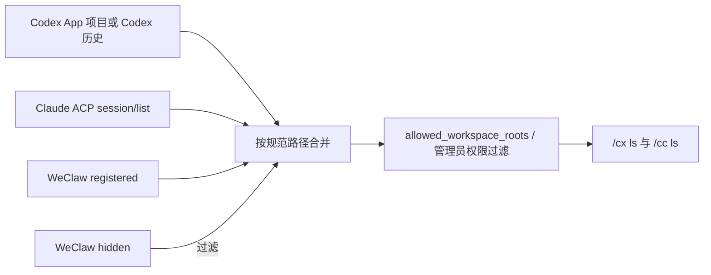

# Codex / Claude 工作空间与会话命名管理设计

## 状态

已实施，尚未发布。

本文定义 WeClaw 远程管理 Codex、Claude 工作空间导航和会话名称的首期契约。当前行为以 `docs/AI_CONTEXT.md` 和源码为准。

## 目标

- 允许管理员通过 WeClaw 为指定 Codex 或 Claude Agent 登记已有工作目录，并从 WeClaw 导航中移除工作目录。
- 允许有权访问目标工作空间的用户重命名 Codex thread 或 Claude session。
- 保持 Codex App / app-server 与 Claude ACP 目录为会话事实源，不通过直接改 SQLite、JSONL 或 Agent 私有状态伪造成功。
- 保持 `allowed_workspace_roots`、单一 Codex Host、单一 ClaudeHost、多前端 binding 和 session/thread 单 writer 约束。
- 所有状态变更都必须可验证；请求结果不确定时明确提示用户复核，不能返回假成功。

## 非目标

- 不创建、移动、重命名或删除服务器上的源码目录。
- 不永久删除 Codex thread、Claude session 或它们的历史文件；首期不暴露 `thread/delete`、ACP `session/delete` 或 `workspace purge`。
- 不修改 Codex App 的 `.codex-global-state.json`、`state_5.sqlite`，也不直接编辑 Claude transcript。
- 不启动独立 `codex`、`claude --resume` 或其他第二 writer 进程。
- 不提供工作空间显示名编辑；手工登记项默认使用目录 basename，重名时通过编号或完整路径区分。
- 不在首期增加 Web 配置页或新的配置字段。

## 已确认的协议基础

### Codex

Codex app-server 提供稳定请求 `thread/name/set`，参数为 `threadId` 和 `name`，成功响应为 JSON object，并发送 `thread/name/updated`。`thread/read`、`thread/list` 返回的 thread 会携带更新后的 `name`。

首期只在官方 daemon 或 WeClaw-managed shared Host 上调用该请求。Codex App Desktop follower 当前没有向 WeClaw 暴露等价写操作，因此 Desktop 是唯一 Host 时必须明确提示用户在 Codex App 内重命名，不能为补齐能力启动第二个 Host。

协议参考：[Codex App Server](https://learn.chatgpt.com/docs/app-server.md)。

### Claude

Claude Code 官方支持在当前 session 中执行 `/rename <名称>`。ACP 没有通用的 client-side session rename 请求；仓库固定的 `@agentclientprotocol/claude-agent-acp` 会在运行时公布可用 slash commands、通过同一 `session/prompt` 执行 `/rename`，并让 `session/list.title` 与 `session_info_update.title` 反映新名称。实现必须按实际能力判断，不能仅按版本号放行。

因此 WeClaw 必须通过现有单一 ClaudeHost 和 session writer lease 发送 `/rename`，不能调用独立 Claude CLI，也不能直接写 Claude 会话文件。发送前必须确认当前 session 的 `available_commands_update` 包含 `rename`；未公布时失败关闭。

协议参考：[Claude Code 会话管理](https://code.claude.com/docs/en/sessions)、[ACP Session List](https://agentclientprotocol.com/protocol/v1/session-list)。

## 术语与语义

- **发现工作空间**：Codex App 项目目录、本机 Codex 历史目录或 Claude `session/list` 中按 `cwd` 聚合出的目录。
- **登记工作空间**：管理员明确加入 WeClaw 导航覆盖层的已有目录；即使目录还没有会话也可显示。
- **隐藏工作空间**：管理员从 WeClaw 导航中移除的目录。隐藏只影响 WeClaw，不修改 Agent 目录、历史或源码。
- **会话名称**：Codex thread 或 Claude session 的 Agent 级全局元数据，不是某个飞书或微信窗口的本地别名。
- **移除**：删除手工登记项并写入隐藏标记，防止同一路径因 Agent 再次发现而立即出现；重新 `add` 会解除隐藏。

## 用户命令契约

| 命令 | 权限 | 行为 |
| --- | --- | --- |
| `/cx workspace add <路径>` | 管理员私聊 | 登记已有目录到当前 Codex Agent，并解除同路径隐藏状态 |
| `/cx workspace remove <编号\|路径>` | 管理员私聊 | 从 WeClaw 的 Codex 导航移除目录，不删除目录和 thread |
| `/cx rename current\|<编号> <名称>` | 可访问目标的用户 | 通过 `thread/name/set` 重命名 Codex thread |
| `/cc workspace add <路径>` | 管理员私聊 | 登记已有目录到当前 Claude Agent，并解除同路径隐藏状态 |
| `/cc workspace remove <编号\|路径>` | 管理员私聊 | 从 WeClaw 的 Claude 导航移除目录，不删除目录和 session |
| `/cc rename current\|<编号> <名称>` | 可访问目标的用户 | 通过当前 ClaudeHost 的 `/rename` 重命名 Claude session |

命令解析要求：

- `workspace add/remove` 把 action 后的剩余文本作为路径，不能用 `strings.Fields` 丢失带空格的目录。
- `rename` 只把第一个参数解析为目标，剩余文本完整作为名称。
- 名称去除首尾空白后必须非空、只能单行、不得包含控制字符，最长 120 个 Unicode code point。
- `current` 必须引用当前窗口已经绑定且可写的会话；编号必须来自当前工作空间最新的会话列表。
- 工作空间编号始终按顶层工作空间列表解析；持久化 revision 变化或飞书卡片 token 过期时要求重新 `/cx ls` 或 `/cc ls`。

权限与路径规则：

- 工作空间登记是主机级状态，只允许 `admin_users` 中且可证明为私聊的操作者修改；无法证明私聊的平台请求失败关闭。
- `add` 复用 `/cwd` 的 `~` 展开、绝对路径、符号链接解析和真实目录校验，不创建缺失目录。
- 管理员可以登记 `allowed_workspace_roots` 之外的目录，但该操作不扩大普通用户权限；普通用户仍看不到、不能选择白名单外目录。
- `rename` 必须再次校验目标工作空间位于操作者可访问范围内，不能用 thread/session ID 绕过工作空间限制或隐藏状态。

## 工作空间状态模型

### 独立导航覆盖层

新增 `~/.weclaw/workspace-registry.json`，按实际配置的 Agent 名称隔离，而不是只按 `codex`、`claude` 类型合并。这样多个同类型 Agent 不会互相污染目录。

建议格式：

```json
{
  "version": 1,
  "revision": 3,
  "agents": {
    "codex": {
      "registered": [
        {
          "root": "/srv/projects/weclaw",
          "added_at": "2026-08-06T08:00:00Z"
        }
      ],
      "hidden": [
        {
          "root": "/srv/projects/legacy",
          "hidden_at": "2026-08-06T08:10:00Z"
        }
      ]
    }
  },
  "updated": "2026-08-06T08:10:00Z"
}
```

状态要求：

- 路径以解析符号链接后的绝对干净路径作为唯一键。
- `add` 幂等：已登记时不重复；已隐藏时原子解除隐藏。
- `remove` 幂等：删除登记项并保留一个隐藏标记；重复调用返回“已移除”。
- 使用 copy-on-write 候选状态，先原子写入 `0600` 临时文件、同步并替换，成功后才发布内存状态。
- 文件损坏或未知版本时不覆盖原文件；工作空间管理命令停用并报告可操作错误，Agent 原生目录仍受 `allowed_workspace_roots` 约束。
- 登记目录后来消失时不展示；管理员仍可按已保存的完整路径执行 `remove` 清理记录。

### 目录合并



合并规则：

1. 先保留各 Agent 原生目录现有顺序。
2. 追加尚未出现的手工登记目录，按 `added_at`、规范路径稳定排序。
3. 按规范路径去重，并过滤隐藏目录。
4. 最后按操作者权限过滤；登记状态不能替代 `allowed_workspace_roots`。
5. 同 basename 的目录在列表中追加最短可区分路径；名称解析不唯一时只接受编号或完整路径。
6. 所有 `cd`、`switch`、`new` 和直接 ID 选择入口都复用同一可见性判断，不能只过滤展示层。

### 移除门禁

工作空间移除不删除历史，但会改变所有前端的全局可见目录，因此必须满足：

- 目标目录没有非终态 Codex/Claude 任务或结果未确认的 writer lease。
- 没有任何前端把目标作为当前 active workspace；操作者需要先切到其他目录。Codex binding 中非活动工作空间的历史选择不阻塞移除。
- 成功后清理指向该目录的纯导航态和过期卡片快照；已保存的 Agent session/thread binding 不被删除。
- 操作进行期间，新的 `cd`、`switch`、`new` 不能在检查后、隐藏提交前抢先绑定该目录。

统一锁顺序为：

1. Agent + workspace registry control；
2. frontend binding；
3. thread/session control；
4. writer lease；
5. Agent RPC。

工作空间选择在提交 binding 前必须在同一 registry control 内复核 revision 和可见性。移除持有 registry control 后再检查当前 binding 与任务，从而避免“移除成功后又提交隐藏目录 binding”的竞态。

## Codex 会话重命名

### 接口

在 `agent/agent.go` 增加可选接口：

```go
type CodexThreadRenameAgent interface {
    RenameCodexThread(ctx context.Context, threadID string, name string) error
}
```

`ACPAgent.RenameCodexThread` 的事务顺序：

1. 确认当前协议是 Codex app-server，并通过 `requireCodexSharedHostCapability("重命名会话")` 拒绝 Desktop follower 缺失能力。
2. 获取 Codex admission 门禁，确认目标没有 writer lease。
3. `thread/read` 校验 thread ID、运行状态和当前名称；active、unknown 或 conflict 均拒绝。
4. 发送 `thread/name/set {threadId, name}`，要求返回非 null JSON object。
5. 再次 `thread/read`，确认返回 `name` 与请求完全一致。
6. 不写 WeClaw 标题缓存；后续列表继续从 Codex 索引、SQLite 或 app-server 权威数据读取。

消息层先按 `current` 或当前工作空间编号解析目标，再获取现有 thread control lock，并复用归档路径的非终态任务检查。其他空闲前端绑定同一 thread 不阻止重命名，因为名称本来就是 Agent 全局元数据；并发重命名由 thread control lock 串行，后提交者覆盖前者。

若请求已发送但响应或读回验证失败，返回“重命名结果暂无法确认”，保留所有 binding，并要求重新 `/cx ls` 核对。该状态不能显示“已重命名”。

## Claude 会话重命名

### 接口

在 `agent/agent.go` 增加可选接口：

```go
type ClaudeSessionRenameAgent interface {
    RenameClaudeSession(ctx context.Context, sessionID string, name string) error
}
```

### Host 级 session 状态

当前 `ACPAgent` 主要通过 frontend conversation mapping 推断 session 是否已在本代 ClaudeHost 恢复。为了支持不改变 frontend binding 的编号重命名，需要增加仅存在于内存的 Host 级加载表：

```text
sessionID -> { cwd, hostGeneration }
```

- `session/new`、`session/resume` 成功后写入加载表。
- 多个 frontend 绑定同一 session 时只复用加载表，不重复 `session/resume`。
- ClaudeHost 重启、身份变化或 generation 更新时清空加载表和命令能力缓存。
- 加载表不是持久化目录，不替代 `session/list`；frontend conversation mapping 仍只表达窗口 binding。

### 重命名事务

1. 从 `session/list` 解析目标并校验 `cwd`、权限和隐藏状态。
2. 获取目标 session 的 control lock 和 `claudeSessionExecutionKey(sessionID)` writer lease；已有任务时立即返回 busy，不排入普通消息续跑队列。
3. 通过 Host 级加载表保证目标在当前 generation 只执行一次有效 `session/resume`，但不改变任何 frontend binding。
4. 等待并确认该 session 的 `available_commands_update` 包含 `rename`。未公布、超时或格式非法时失败关闭。
5. 通过同一 ClaudeHost 发送唯一文本 prompt：`/rename <名称>`。控制命令使用独立结果解析，不复用普通聊天“空正文即失败”的规则。
6. 接收 `session_info_update` 可用于缩短反馈时间，但最终仍重新读取 `session/list`，确认目标 `title` 与请求名称一致。
7. 全程不启动原生 Claude CLI，不修改当前窗口或其他窗口的 workspace/session binding。

`/rename` 是 Claude Code 本地命令，仍会按 Agent 自身语义更新 session 活动时间。若 prompt 已发送但 `session/list` 读回失败或标题不一致，返回“重命名结果暂无法确认”，不得把本地事件缓存当成永久成功。

## 错误与安全边界

| 场景 | 结果 |
| --- | --- |
| registry 持久化失败 | 不发布内存 after-image，原目录列表保持不变 |
| registry 文件损坏或版本未知 | 不覆盖文件，管理命令停用并报告路径与修复建议 |
| 路径不存在或不是目录 | `add` 拒绝，不创建目录 |
| 普通用户执行 workspace add/remove | 拒绝并提示配置 `admin_users` |
| 群聊或无法证明私聊的 workspace mutation | 拒绝主机级变更 |
| 隐藏目录通过 thread/session ID 直接选择 | 拒绝，提示管理员重新登记 |
| Codex Desktop follower 重命名 | 提示在 Codex App 中执行，不启动 shared Host |
| Codex/Claude 目标有 active 或 uncertain writer | 返回 busy，不等待、不排队、不改变 binding |
| Claude adapter 未公布 `rename` | 提示升级/核对 adapter，不把字符串当普通模型 prompt 发送 |
| RPC 已发出但终态无法读回 | 返回结果未确认，保留 binding，要求重新列目录 |

所有 workspace add/remove 与 rename 都写审计事件。审计记录操作者、平台、Agent、规范路径或脱敏会话 ID、成功/失败状态；不记录完整会话名称、prompt、Token 或凭据。

## 文件级实施范围

### 新增

- `messaging/workspace_registry.go`：状态模型、目录合并、revision、访问和 control 门禁。
- `messaging/workspace_registry_persistence.go`：v1 解码、原子持久化和损坏保护。
- `messaging/workspace_commands.go`：Codex / Claude 共用的 add/remove 解析、权限和审计。
- `agent/codex_thread_rename.go`：`thread/name/set`、前后读取和未知终态错误。
- `agent/claude_session_rename.go`：Host 加载、slash command 能力门禁、控制 prompt 与目录读回。
- 对应 `_test.go` 文件。

### 修改

- `agent/agent.go`：增加两个可选 rename 接口。
- `agent/acp_types.go`、`agent/acp_session_update.go`、`agent/acp_sessions.go`：解析并缓存 `available_commands_update`、`session_info_update` 与 Host 级 session 加载状态。
- `messaging/handler.go`、`messaging/session_stores.go`、`cmd/start_runtime.go`：装载独立 workspace registry。
- `messaging/codex_browser_groups.go`、`messaging/codex_local_handler.go`、`messaging/claude_local_handler.go`：合并登记项、应用隐藏项并统一直接选择校验。
- `messaging/codex_session_command_dispatch.go`、`messaging/claude_session_handler.go`：新增命令分发和私聊上下文。
- `messaging/codex_session_status.go`、`messaging/claude_render.go`、`messaging/help_text.go`、`messaging/feishu_help.go`：同步帮助与导航提示。
- `README_CN.md`、`README.md`、`docs/AI_CONTEXT.md`：只在实现完成后同步为当前产品事实。

实施时允许根据现有职责边界合并小文件，但不得把 registry 塞进 Codex 或 Claude session binding 文件，也不得把 Agent 标题变成 WeClaw 自有事实源。

## 测试与验收

### 工作空间

- 登记已有空目录后，Codex 与 Claude 顶层列表可见，并可在其中 `/cx new` 或 `/cc new`。
- 符号链接与真实路径只出现一次；同 basename 可以用编号或完整路径区分。
- `remove` 后即使 Codex App 或 `session/list` 继续返回该目录，WeClaw 仍隐藏它；再次 `add` 后恢复。
- 管理员在白名单外登记目录不会扩大普通用户权限。
- 隐藏目录不能通过 `cd`、`switch`、`new`、thread ID、session ID 或过期飞书卡片绕过。
- active workspace、任务、writer 和 remove/switch 并发矩阵均保持无隐藏 binding 提交。
- 持久化失败、损坏文件、未知版本、缺失目录均保持真实错误且不覆盖原状态。

### Codex rename

- `current` 与编号解析正确，名称空白、换行、控制字符和超长输入被拒绝。
- 精确发送 `thread/name/set`，并用 `thread/read.name` 验证；不调用 `thread/delete` 或直接写状态文件。
- active、uncertain、writer busy 和 Desktop follower 路径失败关闭且 binding 不变。
- 两个前端绑定同一空闲 thread 时可看到同一新名称；并发 rename 串行。

### Claude rename

- 只在 adapter 公布 `rename` 后发送 `/rename <名称>`，不把不支持的 slash command 交给模型。
- 当前和编号目标都使用同一 ClaudeHost；未加载目标最多一次 `session/resume`，不建立第二 writer。
- rename 与普通 prompt 共用 session writer lease，busy 时不排队；所有 frontend binding 前后完全一致。
- `session_info_update` 能被解析，最终成功必须由 `session/list.title` 读回确认。
- 不调用独立 Claude CLI，不直接写 transcript，不调用 `session/delete`。

### 验证命令

```bash
go test ./agent ./messaging ./cmd -count=1 -timeout 180s
go test ./... -count=1 -timeout 180s
go test -race ./... -count=1 -timeout 240s
go vet ./...
go mod tidy -diff
go run honnef.co/go/tools/cmd/staticcheck@v0.7.0 ./...
PYTHONDONTWRITEBYTECODE=1 python3 scripts/validate_docs.py . --profile generic
git diff --check
```

正式发布前仍必须运行 `scripts/release.sh` 的完整验证阶段。

## 实施顺序与回滚

1. 先以测试锁定 registry 合并、权限、隐藏绕过和持久化事务，再接入 Codex/Claude 列表。
2. 接入 workspace add/remove 命令和跨平台路由，验证并发 selection/remove。
3. 实现 Codex rename 接口、消息命令和 Desktop follower 失败边界。
4. 实现 Claude Host 级加载表、命令能力缓存和 rename 事务。
5. 同步帮助、README、`docs/AI_CONTEXT.md`，执行全仓与发布门禁。

回滚时可先停止广告并移除 workspace/rename 命令，再停用 registry overlay；保留 `workspace-registry.json` 供修复版本恢复，不自动删除。rename 不引入数据迁移，失败回滚只需保留原 binding 并重新读取 Agent 目录。由于首期没有目录或历史删除，回滚不需要恢复用户源码或会话文件。
